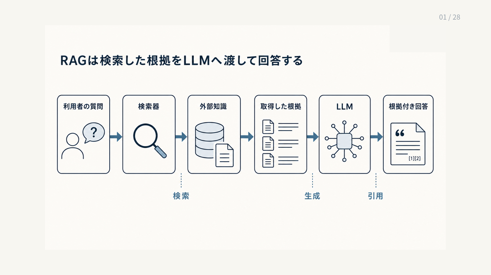

# 1.1 RAGとは

## 1.1.1 RAGの定義

**検索拡張生成（Retrieval-Augmented Generation：RAG）**は、質問に関係する外部知識を取得し、取得した内容を条件として言語モデルが回答を生成する方式です。
この定義には、外部知識を探す検索と、検索結果を使う生成の両方が含まれます。
文書を検索して一覧を返すだけの仕組みや、LLMが学習済み知識だけで答える仕組みとは区別します。

[LewisらのRAG](https://arxiv.org/abs/2005.11401)は、生成モデルが内部に持つ知識と、検索可能な外部の知識源を組み合わせました。
[REALM](https://arxiv.org/abs/2002.08909)も、外部の知識源を検索する部品を言語モデルへ組み込み、知識源をモデル本体とは別に更新できる構成を示しました。
現在の実務では、この考え方を文書検索、根拠の選別、回答生成、引用、回答保留まで含むシステムとして扱います。

例えば、利用者が「製品Aのバージョン3.2でエラーE101が発生した場合の回避策」を質問したとします。
RAGは、製品A、バージョン3.2、E101に関係するマニュアルや既知問題を検索し、取得した箇所を基に回避策を説明します。
回答に参照元を付ければ、利用者は適用条件や手順を原文で確認できます。

## 1.1.2 入力、中間成果物、出力

RAGの処理を調べられるようにするには、入力、中間成果物、出力を分けて考える必要があります。
入力は質問文だけではありません。
検索対象となる知識源、利用者の権限、回答の基準時点、製品や地域などの条件も入力に含まれます。

中間成果物は、検索によって得た**根拠候補**です。
各候補には、文書ID、版、ページや節、取得時刻など、原文へ戻るための情報を持たせます。
[Fusion-in-Decoder（FiD）](https://arxiv.org/abs/2007.01282)は、複数の取得文書を別々に符号化し、生成時に統合する構成を示しました。
複数の資料を利用できることは、複数の資料が正しく選ばれ、矛盾や適用条件を保ったまま統合されることを意味しません。

図1-1は、RAGの基本的な処理を左から右へ示します。
利用者の質問を受けた検索器が外部知識から根拠を取得し、LLMがその根拠を使って引用付きの回答を作る順に読みます。

出力は、根拠に基づく回答と引用だけではありません。
必要な根拠を取得できない場合や、同等の権威を持つ資料が矛盾する場合には、回答を保留できます。
回答保留を正常な出力として定義すると、根拠がないまま文章を生成する処理を、例外ではなく設計済みの分岐として扱えます。

**図1-1　RAGの基本構造**

## 1.1.3 内部知識と外部知識

RAGの説明では、**パラメトリックメモリ（parametric memory）**と**ノンパラメトリックメモリ（non-parametric memory）**を区別します。
パラメトリックメモリは、言語モデルが学習によってパラメーター内に保持した知識です。
[LAMA](https://arxiv.org/abs/1909.01066)は、事前学習済み言語モデルが一定の関係知識を保持していることを調べました。
ただし、個々の回答について学習元、更新時点、利用権限を直接指定することはできません。

**検索インデックス**は、文書や語、ベクトルを素早く探せるように整理したデータです。
ノンパラメトリックメモリは、検索インデックスやデータベースなど、検索可能な外部知識源です。
文書の追加、更新、失効をモデル本体とは別に管理でき、回答に利用した箇所も追跡できます。
ただし、外部知識源を更新しても、解析やインデックス更新が完了するまで検索結果には反映されません。

二つの知識は、一方を捨てて他方へ置き換える関係ではありません。
LLMは質問の解釈、要約、比較、自然な文章化を担い、外部知識源は最新情報、組織固有情報、出典を提供します。
RAGは両者の役割を分け、回答時に組み合わせる設計です。

## 1.1.4 最小パイプライン

RAGの最小の処理の流れ（パイプライン）は、次のように表せます。

`質問 → 検索 → 根拠の追加 → 生成 → 引用または回答保留`

- **質問**：利用者の質問から、対象、条件、期間、版などを読み取ります。
- **検索**：質問と条件に合う根拠候補を知識源から取得します。
- **根拠の追加**：候補を選別し、出典情報とともにLLMへ渡す文脈を作ります。
- **生成**：LLMが文脈に基づいて回答を組み立てます。
- **引用または回答保留**：回答と根拠を対応付けるか、根拠不足を理由に回答を保留します。

[RAGのサーベイ](https://arxiv.org/abs/2312.10997)は、RAGを検索、拡張、生成という工程に分けて整理しています。
工程を分けると、正しい文書が候補に入らなかった検索の失敗と、正しい文書があってもLLMが読み違えた生成の失敗を切り分けられます。
最終回答だけを見ても、この二つの失敗は区別できません。

## 1.1.5 根拠に基づく回答

検索結果を、LLMへの指示や入力情報である**プロンプト**へ入れただけでは、回答が根拠に基づいているとは判断できません。
回答中の各主張について、取得した資料のどの箇所がその主張を支えるかを確認できる必要があります。
このように、回答を外部の根拠へ結び付ける性質を**グラウンディング（grounding）**と呼びます。

[ALCE](https://arxiv.org/abs/2305.14627)は、引用の正しさと網羅性を分けて評価しました。
引用の正しさは、参照先が直前の主張を実際に支持するかを表します。
引用の網羅性は、根拠が必要な主張に引用が付いているかを表します。
したがって、引用番号が表示されることだけでは、根拠に基づく回答の成立を証明できません。

根拠に基づく回答では、根拠に書かれていない補足を事実として断定しません。
また、資料の対象、版、期間、例外を回答へ引き継ぎます。
根拠が一部の主張しか支えない場合は、回答の範囲を根拠が支える範囲まで狭めます。

## 1.1.6 RAGと近隣技術の境界

全文検索は、関連文書や文書内の箇所を返します。
回答を生成しない全文検索は、それだけではRAGではありません。
ただし、原文を確実に提示できる検索システムは、RAGの検索工程を支える重要な部品です。

長い文書を無選別にLLMへ渡す方式は、どの資料を選ぶかという検索工程を持ちません。
対象が小さく、全文がLLMへ一度に渡す入力情報（コンテキスト）へ収まる場合には有効ですが、更新、権限、文書選択の問題は別に扱う必要があります。

ファインチューニングは、出力形式、語調、分類方法など、モデルの振る舞いを調整するために利用できます。
頻繁に変わる事実の正本を管理し、回答時に出典を示す仕組みとは役割が異なります。

ツール利用は、計算、データベース照会、外部システムの機能を呼び出す窓口（Application Programming Interface：API）の実行などを、LLMから依頼する設計です。
[Toolformer](https://arxiv.org/abs/2302.04761)は、言語モデルが必要な場面で外部APIを利用する方法を扱いました。
実務では、文書から知識を取得するRAGと、現在値の取得や状態変更を行うツールを組み合わせる場合があります。

## 1.1.7 システムとしてのRAG

検索器とLLMを接続しただけでは、業務で継続利用できるRAGにはなりません。
どの資料を正本とするかを決め、文書を解析し、検索単位へ分割し、版とアクセス権を保持する必要があります。
回答時には、質問を検索条件へ変換し、候補を順位付けし、限られたコンテキストへ配置します。
運用時には、知識の更新、品質評価、監視、監査も必要です。

[Modular RAG](https://arxiv.org/abs/2407.21059)は、検索、処理経路の選択、書き換え、記憶、生成などを再構成可能な部品として整理しました。
この整理は、RAGの品質が一つのモデルの性能だけで決まらないことを示します。
一つの変更が別の工程へ与える影響を測れるように、各工程の入力、出力、版を記録します。

以降の章では、資料の準備、検索、根拠の選別、生成、評価、運用を順に扱います。
RAGをシステムとして分解することが、失敗原因を特定して改善するための出発点です。
