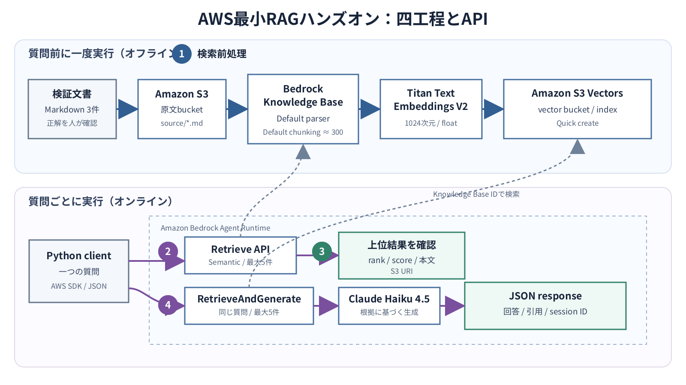

# 10.1. 全体構成

AWSサービスを先に並べるのではなく、RAGのどの工程をどこまでAWSへ任せるかを先に決めます。
本章ではAmazon Bedrock Knowledge Basesを中心にした最小構成を採用し、工程ごとに入れ替えられる選択肢も示します。

## 10.1.1. 工程とAWSサービスの対応

**Pre-retrieval**

Amazon S3、Amazon Bedrock Knowledge Bases、Titan Text Embeddings V2、Amazon S3 Vectorsを使います。
原文保存、解析、chunking、embedding、索引作成を担当します。

**Retrieval**

Bedrock Agent Runtimeの`Retrieve`、Knowledge Bases、S3 Vectorsを使います。
質問のembedding化、metadata filter、近傍検索を担当します。

**Post-retrieval**

Bedrockのrerankerと、必要に応じてAWS Lambdaを使います。
再順位付け、重複排除、業務ルール、context量の制御を担当します。

**Generation**

Bedrock Agent Runtimeの`RetrieveAndGenerate`、Bedrock foundation model、Bedrock Guardrailsを使います。
根拠付き回答、引用、入出力の安全制御を担当します。

Amazon CloudWatch、AWS CloudTrail、AWS KMS、IAMは一つの工程だけに属しません。
監視、監査、暗号鍵、権限を四工程へ横断的に適用します。

## 10.1.2. 採用する最小構成

図10-1の上段は、質問が来る前に実行するPre-retrievalです。
下段は、質問ごとに実行するRetrieval、Post-retrieval、Generationです。



**図10-1　AWS最小RAGハンズオンの構成**

このハンズオンでは次の経路を使います。

```text
Markdown
  -> S3原文バケット
  -> Bedrock Knowledge Base
  -> Default parser / Default chunking
  -> Titan Text Embeddings V2
  -> S3 vector index

質問
  -> Retrieve
  -> 上位候補を確認
  -> RetrieveAndGenerate
  -> Claude Haiku 4.5
  -> 回答 / 引用 / session ID
```

API Gateway、Lambda、Web UIは最小構成へ含めません。
ローカル端末またはAWS CloudShellのPythonクライアントからBedrock Agent Runtimeを直接呼び出します。

## 10.1.3. Knowledge Base方式の選択

最初に、Managed Knowledge Base、vector storeを指定する標準Knowledge Base、独自実装のどれを使うか決めます。

**Managed Knowledge Baseを選ぶ条件**

- embeddingやrerankingを含む検索基盤の運用をAWSへ広く任せたい場合
- `Retrieve`または`AgenticRetrieveStream`を使う構成で要件を満たせる場合
- 検索方式やrerankerをAWSのmanaged設定へ寄せられる場合

**標準Knowledge Baseを選ぶ条件**

- `RetrieveAndGenerate`で検索、生成、引用を一つのAPIから取得する場合
- embedding model、vector store、次元数を明示的に選びたい場合
- Bedrockのmetadata filterやrerankerを使いながら、vector storeの特性も選びたい場合

**独自実装を選ぶ条件**

- 独自のchunk schema、複数indexのfusion、複雑なACL判定が必要な場合
- 検索結果を自前で整形してBedrockの`Converse`または`ConverseStream`へ渡す場合
- Knowledge Basesが対応しないvector databaseやsearch engineを使う場合

`RetrieveAndGenerate`はManaged Knowledge Baseに対応しません。
そのため、本章ではS3 Vectorsをvector storeにする標準Knowledge Baseを使います。
制約は[RetrieveAndGenerate API](https://docs.aws.amazon.com/bedrock/latest/APIReference/API_agent-runtime_RetrieveAndGenerate.html)で確認できます。

## 10.1.4. 全工程に共通する選択

### リージョン

データを保存するリージョンだけでなく、embedding、reranker、generation model、S3 Vectorsを同じリージョンで利用できるか確認します。
このハンズオンは`ap-northeast-1`に固定します。

cross-Region inferenceを使うと可用性やthroughputを広げられますが、入力が別リージョンへ送られる可能性があります。
データ所在地の要件を確認してから採用します。

### IAM role

少なくとも三つの主体を分けます。

- **構築者のIAM identity**：S3とKnowledge Baseを作成し、service roleを渡します。
- **Knowledge Base service role**：S3原文の読み取り、embedding modelの呼び出し、vector indexへの読み書きを行います。
- **アプリケーションrole**：`Retrieve`と`RetrieveAndGenerate`を呼び出します。

構築を簡単にするため、ハンズオンではKnowledge Base service roleをコンソールで自動作成します。
本番では対象bucket、index、model ARNを限定し、構築者の権限を実行roleへ流用しません。

### 暗号化と通信経路

最小構成はS3のserver-side encryptionを使い、Public Accessを遮断します。
規制、契約、鍵の分離要件がある場合はS3、S3 Vectors、ログごとにcustomer managed KMS keyを選びます。
閉域要件がある場合は、利用サービスが対応するVPC endpointとDNS、egress経路を別途設計します。

### 監視と監査

本番では少なくとも次を記録します。

- ingestion jobの処理件数、失敗件数、所要時間
- `Retrieve`と生成APIの成功率、latency、throttling
- input token、output token、取得候補数、採用候補数
- model、prompt、index、data sourceのversion
- CloudTrailで追跡できる管理操作とAPI操作

回答本文や取得chunkをそのままCloudWatch Logsへ保存すると、機密情報がログへ複製されます。
保存項目、masking、保持期間、閲覧権限を先に決めます。

## 10.1.5. 要件と成功条件を固定する

最初の検証では、一つの業務、一つの代表質問、一つの期待文書へ絞ります。

```yaml
purpose: "製品サポート担当者が受付条件を確認する"
representative_question: "スタンダードプランの受付時間と問い合わせ方法は？"
expected_answer: "平日09:00-17:00 JST、Webフォームとメール"
expected_source: "support-policy.md"
source_owner: "製品サポート部門"
allowed_data: "機密情報と個人情報を含まない検証用文書"
completion:
  ingestion_failed_documents: 0
  expected_source_rank_max: 1
  citation_required: true
```

期待文書が検索されなければRetrieval以前の問題です。
期待文書が検索されても回答が違えばGenerationの問題です。
先に期待値を固定すると、工程を分けて診断できます。

## 10.1.6. ハンズオンの共通設定

以降の節では、まず次の値で一経路を動かします。

```yaml
lab_name: rag-four-elements
region: ap-northeast-1
source_prefix: source/
parser: default
chunking: default
embedding_model: amazon.titan-embed-text-v2:0
embedding_dimensions: 1024
embedding_type: float
vector_store: s3_vectors_quick_create
search_type: semantic
retrieval_results: 5
reranker: disabled
generation_model: anthropic.claude-haiku-4-5-20251001-v1:0
```

初回に複数の値を同時に変えると、結果が変わった理由を説明できません。
最小構成を基準にし、評価データを固定して一項目ずつ比較します。

## 10.1.7. 実行環境とリソース名

必要なものは、課金が許可された検証用AWSアカウント、root userではないIAM identity、AWS CLI v2、Python 3.11以降です。
`jq`は結果確認に使いますが、なくてもJSON全体は確認できます。

端末で実行先を確認します。

```bash
aws --version
aws sts get-caller-identity
export AWS_REGION=ap-northeast-1
export AWS_DEFAULT_REGION="$AWS_REGION"
aws configure set region "$AWS_REGION"
```

`Account`と`Arn`が検証環境のものではない場合は進みません。

リソース名は次の形にします。

```yaml
source_bucket: rag-four-elements-<account-id>-<suffix>
knowledge_base: rag-four-elements-kb
data_source: rag-four-elements-source
service_role: <console-created-role>
vector_bucket: <quick-createされた名前>
vector_index: <quick-createされた名前>
```

S3 bucket名は全AWSアカウントで一意です。
Knowledge Base ID、data source ID、自動作成されたrole、vector bucket、vector indexは、削除時にも必要になるため作成直後に記録します。

## 10.1.8. 構築順序と障害の切り分け

構築は依存関係の順に行います。

1. S3へ原文を配置します。
2. Knowledge Base、data source、embedding、vector storeを設定します。
3. data sourceを同期し、失敗0件を確認します。
4. `Retrieve`で期待文書が取れるか確認します。
5. rerankerや業務ルールが必要ならPost-retrievalへ追加します。
6. `RetrieveAndGenerate`で回答と引用を確認します。

障害も同じ境界で切り分けます。

- 同期が失敗する場合は、S3 URI、parser、chunking、embedding権限、index設定を確認します。
- 結果が0件または期待文書が候補にない場合は、同期状態、質問、filter、search type、取得件数を確認します。
- 期待文書が候補にあるのに最終候補から落ちる場合は、reranker、重複排除、閾値を確認します。
- 最終候補が正しいのに回答が違う場合は、model、prompt、推論パラメータ、context量を確認します。

この境界を保つため、`Retrieve`の診断を省略して、最初から最終回答だけを評価しないようにします。
