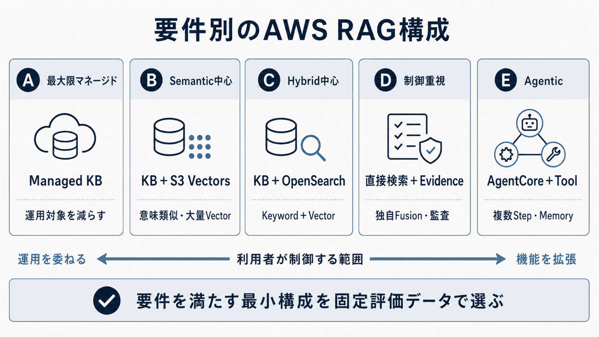

# 全体構成と選定の順序

AWSリソースを選ぶ前に、質問より前に作るものと、質問ごとに動かすものを分けます。
四工程と二層は、処理の目的と実行時の責任という、異なる軸で整理します。
文書解析、チャンク分割、埋め込み、索引作成はBatch Layerに置き、質問理解、検索、検索後処理、生成はReal-time Layerに置きます。

**表10-1 二層と管理面の役割**

| 区分 | 役割 | 主なAWS機能 |
|---|---|---|
| Batch Layer | 質問前に索引を作る | S3、Knowledge Bases、埋め込み、ベクトルストア |
| Real-time Layer | 質問ごとに根拠を探し、回答する | Knowledge Bases、再順位付け、生成モデル、アプリ |
| 管理面 | 両層を安全に運用する | IAM、KMS、CloudWatch、評価、Budgets |

**図10-1 四工程・二層とAWSサービスの全体対応**

Batch Layerの成果物には、ベクトルと、原文まで戻るための情報を含めます。
原文、チャンク、メタデータ、埋め込み、索引の版を結び、検証済みの索引としてReal-time Layerへ公開します。
Real-time Layerは、文章と、検証に必要な情報を返します。
採用根拠、引用、利用した設定版、回答保留理由を追跡できる回答です。

工程の境界では、最低限次の情報を残します。

- **Batch→Real-time**：原文ID、チャンク ID、メタデータ、埋め込み版、索引版
- **検索前処理→検索**：原質問、検索文、フィルター、検証済み利用者コンテキスト
- **検索→検索後処理**：候補本文、出典位置、メタデータ、スコア、検索器
- **検索後処理→生成**：根拠、出典、採否理由、矛盾、回答可能性
- **生成→利用者**：回答、引用、保留理由、モデル・プロンプト・Guardrail版

この境界を残すと、検索品質と生成品質を分けて評価できます。
`RetrieveAndGenerate`のように複数工程を一つのAPIへまとめる場合も、評価上の論理境界は残します。
[Knowledge Basesの仕組み](https://docs.aws.amazon.com/bedrock/latest/userguide/kb-how-it-works.html)と[Knowledge Basesの評価](https://docs.aws.amazon.com/bedrock/latest/userguide/evaluation-kb.html)も、この分離に沿って利用します（確認日：2026年9月5日）。

## AWSリソースを選ぶ順序

**図10-2 要件からAWSリソースを選ぶ四つの問い**

選択は次の順で行います。

1. **どこまで運用を委ねるか**：検索基盤の運用を任せるならManaged Knowledge Base、埋め込みとストアを選ぶならCustomer-managed Knowledge Baseを比較します。
2. **文書に何が含まれるか**：テキスト中心なら標準解析器、表・図・画像が根拠になるならBDAまたは基盤モデル解析器を比較します。
3. **何を検索したいか**：意味類似中心ならS3 Vectors、語彙一致と意味類似を組み合わせるならOpenSearch Serverlessを比較します。
4. **生成と根拠制御をどう分けるか**：標準経路なら`RetrieveAndGenerate`、根拠集合を制御するなら`Retrieve`＋`Converse`、質問分解と反復検索が必要なら`AgenticRetrieveStream`を比較します。

まず、要件を満たす小さな構成を選びます。
管理範囲が大きい構成を基準構成にし、要件を満たせない工程だけを分離します。

## AWSサービスを役割で読む

RAGで使うAWSサービスには、それぞれに異なる役割があります。

- **正本を保持する**：Amazon S3は原文、版、メタデータを保持します。検索や回答生成は行いません。
- **取り込みと検索を仲介する**：Bedrock Knowledge Basesは、データソース、チャンク、出典、埋め込み、ベクトルストア、検索APIを接続します。Knowledge Base自体をベクトルデータベースとは扱いません。
- **索引を保持して検索する**：S3 Vectorsは意味検索、OpenSearch Serverlessはキーワード・ベクトル・ハイブリッド検索を担います。
- **推論する**：Bedrock 埋め込み、再順位付け、生成モデル、Guardrailsは、変換、並べ替え、回答生成、入出力ポリシーをそれぞれ担います。
- **アプリケーションを動かす**：Lambda、ECS、EKSまたはAgentCore Runtimeが、認証済み要求から検索・生成・ツール実行をつなぎます。

Amazon Bedrockを一つの箱として扱うと、権限、費用、版、評価の境界を失います。
Knowledge Bases、埋め込み、再順位付け、生成、Guardrailsは、構成図と実行記録でも分けます。
[Amazon Bedrock Knowledge Bases](https://docs.aws.amazon.com/bedrock/latest/userguide/knowledge-base.html)、[Rerank](https://docs.aws.amazon.com/bedrock/latest/userguide/rerank.html)、[Guardrails](https://docs.aws.amazon.com/bedrock/latest/userguide/guardrails.html)を参照します（確認日：2026年9月5日）。

## 比較する五つの構成パターン

**図10-3 要件別のAWS RAGリファレンス構成**

**表10-2 要件別参照構成の選択**

| 構成 | 選ぶ主な条件 | 避ける主な条件 |
|---|---|---|
| A 最大限マネージド | 運用対象を減らしAWS標準へ寄せる | インデックスや検索方式を細かく固定したい |
| B 意味検索中心 | 意味類似中心でS3 Vectorsの制約内 | キーワード・完全一致が重要 |
| C ハイブリッド中心 | 型番・条文・固有語と意味類似を併用 | 検索運用を最小化したい |
| D 制御重視 | 独自統合、根拠、ACL、検証が必須 | 標準経路で要件を満たせる |
| E エージェント型 | ツール、記憶管理、複数段階が必要 | 一巡の検索・生成で完了する |

構成Aの根拠は[Managed Knowledge Base](https://docs.aws.amazon.com/bedrock/latest/userguide/kb-build-managed.html)、構成Bは[S3 VectorsとKnowledge Bases](https://docs.aws.amazon.com/AmazonS3/latest/userguide/s3-vectors-bedrock-kb.html)、構成Cは[OpenSearch ServerlessのNeural・Hybrid Search](https://docs.aws.amazon.com/opensearch-service/latest/developerguide/serverless-configure-neural-search.html)、構成Eは[AgentCore](https://docs.aws.amazon.com/bedrock-agentcore/latest/devguide/what-is-bedrock-agentcore.html)を参照します（確認日：2026年9月5日）。

構成は、要件と評価結果の変化に合わせて見直します。
第7章の評価データと第8章の非機能要件を固定し、管理範囲が大きい基準構成から始めます。
キーワード、メタデータ、応答時間、費用、制御性で不足する工程だけを分離し、変更前後を同じ基準で再評価します。
