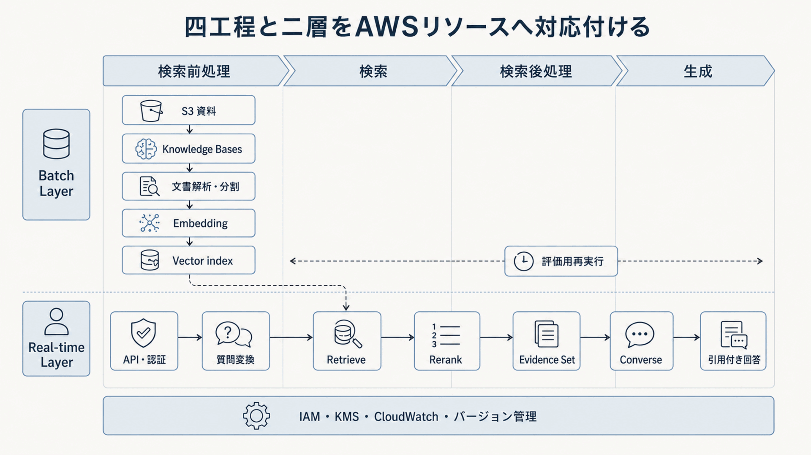
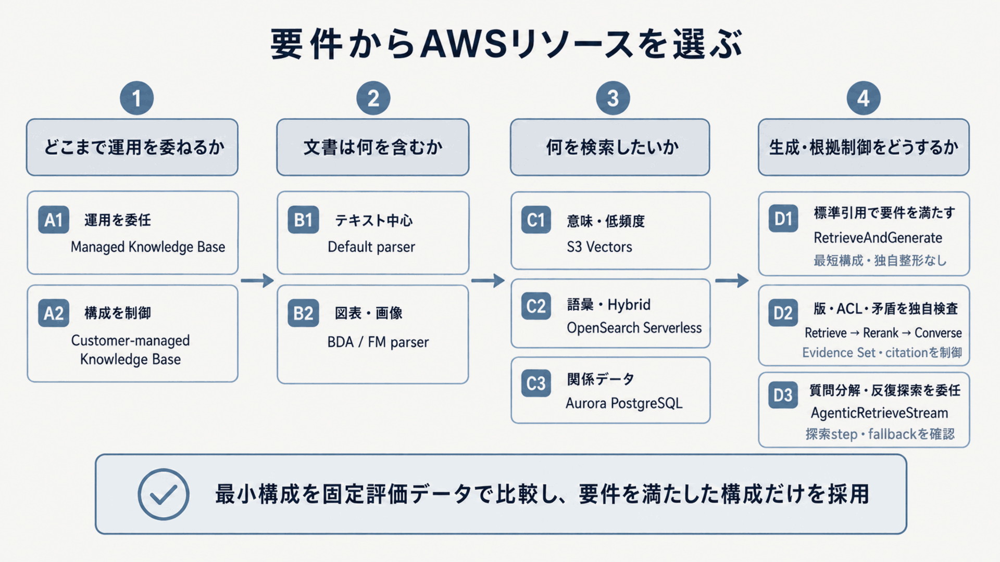

# 10.1. 四工程・二層から構成方式を選ぶ

## 10.1.1. 四工程と二層をAWSリソースへ対応付ける

第2章で定義した四工程は処理の目的を、二層は実行するタイミングを表します。AWSサービス名から構成を考え始めず、まず各処理をBatch LayerとReal-time Layerへ配置し、その責務を満たすサービスとリソースを選びます。一つのKnowledge Baseを両層から利用できますが、取り込み設定と質問時設定は別の構成値として記録します。

| 四工程 | Batch Layerで行うこと | Real-time Layerで行うこと | 主なAWSサービス・リソース | 次へ渡す成果物 |
|---|---|---|---|---|
| 検索前処理 | 文書取得、parse、chunk、embedding、索引更新、削除反映 | query正規化、書き換え、filter生成 | Amazon S3、Bedrock Knowledge Bases、data source、parser、embedding model、S3 VectorsまたはOpenSearch Serverless、Lambda | index、検索query、ACL filter |
| 検索 | 評価queryの再実行、候補数・検索方式の比較 | dense、sparse、hybrid、agentic retrievalで候補取得 | `Retrieve`、`AgenticRetrieveStream`、S3 Vectors、OpenSearch Serverless、Lambda、Step Functions | 出典付き候補集合 |
| 検索後処理 | rerankerや閾値の回帰評価 | reranking、重複排除、版・ACL・矛盾検査、context packing | Bedrock Rerank、Lambda、Step Functions、ECS/Fargate | Evidence Set |
| 生成 | 固定Evidence Setによるprompt・model回帰評価 | 根拠付き回答、回答保留、citation検査 | Bedrock `Converse`、`RetrieveAndGenerate`、Guardrails、Lambda | 回答または回答保留、trace |

**図10-1　四工程と二層へのAWSリソースの配置**

設計書ではサービス名だけでなく、作成・変更・監視する単位までリソース一覧にします。

| 設計対象 | 記録する主なリソース |
|---|---|
| 情報源 | S3 bucket・prefix、native connector、文書ID、版、ACL metadata |
| 取り込み | Knowledge Base、data source、sync job、parser、chunking、transformation Lambda |
| 埋め込み・索引 | embedding model ID、次元、vector store、index、field mapping、distance metric |
| 質問時処理 | API、managed search configuration、候補数、filter、timeout、fallback |
| 検索・根拠整形 | retriever、reranker、Lambda/ECS、Step Functions、Evidence Set schema |
| 生成 | foundation model ID、inference profile、prompt、Guardrail、出力schema |
| 横断基盤 | IAM role、KMS key、VPC endpoint、CloudWatch Logs・Metrics、trace保存先 |

## 10.1.2. リソースをサービス名ではなく要件から選ぶ

次の順序で選択肢を狭めます。先にvector storeやmodelを固定すると、必要な検索方式、ACL、独自処理、運用責任を後から満たせなくなるためです。

**図10-2　要件からAWSリソースを選ぶ順序**

| 選択肢 | 選ぶ条件 | 別構成へ進む条件 |
|---|---|---|
| Managed Knowledge Base | connector、索引、権限反映、rankingの運用を委ねたい | index schemaや独自検索器を直接制御する必要がある |
| カスタマーマネージド型Knowledge Base | embedding、vector store、field mapping、検索方式を選びたい | 管理作業削減を品質・権限制御より優先する |
| default parser | text中心でlayout依存が小さい | 表、図、複雑な段組みが回答根拠になる |
| Bedrock Data Automationまたはfoundation model parser | multimodal文書やlayoutを保持したい | 処理時間・costが許容値を超える |
| S3 Vectors | semantic searchとmetadata filterで足り、低運用負荷を優先する | BM25、hybrid、facet、複雑な語彙一致が必要 |
| OpenSearch Serverless | dense・sparse・hybrid、filter、facetを同じ基盤で扱う | relational transactionや既存DB境界を優先する |
| Aurora PostgreSQL | vectorと業務のrelational dataを同じDB境界で扱う | 検索専用のscale・運用分離が必要 |
| `RetrieveAndGenerate` | カスタマーマネージド型で標準の検索・引用・生成で足りる | Evidence Set、独自reranking、矛盾処理が必要 |
| `Retrieve → rerank → Converse` | 検索と生成を別々に評価し、独自の根拠整形を入れる | Managed Knowledge Baseのagenticな探索に委ねたい |
| `AgenticRetrieveStream` | Managed Knowledge Baseで複数stepの探索や生成を利用する | step、cost、latency、独自制御が要件を満たさない |

Knowledge Baseの管理方式は[Knowledge Bases for Amazon Bedrock](https://docs.aws.amazon.com/bedrock/latest/userguide/knowledge-base.html)、parserの選択肢は[Parsing options for your data source](https://docs.aws.amazon.com/bedrock/latest/userguide/kb-advanced-parsing.html)、vector storeの構成条件は[Set up a vector index for your Knowledge Base](https://docs.aws.amazon.com/bedrock/latest/userguide/knowledge-base-setup.html)で採用時点の対応region、model、上限を確認します。

## 10.1.3. 独自処理の実行リソースを選ぶ

Knowledge Basesの前後へ独自処理を入れる場合は、処理時間、状態管理、並列度、実行環境の自由度から実行リソースを選びます。

| 実行リソース | 適する処理 | 主な判断点 |
|---|---|---|
| AWS Lambda | query変換、metadata filter、軽量な重複排除、citation検査 | 短時間、stateless、event駆動で完結する |
| AWS Step Functions | 複数retriever、再試行、分岐、並列実行、timeout管理 | workflowの状態と失敗経路を明示したい |
| Amazon ECS on AWS Fargate | 大きなparser、長時間reranking、独自library・model | container、CPU・memory、実行時間の自由度が必要 |
| Knowledge Basesのmanaged processing | 標準parse、chunk、embedding、sync | 独自変換より運用削減を優先し、評価で品質を確認できる |

Batch Layerの独自取り込みは再実行可能性、checkpoint、部分失敗、削除反映を設計します。Real-time Layerは各処理へp95 latency budgetとtimeoutを配分し、retrieverやrerankerの失敗時に回答保留、縮退検索、再試行のどれを選ぶかを固定します。

## 10.1.4. 検索と生成の分離境界を決める

標準的な文書RAGは、**Amazon S3（Amazon Simple Storage Service）**に置いた資料をAmazon Bedrock Knowledge Basesで取り込み、embedding、vector storeへの登録、`Retrieve`または`RetrieveAndGenerate`までを構成できます。カスタマーマネージド型の最初の基準構成では、単一のKnowledge Base、単一のdata source、単一のembedding modelを使い、検索と生成を別々に評価できるようにします。

Managed Knowledge Baseを使う場合は、取り込み、索引、保存、検索の運用をサービスへ委ねます。構築作業が減る一方、vector store固有のindex設定や検索器の組み合わせを直接制御する範囲は狭くなります。カスタマーマネージド型とManaged Knowledge Baseを、同じ評価データ、権限条件、更新頻度、latency budget、cost条件で比較します。

管理方式によって利用できるAPIが異なります。

| 管理方式 | 検索結果だけを取得する | 検索から生成までを接続する | 本書での扱い |
|---|---|---|---|
| カスタマーマネージド型 | `Retrieve` | `RetrieveAndGenerate`、または`Retrieve → 検索後処理 → Converse` | 一体型と分離型を要件に応じて選びます |
| Managed Knowledge Base | `Retrieve`、または`generateResponse=false`の`AgenticRetrieveStream` | `AgenticRetrieveStream`で生成するか、検索結果を`Converse`へ渡します | `RetrieveAndGenerate`は利用しません |

AWSの[RetrieveAndGenerate API Reference](https://docs.aws.amazon.com/bedrock/latest/APIReference/API_agent-runtime_RetrieveAndGenerate.html)は、Managed Knowledge BaseでこのAPIを使用できず、`AgenticRetrieveStream`または`Retrieve`を使用するよう明記しています。したがって、以降で「一体型」と呼ぶ`RetrieveAndGenerate`はカスタマーマネージド型だけを指します。

`AgenticRetrieveStream`は`generateResponse=true`で探索から回答生成までを行い、`false`でsource chunkとtraceを取得して独自の根拠整形へ渡せます。生成の責務をどちらへ置くかは、[AgenticRetrieveStream API Reference](https://docs.aws.amazon.com/bedrock/latest/APIReference/API_agent-runtime_AgenticRetrieveStream.html)のrequest・event schemaを確認し、Evidence Setとcitation検査の要件から決めます。

`RetrieveAndGenerate`は検索と引用付き生成を短く接続できます。重複排除、独自reranking、矛盾処理、Evidence Set、claim単位の検査を入れる場合は、`Retrieve → Lambdaなどの検索後処理 → Converse`へ分けます。[根拠整形](../5.根拠を選別・整形する/序文.md)の必須処理をKnowledge Bases設定だけで表現できない場合は、RetrieveとConverseの間に独自処理を分離します。

## 10.1.5. Vector storeと管理方式を検索要件から選ぶ

カスタマーマネージド型では、vector storeが保存先であると同時に、利用できる検索方式とfilterの制約を決めます。

- **Amazon S3 Vectors**は、`float32`の密ベクトルによるsemantic searchとmetadata filterを提供します。疎検索が必要な構成では、別の検索器と結果統合を組み合わせます。
- Amazon OpenSearch Serverlessを密検索・疎検索・hybrid検索の候補に入れる前に、対象regionで三つの検索modeを実行するsmoke testを通します。vectorとraw textを組み合わせ、語彙一致、filter、facetを同じ検索基盤で扱う構成に向きます。
- Amazon Aurora PostgreSQLを使う構成では、dense vectorとrelational dataを同じdatabase境界で管理できます。対応versionとvector機能は利用時点の公式仕様で確認します。Knowledge Basesのhybrid searchは、利用時点の対象リージョンと接続方式の公式仕様で対応を確認し、必要なfilterable text fieldを構成できる場合に限って利用します。
- MongoDB Atlasは、Knowledge Bases接続でsemantic検索とhybrid検索の両経路を実行検証できた場合だけ候補storeへ残します。利用するindex型、text field、filter、リージョンを採用時点の公式文書で確認します。
- **Managed Knowledge Base**では、vector store、索引、保存の運用をサービスへ委ねます。検索APIは`managedSearchConfiguration`を使い、検索方式を`overrideSearchType`で上書きしません。

[S3 VectorsとKnowledge Basesの制約](https://docs.aws.amazon.com/AmazonS3/latest/userguide/s3-vectors-bedrock-kb.html)では、S3 Vectorsがsemantic searchへ対応する範囲を確認できます。Bedrock Knowledge BasesでS3 Vectorsを使う構成はhybrid searchに対応しないため、語彙一致が必要ならOpenSearch Serverlessを選ぶか、別系統で得たBM25結果とS3 Vectors結果を[Hybrid retrieval](../4.質問に合う根拠を探す/4.5.Hybrid retrieval.md)で定義したRRFまたはrerankerで統合します。

Knowledge Basesのhybrid searchについては、AWSのユーザーガイドと一部のAPI Referenceで対応storeの記述が一致しない差異を想定し、実装時は採用するAPIの公式仕様と実行結果を一致させます。単一ページの記述だけで対応可否を断定せず、同一日にユーザーガイド、API Reference、リリース情報を確認し、対象リージョンの最小indexへ`HYBRID`を指定する疎通試験を行います。確認日、region、store種別、index schema、request、responseを証跡へ残します。

## 10.1.6. 基準構成を固定する

カスタマーマネージド型の開始構成は、`S3 data source → Knowledge Bases → S3 VectorsまたはOpenSearch Serverless → Retrieve → Converse`とします。Managed Knowledge Baseの開始構成は、`S3またはnative connector → Managed Knowledge Base → Retrieve → Converse`とします。初回の比較では、管理方式、chunking、embedding、検索方式、候補数、reranking、生成modelのうち一つだけを変更します。

S3 Vectorsはsemantic searchだけで要件を満たすかを確認する基準になります。固有名詞、製品コード、条文番号などで語彙一致の取りこぼしが再現した場合に、対応storeの`HYBRID`、複数検索器、またはManaged Knowledge Baseへ進みます。Managed Knowledge Baseは運用作業の削減だけで採用せず、検索品質、権限反映、更新遅延、traceの粒度、cost、独自処理との接続性を同じ条件で評価します。

| 代表的な要件 | 基準構成 | 追加で確認すること |
|---|---|---|
| 低頻度更新の社内文書をsemantic検索する | S3 → Knowledge Bases → S3 Vectors → Retrieve → Converse | metadata filter、削除反映、固有名詞のRecall |
| 製品コードと自然文の両方で探す | S3 → Knowledge Bases → OpenSearch Serverless → HYBRID Retrieve | field mapping、対象regionの疎通、語彙一致の改善 |
| 版・矛盾・ACLを独自に検査する | Retrieve → LambdaでEvidence Set作成 → Converse → citation検査 | latency、監査trace、回答保留条件 |
| 質問を分解して複数stepで探索する | Managed Knowledge Base → AgenticRetrieveStream | step上限、cost、latency、fallback、provenance |
