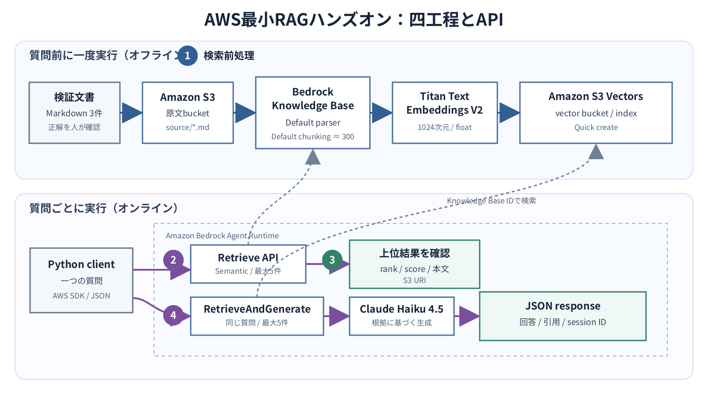

# 10.2 最小AWS構成を理解する

このハンズオンで作るAWSリソースは、S3、S3 Vectors、Amazon Bedrock Knowledge Basesだけです。
質問はローカル端末からBedrock Agent Runtime APIへ直接送ります。

## 10.2.1 構成図

図10-1の上段は、質問が来る前に一度行う検索前処理です。
下段は、質問ごとに実行する検索、検索後処理、生成です。
丸数字はRAGの四工程を表します。



**図10-1　AWS最小RAGハンズオンの構成**

同じ構成を文字で表すと、次のようになります。

```text
質問前に一度実行
  サンプル文書
      |
      v
  S3原文バケット
      |
      v
  Bedrock Knowledge Base
      |-- Default parser / Default chunking
      |-- Titan Text Embeddings V2
      `-- S3 Vectorsのvector index

質問ごとに実行
  Pythonクライアント
      |-- Retrieve API ----------> 順位、score、本文、S3 URI
      `-- RetrieveAndGenerate ---> Claude Haiku 4.5 ---> 回答、引用、session ID
```

API Gateway、Lambda、データベース、Web UIはありません。
PythonクライアントはAWS APIの動作を確認するだけで、公開APIサーバーではありません。

## 10.2.2 リソースと役割

**表10-3　最小構成のAWSリソース**

| リソース | 数 | 役割 | 作成方法 |
|---|---:|---|---|
| S3 general purpose bucket | 1 | 原文のMarkdownを保存 | AWS CLI |
| Bedrock Knowledge Base | 1 | parser、chunking、embedding、検索をまとめる | Bedrockコンソール |
| Bedrock data source | 1 | S3の`source/` prefixをKnowledge Baseへ接続 | Bedrockコンソール |
| S3 vector bucket | 1 | embedding vectorを保存 | Knowledge Base作成時にQuick create |
| S3 vector index | 1 | 質問に近いvectorを検索 | Knowledge Base作成時にQuick create |
| Bedrock service role | 1 | Knowledge BaseがS3、embedding、S3 Vectorsを利用 | コンソールで自動作成 |
| Titan Text Embeddings V2 | 1 model | 文書と質問を1024次元vectorへ変換 | Knowledge Baseから利用 |
| Claude Haiku 4.5 | 1 model | 検索結果を基に回答を生成 | `RetrieveAndGenerate`から利用 |

S3の原文バケットとS3 vector bucketは別の種類のバケットです。
前者には読める文書を置き、後者には検索用vectorが保存されます。

## 10.2.3 四工程とAWS処理の対応

### 1. 検索前処理

1. MarkdownをS3へアップロードします。
2. data sourceの同期を開始します。
3. Default parserが本文を抽出します。
4. Default chunkingが文を約300トークンの単位へ分けます。
5. Titan Text Embeddings V2が各チャンクを1024次元のfloat vectorへ変換します。
6. vectorと原文への参照がS3 vector indexへ保存されます。

Default chunkingが約300トークンで文境界を保つことは、[Knowledge Baseのchunking](https://docs.aws.amazon.com/bedrock/latest/userguide/kb-chunking.html)で確認できます。

### 2. 検索

Pythonクライアントが`Retrieve` APIへ質問を送ります。
Knowledge Baseは質問を同じembedding modelでvector化し、意味が近いチャンクを最大5件返します。

返される各要素には、配列上の順位、`score`、本文、locationが含まれます。
本章のS3 data sourceでは、locationから原文のS3 URIを確認できます。

### 3. 検索後処理

最小構成では、専用reranker、重複排除、context圧縮を追加しません。
`numberOfResults=5`で上位5件へ絞り、次を人が確認します。

- 期待する文書が1位にあるか
- 1位の本文に、質問へ答える記述があるか
- 無関係な文書だけで上位が埋まっていないか
- scoreが同じ設定での別質問と比べて不自然に低くないか

`score`は正答確率ではありません。
モデル、データ、質問、設定を固定した中で順位を読むための値として扱います。

### 4. 生成

Pythonクライアントが同じ質問を`RetrieveAndGenerate` APIへ送ります。
このAPIは内部でKnowledge Baseを検索し、取得したチャンクをClaude Haiku 4.5へ渡して、回答と引用を返します。

`RetrieveAndGenerate`が`Retrieve`とモデル呼び出しを結合することは、[Knowledge Baseの検索方法](https://docs.aws.amazon.com/bedrock/latest/userguide/kb-how-retrieval.html)で確認できます。

診断用の`Retrieve`と、回答用の`RetrieveAndGenerate`は別々のAPI要求です。
両方へ同じ質問と5件という設定を渡しますが、最初の応答を二つ目の入力として再利用するわけではありません。
最終回答が実際に利用した出典は、`RetrieveAndGenerate`応答の引用で確認します。

## 10.2.4 固定する初期設定

**表10-4　ハンズオンで固定する値**

| 設定 | 値 | 選んだ理由 |
|---|---|---|
| AWS Region | `ap-northeast-1` | S3 Vectors、Titan Text Embeddings V2、Claude Haiku 4.5を一つのリージョンで使う |
| data source | S3 | 最少の手順でテキスト文書を配置できる |
| parser | Default parser | Markdownだけを扱い、追加モデルを使わない |
| chunking | Default chunking | 約300トークンで文境界を保ち、設定項目を増やさない |
| embedding model | `amazon.titan-embed-text-v2:0` | Knowledge Basesで東京リージョンに対応するAWSモデル |
| dimensions | 1024 | Titan V2の既定値をそのまま使う |
| vector type | float | Titan V2とS3 Vectorsで使える標準的なvector型 |
| vector store | S3 Vectors | Quick createでき、別のDBを構築しない |
| search type | Semantic | S3 Vectorsで利用する最小の意味検索 |
| results | 5 | 順位を目視でき、回答へ渡す候補を増やしすぎない |
| generation model | `anthropic.claude-haiku-4-5-20251001-v1:0` | 東京リージョンとKnowledge Baseに対応する軽量なmodel |

Titan Text Embeddings V2のモデルID、次元数、東京リージョン対応は、[Knowledge Basesの対応embedding model](https://docs.aws.amazon.com/bedrock/latest/userguide/knowledge-base-supported.html)で確認できます。
S3 Vectorsの東京リージョン対応は、[S3 Vectorsのリージョンとendpoint](https://docs.aws.amazon.com/AmazonS3/latest/userguide/s3-vectors-regions-quotas.html)で確認できます。
Claude Haiku 4.5のKnowledge Base対応と東京リージョン対応は、[Claude Haiku 4.5 model card](https://docs.aws.amazon.com/bedrock/latest/userguide/model-card-anthropic-claude-haiku-4-5.html)で確認できます。

## 10.2.5 Managed Knowledge Baseを使わない理由

Managed Knowledge Baseのほうが、保存や検索基盤をAWSへ任せられる範囲は広くなります。
ただし、2026年7月11日時点で`RetrieveAndGenerate`はManaged Knowledge Baseに対応していません。

今回の完了条件には、次の両方が含まれます。

1. `Retrieve`で検索順位とscoreを見ること
2. `RetrieveAndGenerate`で回答と引用を受け取ること

このため、ベクトルストアを選ぶ標準Knowledge Baseを使います。
コンソールでは、S3 VectorsをQuick createする選択肢を選びます。

## 10.2.6 APIの入出力

質問APIへ渡す最小入力は一つの文字列です。

```json
{
  "question": "スタンダードプランの受付時間と問い合わせ方法を教えてください。"
}
```

付属クライアントは、二つのAWS API応答を一つのJSONへ整理します。

```json
{
  "question": "...",
  "retrieval": {
    "results": [
      {
        "rank": 1,
        "score": 0.0,
        "text": "...",
        "source_uri": "s3://.../support-policy.md"
      }
    ]
  },
  "generation": {
    "answer": "...",
    "citations": [
      {
        "source_uri": "s3://.../support-policy.md"
      }
    ],
    "session_id": "..."
  }
}
```

上記の`score`は形式を示すための値で、期待値ではありません。
実行時のscoreは環境と索引状態によって変わります。

## 10.2.7 この構成へ追加しないもの

初回の成功前に、次のリソースを追加しません。

- OpenSearch Serverless
- Aurora PostgreSQL
- Amazon Kendra
- Lambda、API Gateway、ECS
- DynamoDB、ElastiCache
- Bedrock Agents、AgentCore
- reranker model
- Guardrail

追加サービスがなくても、RAGの四工程とAPI応答を確認できます。
最小構成でどの工程が失敗したかを説明できる状態を作ってから、必要な機能だけを追加します。
