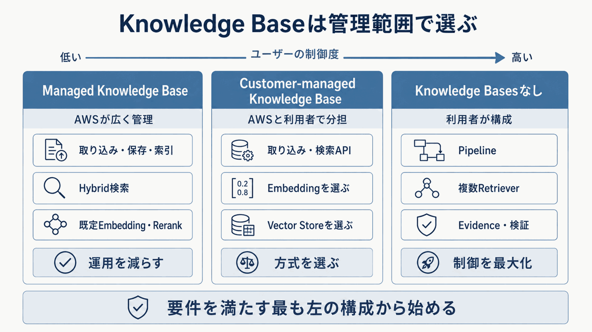
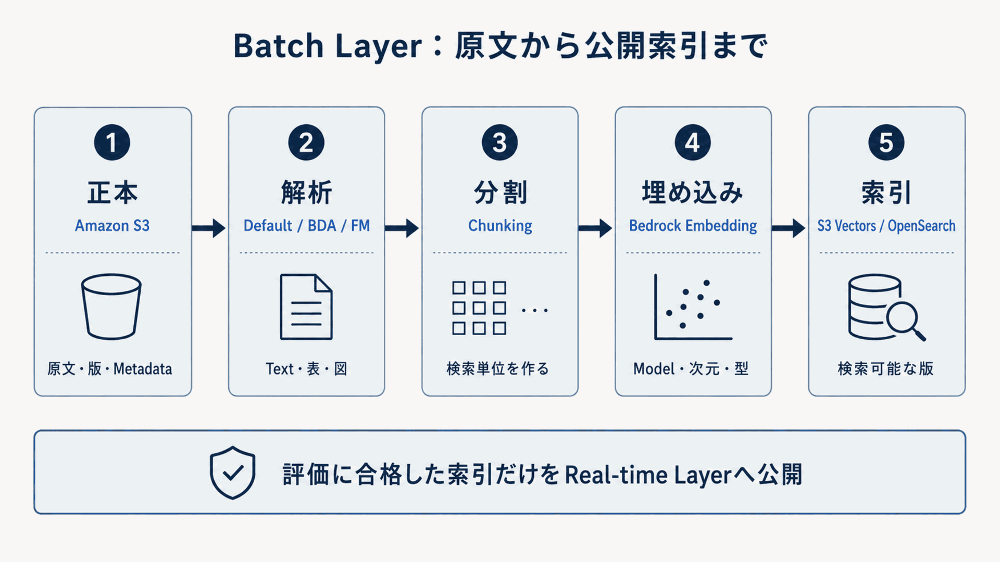
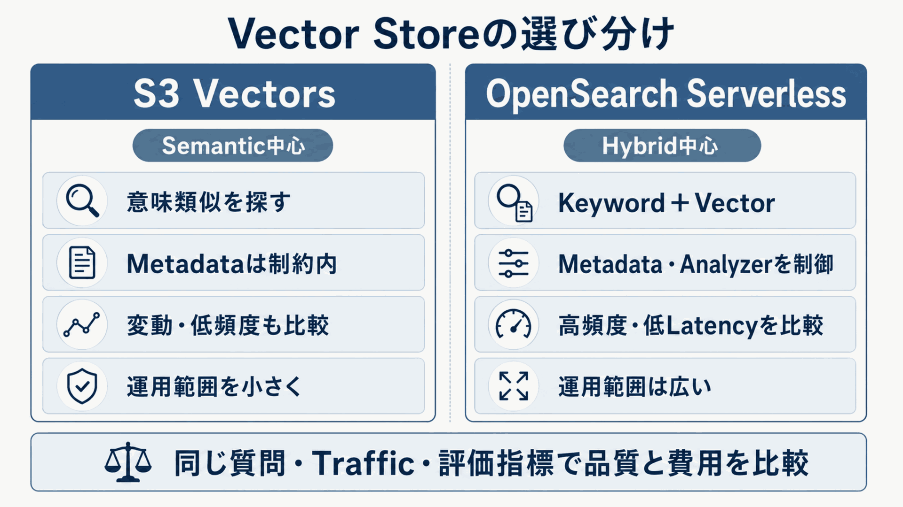

# Batch Layerを構成する

Batch Layerは、信頼できる原文を検索可能な索引へ変換します。
最初にKnowledge Baseの管理範囲を決め、次にS3、解析器、チャンク分割、埋め込み、ベクトルストアを順に選びます。

## Knowledge Baseの管理範囲を選ぶ

**図10-4 Knowledge Baseの管理範囲**

**表10-3 Knowledge Base方式の違い**

| 方式 | AWSへ任せる範囲 | 選ぶ主な条件 |
|---|---|---|
| Managed Knowledge Base | 取り込み、保存、索引、ハイブリッド検索、既定埋め込み・再順位付け | ベクトルストア運用を減らす |
| Customer-managed Knowledge Base | 取り込みと検索API | 埋め込み、ストア、スキーマを選ぶ |
| 個別構成 | AWSの保存容量・検索・モデル・実行環境 | 処理の流れと根拠を全面制御する |

### Managed Knowledge Base

Managed Knowledge Baseでは、内部ストレージとインデックスをAWSが管理します。
利用者はベクトルストアを作成せず、データソース、解析器、同期、フィルター、ACL対応検索、検索件数、再順位付け方式を選びます。

検索境界は`Retrieve`または`AgenticRetrieveStream`です。
回答の生成は、取得した根拠を使ってアプリケーションで構成します。
`AgenticRetrieveStream`は質問分解、反復検索、十分性判断を行えますが、単純な質問でも応答時間と費用が増え得るため、必要な質問型に限定して評価します。

内部インデックスへ直接アクセスできず、埋め込み方式は作成後に変更できません。
独自埋め込みを選ぶ場合は、現行仕様のfloat32・1024次元などの条件と、AWS管理の再順位付けとの組み合わせ制約を確認します。
ACL対応検索は認証の代替ではなく、アプリケーションが検証済み`userContext`を渡します。

[Managed Knowledge Baseの概要](https://docs.aws.amazon.com/bedrock/latest/userguide/kb-build-managed.html)、[agentic retrieval](https://docs.aws.amazon.com/bedrock/latest/userguide/kb-test-agentic-retrieve.html)、[ACL awareness](https://docs.aws.amazon.com/bedrock/latest/userguide/kb-test-retrieve-acl.html)を参照します（確認日：2026年9月5日）。

### Customer-managed Knowledge Base

Customer-managed Knowledge Baseでは、Knowledge Basesが取り込み Job、解析器、チャンク分割、埋め込み呼び出し、チャンクと出典の対応、ストアへの書き込み、検索APIを管理します。
利用者は埋め込みモデル、次元数、ベクトル型、ベクトルストア、インデックススキーマ、メタデータ、距離指標を選びます。

検索には`Retrieve`を使えます。
標準的な検索・生成・引用を一体化する場合は`RetrieveAndGenerate`、工程を分離する場合は`Retrieve`＋`Converse`を使います。
埋め込みモデル、次元数、ベクトル型を変えると既存ベクトルと互換ではなくなるため、全チャンクの再埋め込みと新インデックスが必要です。

[Customer-managed Knowledge Baseの作成](https://docs.aws.amazon.com/bedrock/latest/userguide/knowledge-base-create.html)、[対応StoreとVector Type](https://docs.aws.amazon.com/bedrock/latest/userguide/knowledge-base-setup.html)、[Knowledge Baseからの情報取得](https://docs.aws.amazon.com/bedrock/latest/userguide/kb-test-retrieve.html)を参照します（確認日：2026年9月5日）。

### AWSの部品を個別に組み合わせる構成

次の要件が必須なら、アプリケーションからS3 VectorsまたはOpenSearchを直接呼ぶ構成を比較します。

- 複数インデックス・検索器を独自RRFや重み付き統合で統合する
- 独自チャンクスキーマ、親チャンク-child、表、節、ACLを完全に制御する
- 候補ごとの採否理由と根拠集合を必ず記録する
- 検索、圧縮、入力への配置、生成、主張検証を個別にトレースする

AWSの各サービスを、用途に応じて組み合わせます。
S3、S3 Vectors、OpenSearch Serverless、Bedrock モデル、Lambda、ECS、EKS、AgentCore Runtimeを部品として使い、結合ロジックを利用者が持つ構成です。

## 原文から公開索引までをつなぐ

**図10-5 Batch Layerの取り込みと公開フロー**

### Amazon S3を正本にする

S3は原文、版、取り込み対象、メタデータを保持します。
S3 Vectorsとは別の役割です。
バケットとPrefixで対象範囲を固定し、Object キー、Versioning、暗号化キー、保持期間、所有者、公開状態、更新日、出典URLを管理します。

原文更新後は取り込み Jobで同期し、追加・変更・削除が索引へ反映されたことを確認します。
S3を正本にするなら更新経路を一つに定め、Knowledge Baseへ直接投入した変更と競合させません。
[S3 Data Source connector](https://docs.aws.amazon.com/bedrock/latest/userguide/s3-data-source-connector.html)と[Knowledge Baseへの直接取り込み](https://docs.aws.amazon.com/bedrock/latest/userguide/kb-direct-ingestion.html)を参照します（確認日：2026年9月5日）。

### 解析器を選ぶ

**表10-4 解析器の選択**

| 選択肢 | 向く文書 | 確認すること |
|---|---|---|
| 標準 | テキスト主体 | 欠落、読み順、検索Recall |
| BDA | 表、図、画像、複雑なレイアウト | 構造の忠実性、費用、応答時間 |
| 基盤モデル | 分野固有の文書構造 | モデル、プロンプト、抽出品質 |
| カスタム変換 | 独自OCR・正規化・業務スキーマ | スキーマ適合、失敗率、再現性 |

標準を基準構成にし、表・図・画像が回答根拠になる場合だけBDAまたは基盤モデル解析器を比較します。
独自OCR、帳票分類、機密情報の事前除去が必要ならカスタム変換を上流へ置きます。
[高度なParsing](https://docs.aws.amazon.com/bedrock/latest/userguide/kb-advanced-parsing.html)と[Custom transformation](https://docs.aws.amazon.com/bedrock/latest/userguide/kb-custom-transformation.html)を参照します（確認日：2026年9月5日）。

### チャンク分割を選ぶ

**表10-5 チャンク分割の選択**

| 方式 | 選ぶ主な条件 | 注意点 |
|---|---|---|
| 標準 | 最初の基準構成 | 文書構造に最適とは限らない |
| 固定長 | 再現しやすい比較が必要 | 意味境界をまたぐ場合がある |
| 階層型 | 小さく検索し、広く読ませる | 親チャンク統合で返却件数が減り得る |
| 意味に基づく | 意味の切れ目が重要 | 処理時間・費用も比較する |
| No chunking | 上流で検索単位へ分割済み | 出典位置と粒度を上流で保証する |

比較では、チャンクの意味完結性、Recall@k、親チャンク返却後のPrecision、コンテキストトークン量、引用粒度、埋め込み量を確認します。
方式を変更できないデータソースでは、新しいデータソースまたはインデックスを作って比較します。
[Chunking設定](https://docs.aws.amazon.com/bedrock/latest/userguide/kb-data-source-customize-ingestion.html)と[Chunkingの動作](https://docs.aws.amazon.com/bedrock/latest/userguide/kb-chunking.html)を参照します（確認日：2026年9月5日）。

### 埋め込みを選ぶ

文書チャンクと質問は、互換なモデル、次元数、ベクトル型で同じベクトル空間へ変換します。
候補モデルは次の軸で比較します。

- **言語と分野**：日本語、英語混在、型番、略語、専門語ごとのRecall@k
- **次元数とベクトル型**：品質、インデックス容量、記憶管理、応答時間、費用
- **処理量**：同期時間、質問の埋め込みのP95 応答時間、スロットリング
- **変更影響**：全チャンク再埋め込み、新インデックス、旧新比較、切り戻し

モデル、次元数、ベクトル型をストアスキーマと一致させます。
変更時は既存インデックスへ上書きせず、新インデックスを作って同じ評価データで比較します。
[Knowledge Bases対応ModelとStore](https://docs.aws.amazon.com/bedrock/latest/userguide/knowledge-base-supported.html)を参照します（確認日：2026年9月5日）。

## ベクトルストアを選ぶ

**図10-6 S3 VectorsとOpenSearch Serverlessの選び分け**

**表10-6 ベクトルストアの比較**

| 比較軸 | S3 Vectors | OpenSearch Serverless |
|---|---|---|
| 検索 | 意味に基づく | キーワード、ベクトル、ハイブリッド |
| メタデータ | KB連携上限内で設計 | 項目定義と検索文を柔軟に設計 |
| 運用・費用 | ベクトル保存容量、PUT、検索文中心 | OCU、保存容量、待機容量中心 |
| 向く例 | FAQ、意味類似、大量ベクトル | 型番、条文、エラーコード、全文検索 |

S3 Vectorsは意味検索中心で、Knowledge Bases連携ではハイブリッド検索に対応しません。
次元数、距離指標、non-filterable メタデータ keyは作成後に変えられないため、新インデックスが必要です。
Knowledge Bases連携ではfloat ベクトル、独自メタデータ 1Vector当たり1KB・35 keyなどの上限を確認します。
[S3 Vectors](https://docs.aws.amazon.com/AmazonS3/latest/userguide/s3-vectors.html)と[Metadata filtering](https://docs.aws.amazon.com/AmazonS3/latest/userguide/s3-vectors-metadata-filtering.html)を参照します（確認日：2026年9月5日）。

OpenSearch Serverlessはキーワード、ベクトル、ハイブリッド、フィルターを一つの検索エンジンで扱えます。
コレクション種別、インデックススキーマ、解析器、ベクトル項目、検索パイプライン、暗号化ポリシー、ネットワークポリシー、データアクセスポリシーを利用者が設計します。
IAM許可だけではデータアクセスポリシーの代わりになりません。
[Serverlessの概要](https://docs.aws.amazon.com/opensearch-service/latest/developerguide/serverless.html)、[Hybrid Search](https://docs.aws.amazon.com/opensearch-service/latest/developerguide/serverless-configure-neural-search.html)、[Data access control](https://docs.aws.amazon.com/opensearch-service/latest/developerguide/serverless-security.html)を参照します（確認日：2026年9月5日）。

費用は単価だけで決めません。
同じ保存量、検索件数、メタデータ量、応答時間要件、評価データで、品質と総費用を比較します。

## 検証済みの索引だけを公開する

公開単位には、情報源版、解析器、チャンク分割、埋め込みモデル・次元数・ベクトル型、インデックススキーマ、メタデータスキーマを含めます。
新しい索引は第7章の検索単体評価、ACLテスト、応答時間、費用の基準を満たしてからReal-time Layerへ切り替えます。
旧索引は切り戻し期間中保持します。
