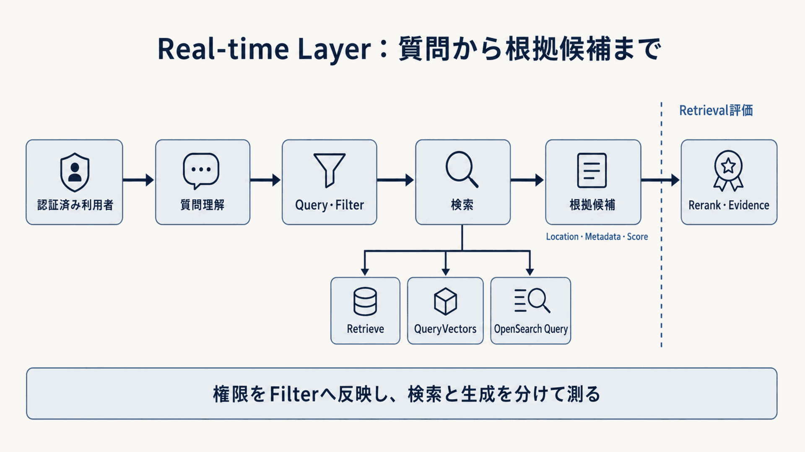

# Real-time Layerで検索する

Real-time Layerでは、認証済みの利用者コンテキストと質問から検索文・フィルターを作り、根拠候補を取得します。
検索と生成を分けて測れるよう、まず候補の取得結果で検索品質を評価します。

**図10-7 Real-time Layerの検索フロー**

## APIを選ぶ

**表10-7 Real-time APIの使い分け**

| API | 担当する範囲 | 選ぶ主な条件 |
|---|---|---|
| `Retrieve` | KBから候補・出典位置・メタデータ・スコアを取得 | 検索後処理と生成を分離する |
| `AgenticRetrieveStream` | 質問分解、反復検索、十分性判断 | Managed KBで複雑な質問を扱う |
| `RetrieveAndGenerate` | 検索、任意の再順位付け、生成、引用 | Customer-managed KBの標準経路 |
| ストア直接API | S3 VectorsまたはOpenSearchを直接検索 | スキーマ、検索文、複数インデックスを制御する |
| `Converse` | 根拠から回答を生成 | プロンプト、モデル、回答保留を分離する |

`Retrieve`はManaged / Customer-managed Knowledge Baseで使えます。
`AgenticRetrieveStream`はManaged Knowledge Base専用です。
`RetrieveAndGenerate`とストリーミング版はCustomer-managed Knowledge Baseで使います。
S3 Vectorsの`QueryVectors`やOpenSearch 検索文 APIを直接使う場合、質問の埋め込み、出典位置復元、インデックススキーマ、検索文を利用者が管理します。

APIの境界は[`Retrieve`](https://docs.aws.amazon.com/bedrock/latest/APIReference/API_agent-runtime_Retrieve.html)、[`AgenticRetrieveStream`](https://docs.aws.amazon.com/bedrock/latest/APIReference/API_agent-runtime_AgenticRetrieveStream.html)、[`RetrieveAndGenerate`](https://docs.aws.amazon.com/bedrock/latest/APIReference/API_agent-runtime_RetrieveAndGenerate.html)、[`QueryVectors`](https://docs.aws.amazon.com/AmazonS3/latest/API/API_S3VectorBuckets_QueryVectors.html)、[`Converse`](https://docs.aws.amazon.com/bedrock/latest/APIReference/API_runtime_Converse.html)を参照します（確認日：2026年9月5日）。

## 検索方式を選ぶ

- **意味検索**：意味が近い別表現を探します。S3 Vectors、Knowledge Bases、OpenSearchのベクトル検索が担当します。
- **キーワード検索**：型番、条文番号、固有語、エラーコードを語彙一致で探します。OpenSearchが担当します。
- **ハイブリッド検索**：キーワードとベクトルを組み合わせます。Managed KBのサービス側ハイブリッド、Customer-managed KB＋対応OpenSearch構成、またはOpenSearchの検索パイプラインを比較します。

S3 Vectors連携は`SEMANTIC`です。
Customer-managed Knowledge Baseで`HYBRID`を上書きできるのは、フィルターに使えるテキスト項目を持つ対応ストアに限られます。
方式の優劣を先に決めず、意味の言い換え、型番、条文、誤字、短い質問を含む同じ評価データで比較します。

## 検索設定を評価する

### 候補数

`numberOfResults`やTop-kは、生成へ渡す最終件数ではなく、最初に拾う候補数です。
少なすぎるとRecallを失い、多すぎると再順位付け、トークン、応答時間、費用を増やします。
複数のkを比較し、質問型別に必要数を決めます。

階層型チャンク分割では、複数の子チャンク候補が同じ親チャンクへ置換され、返却件数が指定値を下回る場合があります。
件数不足と検索失敗を分け、子チャンク単位のRecallと親チャンク返却後のコンテキスト量を確認します。

### スコア

検索スコアは候補の並べ替えと観測に使えますが、異なるストア、モデル、検索文方式のスコアを同じ尺度として直接比較しません。
回答保留の閾値へ使う場合は、正例と難しい負例を含む評価データから校正します。

### メタデータフィルターと利用者コンテキスト

メタデータフィルターには、`tenant`、`department`、`role`、`status`、`version`、`valid_from`、`valid_to`など、検索前に除外すべき条件を使います。
アプリケーションは、認証済みの属性情報から文書の閲覧条件を構築します。

`implicitFilterConfiguration`は質問から検索条件を補う設定です。
利用者の認証は、アプリケーションが行います。
Managed KBのACL対応検索には、検証済みの`userContext`を渡します。
この値を省くと、ACLを有効にしたデータソースの取得結果は0件になります。
同じKBにあるACL未使用のデータソースからは、通常どおり結果が返ります。
許可と拒否の両方に該当するときは、拒否が優先されます。
権限変更の反映には通常数分かかり、外部認証情報のキャッシュは最大1時間保持されます。
権限の剥奪を即時に反映する要件では、アプリケーション側でもアクセスを停止します。
許可する項目と演算子を限定し、漏れと過剰除外をAllow/Denyテストで確認します。
[Knowledge Base retrieval configuration](https://docs.aws.amazon.com/bedrock/latest/userguide/kb-test-config.html)と[ACL awareness](https://docs.aws.amazon.com/bedrock/latest/userguide/kb-test-retrieve-acl.html)を参照します（確認日：2026年9月5日）。

## AWS標準から分離する条件

次の要件がある処理だけを、Lambda、ECS、EKSまたはAgentCore Runtimeへ分離します。

- **会話から独立した検索文への変換・質問の書き換え**：会話の省略、略語、期間、表記揺れを補う
- **HyDE・Query2doc**：短い質問と文書表現の隔たりを補う
- **複数KB・インデックスへの振り分け**：分野、テナント、機密区分で検索先を分ける
- **独自統合・RRF**：複数検索器の順位を独自規則で統合する

各処理は、追加前後でRecall、応答時間、費用、トレース可能性を比較します。
検索を高度化しても、権限外候補や古い版を取得してよいことにはなりません。
