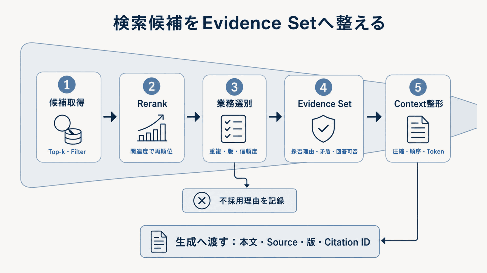
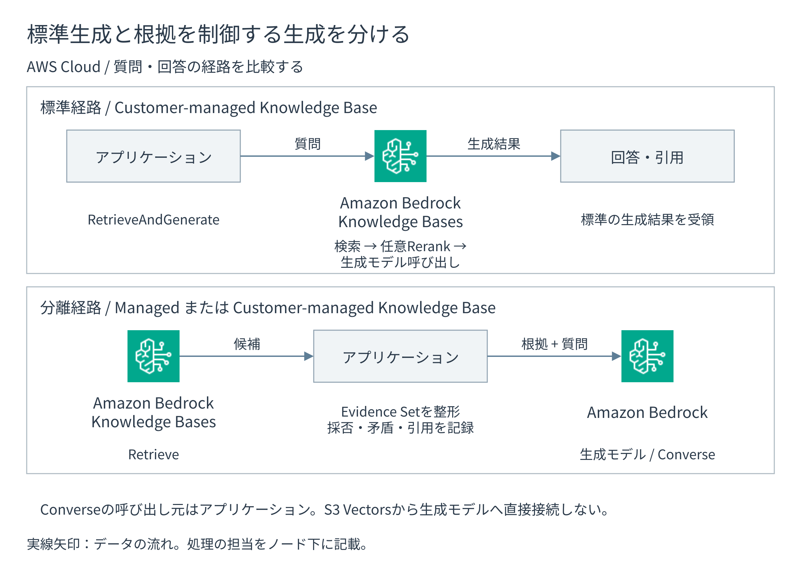

# 根拠集合を作り回答する

検索後処理は、取得候補をそのままモデルへ渡す工程ではありません。
候補を並べ直し、重複、版、信頼度、矛盾、トークン予算を確認して、回答に使う根拠集合へ変換します。
その後、根拠に基づいて回答、引用、回答保留を作ります。

## 検索候補を根拠集合へ変換する

**図10-8 検索候補から根拠集合を作る流れ**

### Bedrock Rerankを使う

Bedrock Rerankは、質問と候補テキストをまとめて評価し、関連度順を付け直します。
単体`Rerank` API、Knowledge Baseの`Retrieve`、Customer-managed Knowledge Baseの`RetrieveAndGenerate`へ組み込めます。

利用者はモデル、最初の候補数、再順位付け後の返却数、モデルへ渡すメタデータを選びます。
次を別々に評価します。

- 最初の候補数を増やしたとき、正解根拠のRecallが改善するか
- 再順位付け後の件数を減らしたとき、正解を残したままトークンを削減できるか
- nDCG、MRR、Precision、P95 応答時間、費用が改善幅に見合うか

再順位付け器は入力された候補だけを並べ替えます。
検索で取得できなかった根拠を回復できません。
最新版、公開状態、情報源 trustなどの決定的な規則も再順位付け器へ任せず、フィルターまたは業務選別で扱います。
[Bedrock Rerank](https://docs.aws.amazon.com/bedrock/latest/userguide/rerank.html)と[`Rerank` API](https://docs.aws.amazon.com/bedrock/latest/APIReference/API_agent-runtime_Rerank.html)を参照します（確認日：2026年9月5日）。

### 業務規則とコンテキストを整える

AWSのモデルと実行基盤を利用できますが、次の処理ロジックは利用者が持ちます。

- **重複排除・Diversity**：同じ文書や観点だけでコンテキストが埋まることを防ぐ
- **版・鮮度・信頼度の選別**：新旧の矛盾、公開前文書、非公式情報源を処理する
- **根拠集合**：採用・不採用理由、矛盾、回答可能性、引用 IDを記録する
- **コンテキスト圧縮**：根拠を失わず、不要部分とトークンを減らす
- **コンテキストの配置**：文書の順序、文書当たり上限、トークン配分を決める

根拠集合には、少なくとも本文、情報源、出典位置、文書版、検索器、スコア、採否理由、引用 IDを含めます。
検索結果の全件ではなく、回答へ使う根拠と使わない理由を再現できる状態を成果物にします。

## 生成経路を選ぶ

**図10-9 標準生成経路と分離生成経路**

### 標準経路：RetrieveAndGenerate

Customer-managed Knowledge Baseで、検索、任意の再順位付け、プロンプトへの結果挿入、生成モデル呼び出し、引用返却を一体化します。
構成を短くし、システム全体評価を始めやすい経路です。

ただし、API内部のコンテキスト構築が中心になるため、候補の採否理由、矛盾、回答可能性を独自スキーマで残す要件には向きません。
Managed Knowledge Baseには、次の分離経路を使います。

### 分離経路：Retrieve＋根拠集合＋Converse

Managed / Customer-managed Knowledge Baseで候補を取得し、アプリケーションが根拠集合を作って`Converse`へ渡します。
プロンプト、モデル、会話、引用 ID、回答保留、主張検証を工程別に制御できます。

分離するほど実装は増えますが、検索、再順位付け、根拠、生成を別々に評価できます。
監査、複数検索器、厳密な引用、業務固有の保留が必要なら、この経路を比較します。

どちらの経路でも、引用が存在するだけで正しい回答とは判定しません。
主要主張を引用が本当に支持するかを第7章で評価します。
[RetrieveAndGenerateのResponse](https://docs.aws.amazon.com/bedrock/latest/APIReference/API_agent-runtime_RetrieveAndGenerate.html)と[Conversation inference](https://docs.aws.amazon.com/bedrock/latest/userguide/conversation-inference.html)を参照します（確認日：2026年9月5日）。

## モデルとプロンプトを固定する

利用者はモデル / 推論プロファイル、プロンプト版、システム指示、温度、top-p、出力トークン上限、生成を止める文字列、回答形式を選びます。
Knowledge Basesのカスタムプロンプトでは検索結果を渡す`$search_results$`を含め、引用を返す構成では`$output_format_instructions$`を維持します。

モデルを大きくする前に、検索と根拠の不足を切り分けます。
モデル、プロンプト、推論パラメーターの変更は、回答の傾向に影響します。
根拠忠実性、正確性、完全性、引用精度と網羅性を回帰評価します。
形式適合、応答時間、トークン数、回答当たりの費用も確認します。
[Model API compatibility](https://docs.aws.amazon.com/bedrock/latest/userguide/models-api-compatibility.html)、[Retrieve and generate configuration](https://docs.aws.amazon.com/bedrock/latest/userguide/kb-test-config.html)、[Model lifecycle](https://docs.aws.amazon.com/bedrock/latest/userguide/model-lifecycle.html)を参照します（確認日：2026年9月5日）。

## 会話の継続と回答の確定を管理する

`RetrieveAndGenerate`のセッションIDは、会話の継続に使います。
利用者の認証と認可は、要求ごとに確認します。
アプリケーションは、利用者、会話、AWSのセッションを対応づけます。

ストリーミングは最初の表示を早めますが、総処理時間やトークン費用を必ず減らすわけではありません。
途中結果を業務処理へ使わず、回答と引用が確定した状態をUIで区別します。

## Guardrailsの役割を限定する

Bedrock Guardrailsは、入力と生成結果に対して、有害内容、禁止トピック、単語、機密情報などを検査します。
根拠との対応を調べる検査も、用途に応じて設定します。
`Converse`に関連付けるときは`guardrailConfig`を指定します。
検査対象のテキストを選ぶときは`guardContent`を使います。
モデル呼び出しから独立して検査するときは`ApplyGuardrail`を使います。
システム指示やツール結果は、項目ごとの検査範囲を確認して別途保護します。
詳しい適用範囲は[Converse APIでGuardrailsを使う](https://docs.aws.amazon.com/bedrock/latest/userguide/guardrails-use-converse-api.html)を参照します（確認日：2026年9月5日）。
本番では評価済み数値版を記録し、危険入力の検出率、正常質問の誤ブロック率、PII マスキングの漏れ、応答時間、費用を評価します。

Knowledge Basesから返る参照資料の本文は、アプリケーションでも検査します。
Guardrailsの検査対象となるモデル入出力と、取得した参照資料を分けて扱います。
マスキング後の応答を使う場合も、呼び出しログや検査トレースには元の機密情報が残り得ます。
ログの保存項目、閲覧権限、暗号化、保持期間を個別に設定します。
文書の公開状態とACLはデータソース・メタデータフィルター、根拠性は根拠・引用評価、ツール認可はIAM・AgentCore Policyで扱います。
[Guardrailsの仕組み](https://docs.aws.amazon.com/bedrock/latest/userguide/guardrails-how.html)と[Knowledge Base retrieval configuration](https://docs.aws.amazon.com/bedrock/latest/userguide/kb-test-config.html)を参照します（確認日：2026年9月5日）。

## 回答保留を設計する

回答を保留する条件を、評価データで決めます。
少なくとも次の兆候を評価します。

- 必須フィルター適用後に候補がない
- 正解を支える根拠が基準を満たさない
- 根拠が矛盾し、版・信頼度規則で解消できない
- 引用が主要主張を支えない
- Guardrailが入力または出力をブロックした
- 権限外操作、人の承認、高リスク判断が必要である

閾値は、答えるべき質問と答えるべきでない質問を含む評価データで校正します。
誤回答だけでなく、答えられる質問を過剰に保留する率も確認します。
主張単位の検証、引用再検証、人による確認への引き継ぎが必要なら、生成前後にアプリケーション処理を追加します。
