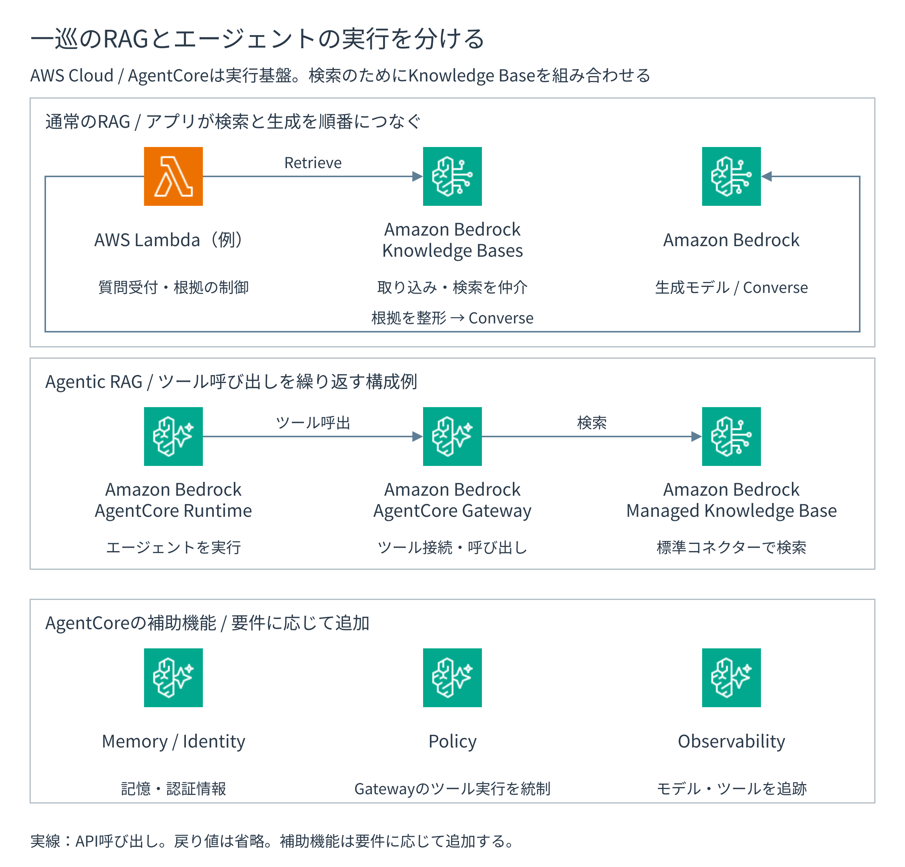

# RAGアプリケーションとAgentCoreを選ぶ

Knowledge Baseとベクトルストアは根拠を探す基盤です。
利用者を認証し、検索、根拠、生成、回答保留をつなぐアプリケーションは別に必要です。
まず通常の一問一答RAGを検討し、複数段階、ツール、記憶管理、ツール単位ポリシーが必要な場合だけAgentCoreを追加します。

**図10-10 通常RAGとAgentCore利用構成の比較**

## 通常アプリケーションを基準構成にする

次の条件なら、API GatewayまたはALBとLambda、ECS、EKSなどで動かす通常アプリケーションを基準構成にできます。

- 一つの質問に対し、検索・生成を一巡すれば完了する
- Knowledge Baseまたは検索先が一つで、動的振り分けが不要である
- ツールで業務状態を変更しない
- 長時間処理や複数段階の再開が不要である
- セッションをアプリケーションのストレージで管理できる

通常構成でも、認証、メタデータフィルター、根拠集合、モデル呼び出し、回答保留、監視は必要です。
これらは、実行基盤の選択にかかわらずアプリケーションが担う責任です。

## AgentCoreを追加する条件

AgentCoreは、RAGや業務ツールを使うエージェントアプリケーションへ実行・統制基盤を提供します。
検索には、Knowledge Baseやベクトルストアを組み合わせます。

- **AgentCore Runtime**：エージェントやツールを隔離して実行し、処理量に応じて拡張する
- **AgentCore Gateway**：API、Lambda、MCP、Managed Knowledge Baseをツールとして接続する
- **AgentCore Identity**：外部との入出力に必要な認証と認証情報を管理する
- **AgentCore Memory**：会話中のイベントと、設定した規則で抽出した長期記憶を保持する
- **AgentCore Policy**：Gatewayを通るツール呼び出しをCedar ポリシーで許可・拒否する
- **AgentCore Observability**：モデル、ツール、記憶管理をまたぐ指標とトレースを関連づける
- **AgentCore Evaluations**：タスク成功率とエージェントの実行履歴を評価する

AWSは実行環境のホスティング、セッションの分離、Gatewayの接続先、認証情報の連携、記憶管理基盤、ポリシーの評価基盤、観測基盤を提供します。
利用者はエージェントの計画、検索先、ツールスキーマ、引数、停止条件、代替処理、人による承認、記憶管理へ保存する情報を決めます。

[Amazon Bedrock AgentCore](https://docs.aws.amazon.com/bedrock-agentcore/latest/devguide/what-is-bedrock-agentcore.html)、[Runtime](https://docs.aws.amazon.com/bedrock-agentcore/latest/devguide/agents-tools-runtime.html)、[Gateway](https://docs.aws.amazon.com/bedrock-agentcore/latest/devguide/gateway-core-concepts.html)、[Policy](https://docs.aws.amazon.com/bedrock-agentcore/latest/devguide/policy-core-concepts.html)を参照します（確認日：2026年9月5日）。

## 実行環境、記憶管理、Knowledge Baseを分ける

三つは保存目的と評価方法が異なります。

- **実行環境の一時状態**：処理の継続と隔離に必要な最小状態
- **短期記憶**：会話セッション内のイベント
- **長期記憶**：利用者同意と抽出規則に基づくセッション横断の記憶
- **Knowledge Base**：組織文書を検索するための索引
- **原文S3**：版、所有者、公開状態を持つ正本

個人情報や業務秘密を記憶管理へ保存する場合、文書検索のACLとは別に、保存目的、名前空間、保持期間、削除、同意、KMS キー、ログのマスキングを設計します。
[Memory terminology](https://docs.aws.amazon.com/bedrock-agentcore/latest/devguide/memory-terminology.html)を参照します（確認日：2026年9月5日）。

## AgentCoreの採否を評価する

次の能力が必要な場合だけAgentCoreを比較します。

- 一つの質問で複数回検索し、次の検索文や検索先をエージェントが決める
- 複数Knowledge Base、社内API、Lambda、MCP ツールを選択する
- 回答後に申請、登録、通知などのツール実行を行う
- 長時間処理、複数段階、セッション隔離が必要である
- 短期記憶または長期記憶が必要である
- ツール呼び出しを決定的なポリシーで許可・拒否する
- モデル、ツール、記憶管理をまたぐ段階別のトレースが必要である

AgentCoreの採否は、実行・統制の要件から判断します。
検索品質は、検索方式と資料を対象に別途評価します。
タスク成功率、実行履歴、ツール選択・引数、反復の停止、ポリシーによる許可・拒否、記憶管理汚染、P95 応答時間、段階ごとの費用を評価します。

Managed Knowledge Baseのエージェント型検索だけが必要なら、通常アプリケーションから`AgenticRetrieveStream`を呼ぶ構成も比較します。
必要なAPIと実行基盤を個別に選べます。
Managed Knowledge BaseはGatewayの標準の接続先にできますが、Customer-managed Knowledge Baseは実行環境からAPIを呼ぶか、Lambda / API ツールとして接続します。
[Managed KB Gateway connector](https://docs.aws.amazon.com/bedrock-agentcore/latest/devguide/gateway-target-connector-managed-kb.html)を参照します（確認日：2026年9月5日）。
