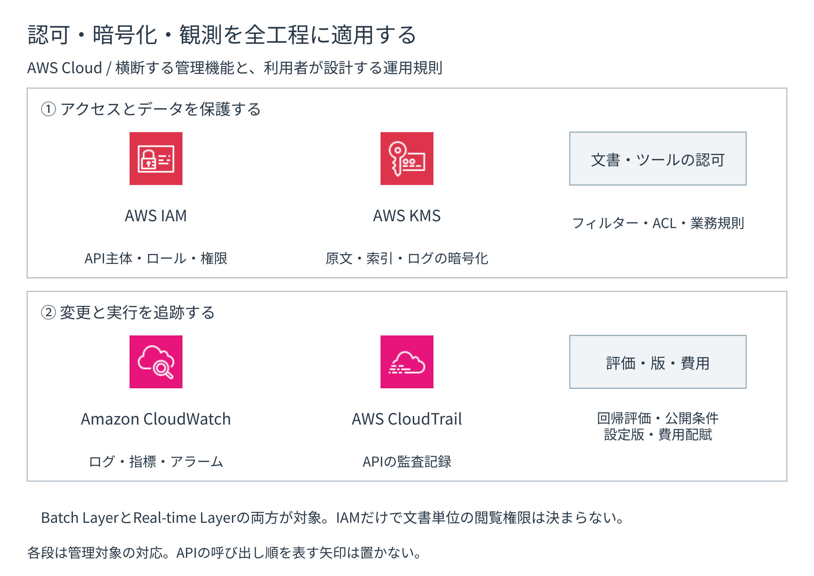

# 安全に運用し変更する

IAM、KMS、監視、評価、版管理、コスト管理は、二層の全工程に適用します。
Batch Layerの取り込みからReal-time Layerの回答まで、同じ要求と版を追跡する横断的な管理面です。

**図10-11 全工程を横断する管理面**

## 認可を四つの境界へ分ける

IAMロールは、必要な操作範囲に合わせて分けます。
役割ごとに境界を分けます。

1. **AWS APIの認可**：アプリケーションのロール、Knowledge Baseのサービスロール、AgentCore RuntimeとGatewayのロールを分け、必要な操作とリソースだけを許可します。
2. **検索基盤のデータ操作**：OpenSearch ServerlessではIAMに加えてデータアクセスポリシーを設定します。
3. **文書単位の絞り込み**：認証済みの属性情報からメタデータフィルターまたはACL `userContext`を構築します。
4. **ツール呼び出しの認可**：AgentCore Policyとツール側IAM・業務認可を組み合わせます。

文書の閲覧条件、ツールの認可、IAMの許可、利用者認証を、それぞれの役割に応じて組み合わせます。
正常な主体のAllowだけでなく、権限外主体、他テナントへのアクセス、失効済みの認証情報、ツール引数のDenyを自動テストします。
[Knowledge BasesのService role](https://docs.aws.amazon.com/bedrock/latest/userguide/kb-permissions.html)、[Managed KB permissions](https://docs.aws.amazon.com/bedrock/latest/userguide/kb-managed-permissions.html)、[Runtime security best practices](https://docs.aws.amazon.com/bedrock-agentcore/latest/devguide/runtime-security-best-practices.html)を参照します（確認日：2026年9月5日）。

## 暗号化の境界をデータ分類に合わせる

原文、ベクトル、インデックス、記憶管理、ログ、評価データを分類し、AWS所有キー、AWSマネージドキー、カスタマーマネージドKMSキーを選びます。
独自キーを使う場合は、キーの管理者と利用者を分け、各サービスロールへ必要な`kms:Decrypt`と`kms:GenerateDataKey`だけを許可します。

キーを無効化・削除すると、取り込み、検索、ログ閲覧、記憶管理へ影響します。
リソースごとに作成後のキー変更可否、再作成、移行、復旧を確認します。
[Knowledge BasesのData encryption](https://docs.aws.amazon.com/bedrock/latest/userguide/encryption-kb.html)と[OpenSearch Serverless Encryption policies](https://docs.aws.amazon.com/opensearch-service/latest/developerguide/serverless-encryption.html)を参照します（確認日：2026年9月5日）。

## 同じtrace_idで全工程を追う

Batch LayerとReal-time Layerの記録を、公開した版と`trace_id`で関連づけます。
各工程では、次の情報を残します。

- **Batch**：情報源、データソース、解析器、チャンク、埋め込み、インデックス、同期結果
- **検索**：原質問、検索文、フィルター、検索器、候補数、スコア、再順位付け前後件数
- **生成**：根拠版、プロンプト、モデル、Guardrail、引用、回答保留理由
- **エージェント**：段階、ツール、引数、ポリシー判定、記憶管理、停止理由
- **運用**：エラー、スロットリング、P95 応答時間、トークン、要求当たり費用、利用者の評価

CloudWatchは指標・ログ・アラーム、CloudTrailはAPI監査に使います。
X-RayとADOTは、複数の処理をつなぐ分散トレースに使います。
AgentCore Observabilityでは、エージェントの各段階を関連づけます。
モデル呼び出しログへ要求と応答の全文を記録する場合は、機密情報の扱いと保持期間を先に決めます。
[Managed KB observability](https://docs.aws.amazon.com/bedrock/latest/userguide/kb-managed-observability.html)、[Runtime CloudWatch metrics](https://docs.aws.amazon.com/bedrock/latest/userguide/monitoring-runtime-metrics.html)、[Model invocation logging](https://docs.aws.amazon.com/bedrock/latest/userguide/model-invocation-logging.html)、[AgentCore Observability](https://docs.aws.amazon.com/bedrock-agentcore/latest/devguide/observability-configure.html)を参照します（確認日：2026年9月5日）。

## 評価を公開条件にする

AWSの評価機能は実行基盤として使い、第7章の正解付き評価データと合格基準を共通入力にします。

- **検索単体**：Recall@k、MRR、nDCG、コンテキストの関連性・網羅性、ACL漏えい
- **再順位付け・根拠**：正解採用率、重要候補の脱落、矛盾、回答可能性
- **生成**：正確性、完全性、根拠忠実性、引用精度・網羅性、回答保留
- **エージェント**：タスク成功率、実行履歴、ツールの許可・拒否、記憶管理、不要な段階
- **非機能**：エラー、P95 応答時間、スロットリング、安全性、回答当たりの費用

LLM-as-a-judgeには偏り、変動、費用があります。
決定的な正解照合、専門家評価、本番での利用者の評価と組み合わせます。
[Knowledge Bases evaluation](https://docs.aws.amazon.com/bedrock/latest/userguide/evaluation-kb.html)、[Retrieve evaluation metrics](https://docs.aws.amazon.com/bedrock/latest/userguide/knowledge-base-eval-retrieve.html)、[AgentCore Evaluations](https://docs.aws.amazon.com/bedrock-agentcore/latest/devguide/evaluations-types.html)を参照します（確認日：2026年9月5日）。

## 変更単位と再評価範囲を固定する

プロンプトだけでなく、情報源からアプリケーションまでを一組の版として残します。

**表10-8 変更時の再作成・再評価範囲**

| 変更のまとまり | 再作成・移行 | 必須の再評価 |
|---|---|---|
| 解析器・チャンク・埋め込み | 再取り込み、再埋め込み、新インデックス | Recall、引用粒度、容量、応答時間 |
| ストア・メタデータ・ACL | 新インデックス / コレクション、既存データの補完 | 検索方式、フィルター、Allow/Deny、費用 |
| 再順位付け・生成・Guardrail | 設定 / 版更新 | nDCG、根拠忠実性、引用、安全性 |
| エージェント・ツール・記憶管理・アプリケーション | エージェント / アプリケーション版更新 | タスク成功率、実行履歴、ポリシー、切り戻し |

Managed KBの埋め込み方式、S3 Vectorsの次元数・距離指標・フィルター対象外のキー、OpenSearchのコレクション種別や互換性のない項目定義は、新しいKnowledge Baseまたはインデックスを必要とする場合があります。
上書きせず、新旧を同条件で比較してから切り替えます。

Prompt managementとGuardrailsはDRAFTではなく、評価済み数値版を公開する版へ固定します。
[Prompt versionのDeploy](https://docs.aws.amazon.com/bedrock/latest/userguide/prompt-management-deploy.html)と[GuardrailのVersion](https://docs.aws.amazon.com/bedrock/latest/userguide/guardrails-test.html)を参照します（確認日：2026年9月5日）。

## 費用を工程別に配賦する

**表10-9 工程別の主な費用要因**

| 工程 | 主な費用要因 |
|---|---|
| Batch | 原文保存容量、解析器、埋め込み、同期、再取り込み |
| 検索 | Managed KB、S3 Vectorsの検索要求、OpenSearch OCU、再順位付け候補数 |
| 生成 | 入力・出力トークン数、モデル、Guardrails、ストリーミング |
| アプリケーション・運用 | 実行環境、Gateway、記憶管理、ログ、トレース、評価 |

単価だけでなく、保存量、検索頻度、候補数、トークン、待機容量、再処理を同じ利用量前提へ換算します。
費用削減のためにTop-kやコンテキストを減らす場合も、第7章の品質基準を公開条件にします。
[Application inference profilesによるCost management](https://docs.aws.amazon.com/bedrock/latest/userguide/cost-mgmt-application-inference-profiles.html)、[Amazon Bedrock pricing](https://aws.amazon.com/bedrock/pricing/)、[AgentCore pricing](https://aws.amazon.com/bedrock/agentcore/pricing/)を参照します（確認日：2026年9月5日）。

## ADRで設計を完了する

**ADR（Architecture Decision Record、設計上の意思決定記録）**には、採用案と次の情報を残します。

- **工程と責任**：四工程・二層の入出力、AWSが管理する範囲、利用者が実装する範囲
- **選択理由**：KB方式、解析器、チャンク分割、埋め込み、ストア、API、モデル、AgentCoreの採否
- **セキュリティ**：IAM主体、KMS キー、ネットワーク、ACL / フィルター、ツールポリシー
- **検証**：評価データ、指標、合格基準、費用前提、失敗時の保留・引き継ぎ
- **変更**：再取り込み、再埋め込み、再索引、切替、切り戻し、再検討条件

これにより、AWSサービス名の一覧ではなく、責任分界と検証可能な構成として第1章から第9章の設計を実装へ翻訳できます。
