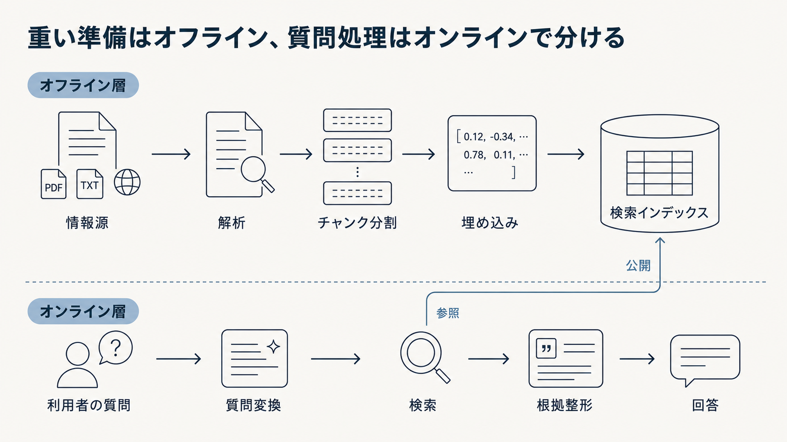

# 2.5 二つの層

四つの工程は処理の目的を表しますが、システムを運用するには、処理をいつ実行するかも決める必要があります。
本書では、質問前に実行できる処理をオフライン層、質問ごとに実行する処理をオンライン層として整理します。

図2-6は、上段のオフライン層で検索インデックスを準備し、下段のオンライン層が質問時にそのインデックスを参照する関係を示します。
上段と下段をそれぞれ左から右へ読み、中央の矢印で「準備済みの成果物を質問時に使う」という境界を確認します。

**図2-6　オフライン層とオンライン層の分担**

## 2.5.1 層を分ける理由

文書解析や埋め込み生成は、利用者から質問が届く前に実行できます。
利用者の権限、会話履歴、現在時刻に依存する検索条件は、質問が届くまで確定できません。
二種類の処理では、求められる応答時間、再現性、費用、障害対応が異なります。

[Dataflow Model](https://doi.org/10.14778/2824032.2824076)は、データ処理について、正しさ、結果が利用可能になるまでの時間、費用を別々の軸として扱いました。
RAGでも、事前処理と質問時処理を分けると、知識が古い問題と、質問への応答が遅い問題を別々に管理できます。

層は製品名やチーム名を付けるための分類ではありません。
障害の切り分け、担当範囲、リリース、監査の境界として使います。
必要に応じて処理を別の層へ移せるよう、入出力の契約を保ちます。

## 2.5.2 オフライン層

オフライン層は、情報源の文書と変更イベントを受け取り、解析、正規化、分割、メタデータ付与、埋め込み生成、インデックス構築、品質検査を行います。
更新や削除を継続的に取り込む処理も、この層の責任です。

成果物は、版を持つ検索インデックス、チャンクの一覧、設定と版を記録した構成一覧（マニフェスト）、取り込み結果の報告です。
単にベクトルデータベースへデータが保存された状態ではありません。
情報源から同じ成果物を再構築でき、文書の欠落や権限の不整合を検査できる必要があります。

オフライン層のサービス目標には、情報源の変更が検索可能になるまでの時間、削除と権限剥奪の反映時間、再構築時間、処理失敗率などがあります。
これらは利用者の質問に対する応答時間とは別に測ります。

[EnrichIndex](https://arxiv.org/abs/2504.03598)のように、LLMを用いて文書間の関係や説明を事前に追加する方法もあります。
質問時の計算を減らせる一方、生成誤りがインデックスへ保存され、文書更新時の再計算が増えます。
事前生成した内容を原文と区別し、生成器とプロンプトの版を記録します。

## 2.5.3 オンライン層

オンライン層は、利用者の質問、識別情報、会話状態、要求ごとの方針を受け取ります。
認可、質問理解、検索、再順位付け、根拠配置、生成、引用を、応答期限内に実行します。
現在値が必要な場合は、質問時にAPIやデータベースも参照します。

出力は、回答または回答保留、引用、警告、トレースIDです。
応答時間は平均値だけでなく、50、95、99パーセンタイル（それぞれの割合の要求が、その時間以内に収まる境界値）など、遅い要求を含む分布で確認します。
可用性、要求当たりの費用、権限フィルターの正しさも測ります。

利用者の権限、現在時刻、会話中の参照先は要求ごとに変わります。
これらをオフライン層で固定すると、古い権限や別の利用者の文脈を使う危険があります。
キャッシュを利用する場合も、利用者、権限、インデックス版、質問条件をキーへ含めます。

## 2.5.4 二層と四工程の関係

二層と四工程は、厳密な一対一対応ではありません。
検索前処理は主にオフライン層で動き、検索、検索後処理、生成は主にオンライン層で動きます。
評価、版管理、方針は両方の層を横断します。

表2-1は、四工程の主な配置と例外を示します。
左端で工程を選び、中央で通常の配置、右端で質問や処理条件によって配置が変わる例を確認します。

**表2-1　四工程と二層の対応**

| 工程 | 主な配置 | 例外となる処理 |
|---|---|---|
| 検索前処理 | オフライン | 質問時に取得する最新API値 |
| 検索 | オンライン | 頻出質問に対する事前計算候補 |
| 検索後処理 | オンライン | 質問に依存しない要約や固有表現の抽出 |
| 生成 | オンライン | インデックスへ付加する事前生成の説明 |

配置を決める基準は分類名ではなく、その処理が何に依存するかです。
質問、利用者、現在状態に依存しない処理は事前計算できます。
質問の意図、権限、根拠不足の状態に依存する処理はオンラインに残します。

## 2.5.5 オフラインへ移す処理

オンラインの応答時間や費用が大きい場合は、文書要約、エンティティ、想定質問、文書間の橋渡し情報を事前に作る方法があります。
質問時には、事前計算済みの情報を検索するため、LLM呼び出しや入力トークンを減らせます。

[IndexRAG](https://arxiv.org/abs/2603.16415)は、共有エンティティを利用して文書間の橋渡しとなる事実をインデックス作成時に生成し、複数文書を必要とする質問応答を扱いました。
[EnrichIndex](https://arxiv.org/abs/2504.03598)も、暗黙の関係をオフラインで明示化する方法です。
これらは比較的新しい研究であり、対象データと運用条件で再検証する必要があります。

事前計算には、保存容量、再構築時間、知識の鮮度という費用があります。
生成誤りが多くの質問へ再利用される危険もあります。
オンライン応答時間だけでなく、更新後に再計算が完了するまでの時間と、原文にない内容の混入率を測ります。

## 2.5.6 オンラインへ残す処理

利用者の識別情報、現在時刻、会話履歴、要求固有のフィルターは、質問が届くまで確定しません。
根拠不足時の追加検索や、質問の複雑さに応じた経路選択も質問に依存します。
[Adaptive-RAG](https://arxiv.org/abs/2403.14403)は、質問の複雑さを分類し、異なる検索拡張処理を選びました。

オンラインへ処理を残すと、質問に合わせて柔軟に制御できます。
一方で、LLM呼び出しが増えると、応答時間、費用、出力のばらつきが増えます。
各処理に期限、最大回数、失敗時の代替経路を設定します。

事前計算できるかだけでなく、事前計算すると意味、権限、鮮度が不適切にならないかを確認します。
利用者ごとのアクセス権を反映した要約を共有キャッシュへ保存するような設計は避けます。

## 2.5.7 層間の契約

オフライン層とオンライン層の間には、暗黙の共有データではなく、明示的な契約を置きます。
オフライン層は、インデックスとメタデータのスキーマ、版、鮮度、ACL表現、距離尺度を公開します。
オンライン層は、使用したインデックス版、フィルター、質問変換、候補IDをトレースへ残します。

スキーマや埋め込みモデルを変更する場合は、新しいインデックスを別に構築し、同じ質問集合で評価してから切り替えます。
互換性のない質問エンコーダーと文書ベクトルを組み合わせてはいけません。
問題が生じた場合に旧版へ戻せるようにし、削除済み文書や古いACLまで復元しないようデータ変更と処理版を分けます。

権限外の本文は、生成用コンテキストだけでなく、デバッグログや評価データにも流しません。
層間契約があれば、同じ質問を異なるインデックスへ実行し、変更による差を再現できます。

## 2.5.8 分類の適用範囲

オフラインとオンラインは、RAG研究で唯一の標準分類ではありません。
本書では、責任、サービス目標、リリースの境界を説明するために使います。

複数件をまとめる一括処理（バッチ処理）とオフライン処理、変更に即時に応じる処理（リアルタイム処理）とオンライン処理を完全な同義語にはしません。
文書の変更イベントを継続的に処理する増分取り込みは、オフライン層の責任であっても、長時間の一括処理ではありません。
オンライン層の処理でも、非同期で結果を返す長時間調査があります。

[Dataflow Model](https://doi.org/10.14778/2824032.2824076)がイベント時刻や処理開始条件（トリガー）を用いて一括処理と継続処理（ストリーム処理）を統一的に扱ったように、中間的な処理形態を認めます。
製品の「バッチ」「リアルタイム」という機能名ではなく、処理が依存する情報と求めるサービス目標から配置を決めます。
