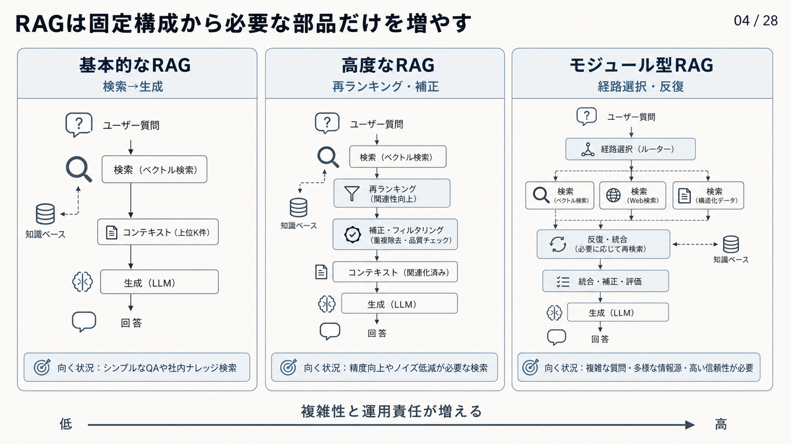

# 2.6 RAGの発展段階

RAGには、単純な検索と生成から、質問に応じて処理を組み替える構成まであります。
発展段階は導入した技術の数を競う成熟度ではなく、観測された失敗に必要な制御を選ぶために使います。

図2-4は、左から基本的なRAG、高度なRAG、モジュール型RAGを並べています。
各列を上から下へ読んで処理経路を確認し、下端の矢印で、右へ進むほど構成と運用責任が増えることを読み取ります。
右へ進めば必ず品質が上がるという図ではありません。
図中の「再ランキング」は本文の「再順位付け」と同じ処理であり、基本的なRAGのベクトル検索は一例です。
キーワード検索でも最小構成を作れます。
図中の「ユーザー」は、本文の「利用者」と同じ意味です。

**図2-4　RAGの発展段階と増える運用責任**

## 2.6.1 発展段階の使い方

[RAGのサーベイ](https://arxiv.org/abs/2312.10997)は、RAGをNaive RAG、Advanced RAG、Modular RAGとして整理しました。
段階が進むほど、検索前後の処理や制御経路を細かく設計できます。
一方で、応答時間、費用、構成の複雑さ、出力のばらつきも増えます。

すべての質問を最も複雑な経路へ送る必要はありません。
固定した構成で十分に答えられる質問は短い経路を使い、複数段階の検索や外部ツールが必要な質問だけを別の経路へ振り分けます。
段階を上げる条件は、流行している手法ではなく、現在の構成で繰り返し観測される失敗です。

## 2.6.2 基本的なRAG（Naive RAG）

基本的なRAGは、次のような最小構成です。

`質問 → 上位数件の検索 → プロンプトへの追加 → LLMによる回答`

検索拡張生成の基本を学び、小規模な概念実証を作るには有用です。
[LewisらのRAG](https://arxiv.org/abs/2005.11401)が示した、外部文書を取得して生成へ利用する考え方を確認できます。

ただし、最小構成には本番で必要な責任が抜けやすくなります。
文書の版とACL、候補の再順位付け、重複排除、引用、回答保留、処理トレースがない場合、誤答の原因と情報漏えいを調べられません。
権限外の文書を検索した後で画面だけから隠す構成も不適切です。

基本的なRAGを本番の完成形とは見なしません。
狭いデータと質問で基礎動作を確認し、次段階へ進むために不足している要件を特定する構成です。

## 2.6.3 高度なRAG（Advanced RAG）

高度なRAGは、固定した検索・生成パイプラインの各工程を分け、品質と安全性を高める段階です。
質問の正規化、キーワード検索と意味検索、必須の絞り込み、再順位付け、重複排除、コンテキスト配置を明示します。
生成では、根拠付きプロンプト、引用、回答保留、検証を標準経路へ含めます。

各工程の入力と出力を記録すると、同じ正解集合で変更前後を比較できます。
[RAGChecker](https://arxiv.org/abs/2408.08067)は、検索器と生成器を細かな単位で調べる診断指標を提案しました。
最終回答の正しさだけでなく、根拠の回収、利用、ノイズ、ハルシネーションを分けて調べられます。

高度なRAGは、派手な反復処理や外部ツールの実行を意味しません。
固定経路で失敗を再現し、危険な回答を止められることが重要です。
社内文書QAなどの最初の本番候補として、本書はこの段階を基準にします。

## 2.6.4 モジュール型RAG（Modular RAG）

モジュール型RAGは、質問や途中結果に応じて、処理モジュールを組み替える構成です。
経路選択部品、計画器、検索器、SQL、知識グラフ、検証器などを、必要な場合だけ実行します。
[Modular RAG](https://arxiv.org/abs/2407.21059)は、直線、分岐、反復、複数結果の統合という処理構造を整理しました。

モジュールが多いこと自体が目的ではありません。
例えば、通常のFAQは固定した文書検索へ送り、複数文書をたどる質問だけを分解と反復検索へ送ります。
構造化データが正解となる質問は、文書検索ではなくSQL経路へ振り分けます。

各モジュールには、入力と出力のスキーマ、権限、期限、再試行、停止条件を定義します。
部品間の接続条件が曖昧なままモジュールを増やすと、どの処理が判断し、どの処理が権限を強制するか分からなくなります。

## 2.6.5 適応的・補正的・内省的RAG

適応的、補正的、内省的なRAGは、検索の要否、取得した根拠の品質、追加検索の必要性を処理途中で判断します。
固定した一回の検索で解けない質問に、必要な処理だけを追加できる点が共通しています。

[Self-RAG](https://arxiv.org/abs/2310.11511)は、検索の要否、根拠の関連性、回答の支持性などを示すリフレクショントークンを用いました。
[Corrective RAG](https://arxiv.org/abs/2401.15884)は、取得文書を評価し、必要に応じて検索結果を補正する構成を提案しました。
[FLARE](https://arxiv.org/abs/2305.06983)は、生成途中で不確かな内容が現れたときに追加検索を行います。

これらの方法では、処理を選ぶ判定器自身も誤ります。
不要な検索を繰り返す、十分な根拠を不十分と判断する、誤った根拠を合格させる可能性があります。
反復回数、応答時間、費用の上限、停止理由、固定構成へ戻す条件を定めます。

## 2.6.6 外部ツールを使うRAG（Agentic RAG）との境界

外部ツールを使うRAGでは、文書検索だけでなく、計算、データベース照会、API呼び出し、業務操作を複数段階で実行します。
[ReAct](https://arxiv.org/abs/2210.03629)は、推論、行動、外部環境からの観測を交互に行う方法を提案しました。
外部へ作用する行動は、読み取り専用の検索より強い権限と副作用を持ちます。

単純なFAQをこのような反復処理へ送ると、回答品質が変わらないまま応答時間、費用、攻撃面が増える可能性があります。
計算や業務操作が必要な質問だけを該当経路へ送ります。

外部ツールを使うRAGでは、回答品質だけでなく、業務が完了したか、認可された操作だけを実行したか、同じ操作を重複実行しなかったか、停止条件を守ったかを測ります。
書き込み、削除、外部送信には、人による承認や追加の方針判定を置きます。

## 2.6.7 段階の比較

表2-2は、四つの段階について、処理、適する用途、増える負担、次へ進む条件を比較します。
左端で現在の段階を選び、同じ行を右へ読むと、高度化によって得る機能と引き受ける負担を対にして確認できます。

**表2-2　RAGの発展段階の比較**

| 段階 | 主な処理 | 適する用途 | 増える負担 | 次へ進む条件 |
|---|---|---|---|---|
| 基本的なRAG | 一回の検索と生成 | 学習、狭い概念実証 | 診断・権限・引用が不足します | 本番要件を満たす必要があります |
| 高度なRAG | 固定した多段パイプライン | 最初の業務用RAG | 工程別評価と運用が必要です | 固定経路で解けない失敗があります |
| モジュール型RAG | 条件付きの分岐・反復 | 複数の情報源や複雑な質問 | 結果のばらつき、費用、監査負担が増えます | 追加経路の改善効果を確認します |
| 外部ツールを使うRAG | 検索と外部行動 | 調査、計算、業務ツール連携 | 副作用、認可、停止制御が必要です | 外部行動が業務上必要です |

基本的なRAGから高度なRAGへ進む理由は、本番要件が不足しているためです。
高度なRAGからモジュール型RAGへ進む理由は、固定経路で再現する具体的な失敗があるためです。
例えば、複数文書の関係をたどれない質問だけを知識グラフ経路へ送り、すべての質問を複雑化しません。

各段階に、リリース単位と戻り先を用意します。
全体平均が改善しても、権限、特定言語、答えのない質問などの一部で悪化していないかを確認します。

## 2.6.8 導入原則

最初に作るべきものは、動くだけの構成ではなく、変更前後を比較できる構成です。
高度なRAGの固定基準を版管理し、失敗をデータ、検索、検索後処理、生成、方針へ分類します。

一度に複数のモジュールを変更すると、改善または悪化の原因を特定できません。
一つの変更を加え、同じ評価データで品質、応答時間、費用、安全性を比較します。
[ML Test Score](https://research.google/pubs/the-ml-test-score-a-rubric-for-ml-production-readiness-and-technical-debt-reduction/)が示すように、モデルだけでなくデータとパイプラインを継続的に検査する仕組みが必要です。

改善が再現しないモジュールは外すか、効果が確認できた質問群へ限定します。
技術の新しさやモジュール数ではなく、観測された失敗を減らし、追加負担が許容範囲にあることを構成へ残す条件とします。
