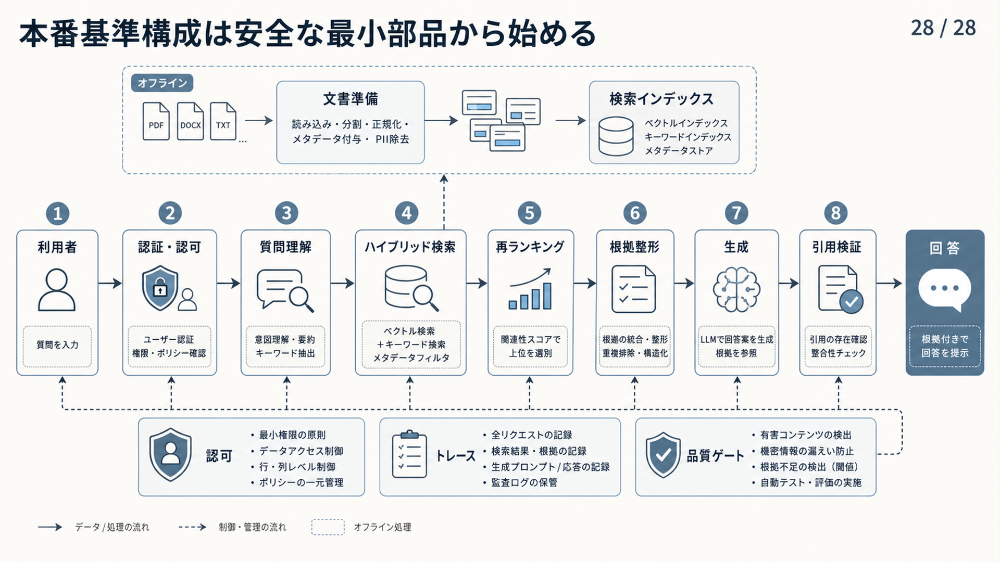
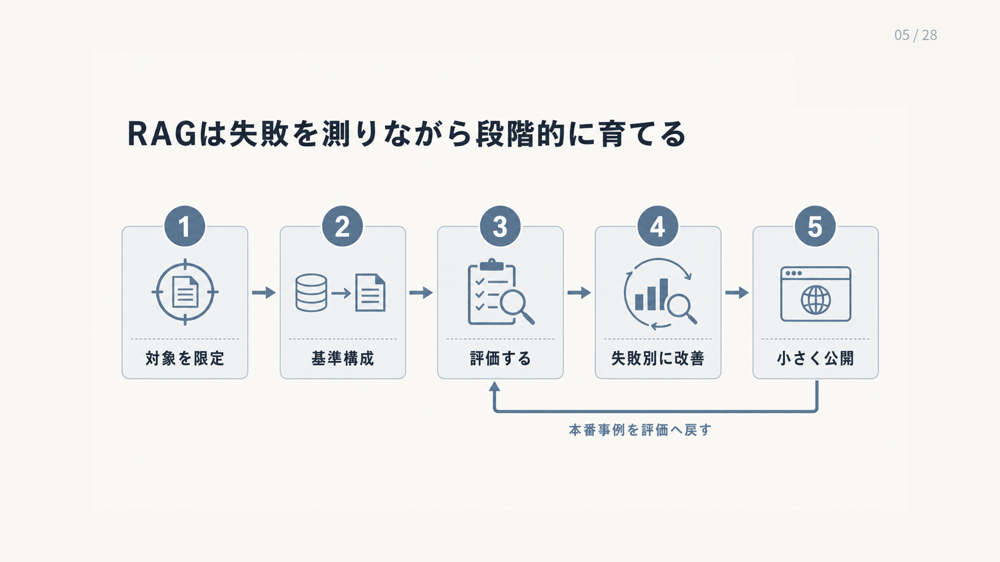

# 2.7 最初に作る構成と育て方

最初の業務用RAGは、対象を限定した固定パイプラインとして作ります。
正本、権限、引用、回答保留、評価、ロールバックを最初から含め、観測した失敗に応じて拡張します。

## 2.7.1 小さな高度なRAG（Advanced RAG）

対象は、一つの製品、一つの部門、一つの業務など、人が正解根拠を確認できる範囲へ限定します。
文書種別、利用者、代表質問、答えてはいけない質問を決めます。

オフライン層には、次の処理を置きます。

- 情報源と正本の台帳
- 文書解析と検索単位への分割
- 来歴メタデータとACLの継承
- BM25用の転置インデックス
- 埋め込み生成とベクトルインデックス
- インデックス版、品質検査、公開とロールバック

オンライン層には、次の処理を置きます。

- 利用者の認証と検索前の認可
- 質問の正規化と条件抽出
- キーワード検索と意味検索
- RRFなどによる候補統合
- 再順位付け、重複排除、コンテキスト配置
- 根拠付き生成、引用、回答保留
- 要求単位のトレース

[RRF](https://dl.acm.org/doi/10.1145/1571941.1572114)は、異なる検索結果を元のスコア尺度へ依存せず順位で統合する基準として利用できます。
[ALCE](https://arxiv.org/abs/2305.14627)が扱った引用の正しさと網羅性は、最初の構成から評価対象へ含めます。

ここでいう「小さい」は、単に部品数が少ないという意味ではありません。
正しい根拠を取得したか、権限外文書を取得していないか、答えがない質問を保留できたかを診断できる最小範囲です。

図2-5は、上段に質問前の文書準備、中央に質問から回答までの八工程、下段に全工程を支える認可、処理記録、品質検査を配置しています。
実線を左から右へ追ってデータの流れを読み、破線で各工程に適用される制御を確認します。
図中の「再ランキング」は本文の「再順位付け」と同じ処理です。
図中の「ユーザー」は本文の「利用者」と同じ意味です。
図中の「品質ゲート」は、公開の合否を決める品質判定を指します。
個人を識別できる情報（Personally Identifiable Information：PII）の除去は、利用条件で必要な場合に行う処理例であり、すべての資料へ一律に適用する意味ではありません。

**図2-5　安全な最小本番構成**

## 2.7.2 失敗パターンによる拡張

RAGを育てる作業は、新製品の機能一覧ではなく、失敗記録から始めます。
質問、検索候補、LLMへ渡した根拠、回答、引用を同じトレースIDで結びます。
期待した根拠と実際の処理を比較し、最初に失敗した工程を特定します。

表2-3は、観測した失敗から最初の調査箇所と変更候補を選ぶための対応表です。
左端で症状に近い行を選び、中央の箇所を調べて原因を確かめてから、右端の変更候補を一つずつ試します。

**表2-3　失敗パターンと最初に調べる箇所**

| 観測した失敗 | 最初に調べる箇所 | 変更候補 |
|---|---|---|
| 正しい根拠が検索候補にありません | 情報源、解析、分割、質問、フィルター | 正本追加、再解析、分割変更、検索方式変更 |
| 候補にはあるが根拠集合から落ちます | 再順位付け、フィルター、重複排除、トークン上限 | 候補数、しきい値、配置規則の変更 |
| 根拠集合にあるが回答が誤ります | プロンプト、複数根拠の統合、回答可能性 | 指示、出力契約、検証の変更 |
| 引用が主張を支えません | 引用生成、原文範囲、画面表示 | 主張単位の対応付けと検証 |
| 権限外文書が候補へ入ります | ACL継承、認可、フィルター、キャッシュ | 公開停止とアクセス制御の修正 |

[RAGChecker](https://arxiv.org/abs/2408.08067)のように細かな単位で調べる評価は、検索と生成の失敗を分ける際に役立ちます。
一度に一つの変更を試し、改善した指標だけでなく、応答時間、費用、権限、安全性への影響を記録します。

## 2.7.3 導入の段階

導入は、次の五段階に分けられます。

1. **試作**：数件の資料と質問で、検索と生成の流れを理解します。
2. **範囲を限定した基準構成**：対象業務を限定し、正本、ACL、正解根拠、答えのない質問を用意します。
3. **本番用の基準構成**：固定したAdvanced RAGへ、引用、回答保留、監視、ロールバックを含めます。
4. **管理された改善**：再順位付け、質問書き換え、圧縮などを一つずつ比較します。
5. **必要な箇所だけの高度化**：知識グラフ、SQL、外部ツールを使う処理、画像などを扱う処理を、必要な質問だけへ追加します。

初期段階では、正本とACLを整え、キーワード検索と意味検索を比較し、引用と回答保留を実装します。
次に、再順位付け、評価、インデックスの更新・切替を安定させます。
質問書き換えやコンテキスト圧縮は、基準となる回帰評価を用意してから追加します。

各段階には、進む条件と戻す条件を定めます。
新しい経路が特定の質問群だけで有効なら、その質問群へ限定します。
改善が再現しない場合に以前の構成へ戻せるよう、複雑さを不可逆な成長にしません。

## 2.7.4 リリース判定

リリースは、最終回答の平均正答率だけで決めません。
少なくとも、次の条件を確認します。

- 代表質問で、承認済みの基準構成以上の品質です。
- 答えがない質問で、根拠のない回答を生成しません。
- 権限試験で、権限外の本文と機密メタデータが候補、回答、ログへ現れません。
- 引用が主張を支持し、必要な主張を十分に覆います。
- 95パーセンタイルの応答時間と要求当たり費用が、定めた上限内です。
- 更新、削除、権限剥奪が定めた時間内に反映されます。
- 旧構成へ戻す手順を実行し、削除済み文書や古いACLが復活しません。

インデックス、解析器、分割器、埋め込みモデル、検索設定、プロンプト、生成モデル、方針を一つの公開構成一覧（リリースマニフェスト）へ記録します。
一部だけ版が変わった構成を、同じリリース名で扱いません。

[RAGGED](https://arxiv.org/abs/2403.09040)が示したように、検索候補数を増やしても最終回答が改善するとは限りません。
検索再現率、ノイズ量、生成品質を一続きで評価します。
[ML Test Score](https://research.google/pubs/the-ml-test-score-a-rubric-for-ml-production-readiness-and-technical-debt-reduction/)の観点も参考にし、データ、処理の流れ、モデル、監視を含む準備状態を確認します。

図2-6は、対象を限定し、基準構成を作り、評価し、失敗別に改善してから小さく公開する五段階を左から右へ示します。
下側の戻り矢印は、公開後の実例を再び評価へ戻し、改善を一度で終わらせないことを表します。

**図2-6　RAGを段階的に育てる流れ**

## 2.7.5 育てられる構成の条件

最初から最も高度な構成を作る必要はありません。
正本、権限、引用、回答保留、トレースを備えた小さな固定パイプラインを安定させ、その構成で解けない失敗だけを高度な経路へ送ります。

BM25、密検索、RRF、再順位付けといった基礎部品も、名称だけで採用しません。
業務の質問と正解根拠を使って比較し、改善が確認できた設定を残します。
新しい方法が一部の質問を悪化させる場合は、適用範囲を分けます。

RAGの成熟度は、モジュール数ではなく、変更前後を再現できること、危険な入力を止められること、不要な複雑さを撤回できることによって測ります。
次章から、各工程の設計と検査を詳しく説明します。
