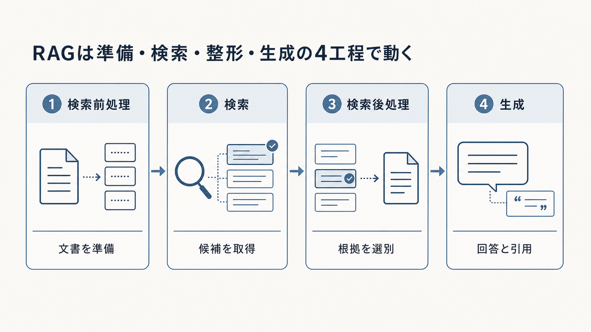

# 2. アーキテクチャ

システム全体の構成をアーキテクチャと呼びます。
RAGの処理は、質問を受け取って回答を返す部分だけではありません。
質問が来る前に資料を収集・解析して検索可能にし、質問時には根拠を検索・選別してから回答を生成します。
知識やシステムを変更した後には、版を管理し、品質と安全性を再評価する必要があります。

本章では、RAGを四つの工程に分けます。
検索前処理（Pre-retrieval）は資料を検索可能な状態へ変え、検索（Retrieval）は質問に必要な根拠候補を集めます。
検索後処理（Post-retrieval）は候補を選別・整形し、生成（Generation）は根拠に基づく回答または回答保留へ変換します。
本章はシステム全体を見渡すための地図であり、各工程の設計と評価は第3章から第6章で詳しく扱います。

同じシステムを、質問前に動くオフライン層と、質問ごとに動くオンライン層という見方でも整理します。
四工程は処理の目的を表し、二層は処理をいつ実行するかを表します。
二つの見方を使い分けると、品質問題の発生箇所、応答時間への影響、担当範囲、リリース単位を明確にできます。

後半では、単純なRAGから高度なRAGへ進む条件と、最初の業務用構成を説明します。
製品名から設計を始めず、各工程の入力、出力、失敗、評価方法を決めることが本章の目的です。

図2-1は、RAGの四工程を左から右へ示します。
文書を準備し、根拠候補を集め、必要な根拠を選び、回答と引用を作る順に読みます。
各枠の下段は、その工程が次の工程へ渡す主な成果を表します。

**図2-1　RAGを構成する四工程**
