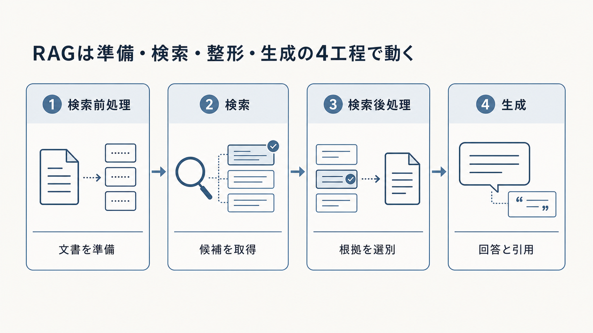

# 2. 全体アーキテクチャ

システム全体の構成をアーキテクチャと呼びます。RAGの処理は、質問を受け取って回答を返す部分だけではありません。質問が来る前に資料を収集・解析して検索可能にし、質問時には根拠を検索・選別してから回答を生成します。知識やシステムを変更した後には、版を管理し、品質と安全性を再評価する必要があります。

本章では、RAGを四つの工程に分けます。検索前処理（Pre-retrieval）は資料を検索可能な状態へ変え、検索（Retrieval）は質問に必要な根拠候補を集めます。検索後処理（Post-retrieval）は候補を選別・整形し、生成（Generation）は根拠に基づく回答または回答保留へ変換します。

同じシステムを、質問前に動くオフライン側の処理と、質問ごとに動くオンライン側の処理という見方でも整理します。四工程は処理の目的を表し、二つの処理区分は処理をいつ実行するかを表します。二つの見方を使い分けると、品質問題の発生箇所、応答時間への影響、リリース単位を明確にできます。

本章は、第3章から第9章を使うための地図です。製品名や個別のアルゴリズムから設計を始めず、各工程の入力、出力、失敗、評価方法を先に確認します。実装時は、2.1の対応表から必要な詳細へ進めます。

**図2-1　RAGを構成する四工程**
