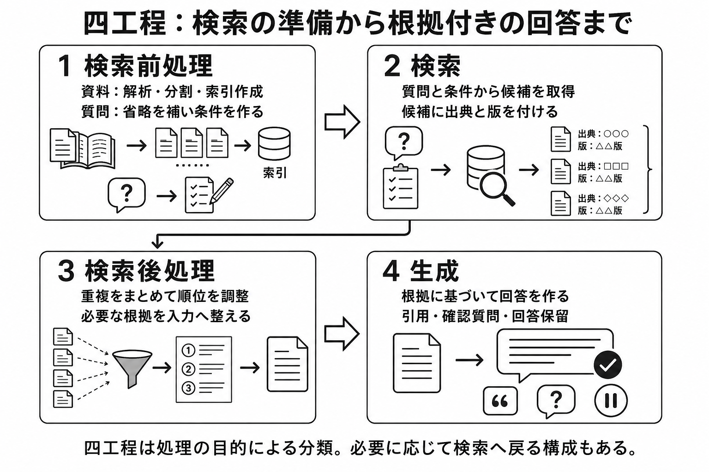

# 2. 全体アーキテクチャ

RAGは、外部情報を取得して生成へ利用するまでに複数の処理を組み合わせます。
処理の目的と実行時点を分けて考えると、各技術の役割と失敗箇所を追いやすくなります。

本書では、処理の目的を**検索前処理（Pre-retrieval）**、**検索（Retrieval）**、**検索後処理（Post-retrieval）**、**生成（Generation）**の四工程で整理します。
この分類は、Huangらの[検索拡張テキスト生成に関するサーベイ](https://doi.org/10.1145/3805774)が、RAGの研究を検索の観点から四段階に整理した枠組みに基づきます。

同じ処理を実行時点から見ると、質問前に知識を準備する**Batch Layer（バッチ層）**と、質問を受けて応答を返す**Real-time Layer（リアルタイム層）**に分かれます。
この二層は本書が実装責務を説明するために用いる区分です。
Batch LayerとReal-time Layerという名称は、開発時の責任を分かりやすくするために用います。
四工程の範囲は[公開著者版](https://arxiv.org/html/2404.10981v2)の整理に沿います。
検索前処理には、資料の準備と、質問の変換の両方が含まれます。
Real-time Layerは質問時に動く処理を表し、厳密な時間制約を保証するリアルタイムシステムという意味ではありません。
四工程とは別の分類軸であり、検索前処理にはBatch Layerの索引作成とReal-time Layerの質問変換が含まれます。

2.1で四工程と二層の関係を確認した後、2.2から2.5で各工程、2.6で評価、2.7で非機能、2.8で最初に作るAdvanced RAGの最小構成を説明します。
第3章から第9章は、各節から参照できる実装・評価用の詳細です。

**図2-1　RAGを構成する四工程**
