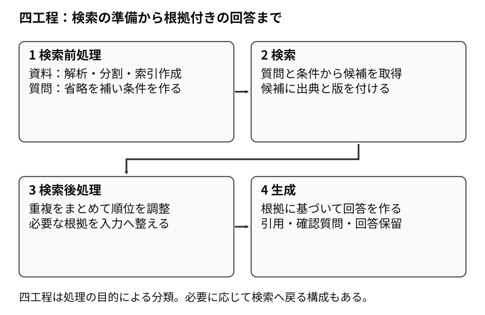

# 2. アーキテクチャ

システム全体の構成をアーキテクチャと呼びます。
RAGは、資料の準備から質問への応答までを含む仕組みです。
質問が来る前に資料を収集・解析して検索可能にし、質問時には根拠を検索・選別してから回答を生成します。
知識やシステムを変更した後には、版を管理し、品質と安全性を再評価する必要があります。

本章では、RAGを四つの工程に分けます。
検索前処理（Pre-retrieval）は、検索に使う資料と質問を整えます。
検索（Retrieval）は、質問に必要な根拠候補を集めます。
検索後処理（Post-retrieval）は、候補を選別・整形します。
生成（Generation）は、根拠に基づく回答を作ります。
根拠が不足する場合には、確認質問や回答保留を選びます。
本章はシステム全体を見渡すための地図であり、各工程の設計と評価は第3章から第6章で詳しく扱います。

同じシステムを、資料を準備するBatch Layerと、質問へ応答するReal-time Layerという二層でも整理します。
四工程は処理の目的を表し、二層は処理をいつ実行するかを表します。
二つの見方を使い分けると、品質問題の発生箇所、応答時間への影響、担当範囲、リリース単位を明確にできます。

後半では、単純なRAGから高度なRAGへ進む条件と、最初の業務用構成を説明します。
各工程の入力、出力、失敗、評価方法から、必要な製品や機能を選びます。

四工程の整理は、HuangとHuangの[A Survey on Retrieval-Augmented Text Generation for Large Language Models](https://doi.org/10.1145/3805774)を基にしています。
[公開著者版の2.2節と3節](https://arxiv.org/html/2404.10981v2)では、質問の書き換えも検索前処理に含まれます。
第4章では、この質問側の準備と、その後に続く検索を一緒に説明します。

Batch LayerとReal-time Layerは、本書で開発上の責任を表す呼び名です。
それぞれオフライン層とオンライン層に対応します。
四工程は「何をするか」、二層は「質問への応答に依存するか」を表します。
文書の更新を即時に取り込む処理も、資料を準備するBatch Layerへ置けます。

同論文は、既存研究を分類するサーベイです。
方式ごとの優劣は、各研究のデータ、モデル、評価条件とともに読み取ります。
Naive・Advanced・Modularの整理は、別の[Gaoらのサーベイ](https://arxiv.org/abs/2312.10997)に基づきます。
本書の権限管理、運用設計、AWSへの配置には、各節に示す研究と公式仕様も用います。

図2-1は、RAGの四工程を番号順に示します。
資料と質問を準備し、根拠候補を集め、必要な根拠を選び、回答と引用を作る順に読みます。
各枠には、その工程で行う主な処理を示しています。

**図2-1　RAGを構成する四工程**
