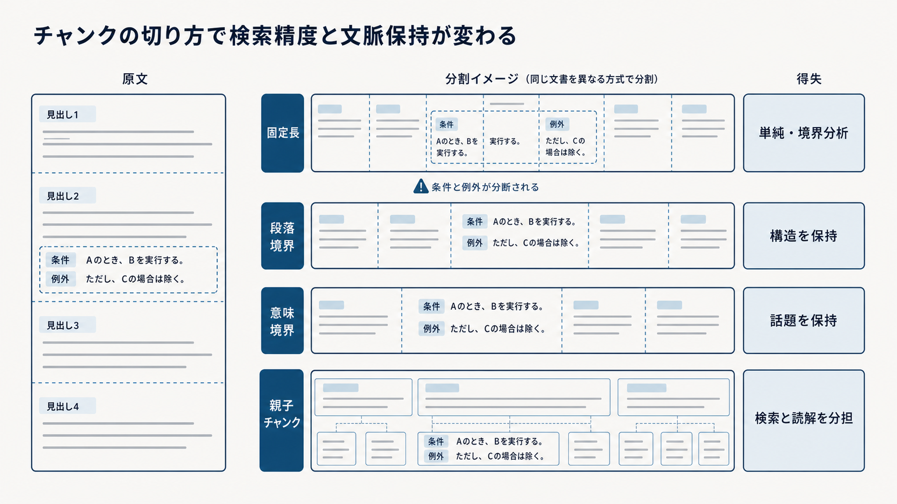

# 3.4 チャンク分割設計

チャンキングは、文書を保存しやすい大きさへ切る処理ではありません。
検索器が比較する知識の単位、LLMへ渡す文脈、利用者へ示す引用範囲を設計する処理です。

## 3.4.1 三つの単位

一つのチャンクを、検索、生成、引用のすべてへそのまま使う必要はありません。

- **検索単位**は、質問と比較して候補を選ぶ単位です。
- **生成単位**は、LLMが条件や前後関係を理解するために読む単位です。
- **引用単位**は、回答中の主張を支える原文範囲です。

[Dense X Retrieval](https://arxiv.org/abs/2312.06648)は、文書、段落、文、命題という検索粒度が、検索と質問応答の性能へ影響することを評価しました。
小さい検索単位は質問に関係する情報の密度を高められますが、前提や主語を失う場合があります。
大きい単位は文脈を保持できますが、一つのベクトルへ複数の話題が混ざります。

小さい単位で検索し、親となる節をLLMへ渡し、主張を支える数文だけを引用する構成を選べます。
単一のチャンク長ではなく、三つの単位と関係を評価します。

## 3.4.2 固定長と重なりによる基準

最初の比較基準として、一定のトークン数で分割し、隣接チャンクへ重なりを持たせる方法があります。
実装と再現が容易で、構造ベースや意味ベースの方法による改善を測る基準です。

300〜800トークン、10〜20パーセントの重なりといった値は、対象データに対する答えではありません。
初期比較の候補範囲です。
モデルが文章を入力単位へ分ける規則（トークナイザー）、文書種別、質問、回答に必要な文脈によって適切な値は変わります。

短すぎるチャンクでは、条件節、否定、例外、主語が別のチャンクへ分かれます。
長すぎるチャンクでは、複数の話題が一つの埋め込みに混ざり、検索結果中の根拠密度が下がります。
重なりを増やすと境界での分断を減らせますが、インデックス量と重複候補が増えます。

長さの分布、正解原文を覆う割合、検索再現率、コンテキスト内の重複率、入力トークン数を同時に測ります。

## 3.4.3 文書構造に基づく分割

規程、設計書、マニュアルには、見出し、段落、リスト、条・項などの意味境界があります。
これらを分割境界として利用すると、利用者が原文で読む単位と検索・引用の単位を揃えやすくなります。

節が長い場合は、節見出しを各子チャンクの本文またはメタデータへ継承します。
「適用条件」「例外」のような見出しがないと、本文だけでは意味が変わる場合があります。
リストは導入文と項目を一体にし、但し書きを本則から切り離さないようにします。

構造ベースの品質は、解析器が正しく見出しと段落を復元したことに依存します。
解析器が本文を見出しと誤認した場合、分割器も誤った境界を使います。
検索改善を評価するときは、解析品質と分割品質を区別します。

## 3.4.4 意味と話題に基づく分割

見出しがなく、長い段落の途中で話題が変わる文書では、語彙や埋め込みの変化から境界を推定できます。
[TextTiling](https://aclanthology.org/J97-1003/)は、語彙のまとまりを使って複数段落の文章を副話題へ分割する方法を示しました。

LLMへ境界を選ばせる方法は、複雑な文章に対応できる可能性があります。
一方で、モデル呼び出しの費用、出力のばらつき、モデル更新による境界変化が生じます。
同じ入力と設定で再構築できるよう、モデル、プロンプト、乱数条件を記録します。

境界が人にとって自然に見えることだけで採用しません。
固定長の基準と同じ質問集合で、必要根拠の検索再現率、引用範囲、入力トークン数を比較します。

## 3.4.5 文書形式ごとの規則

文書形式によって、分離してはいけない関係が異なります。

表3-3は、文書形式ごとに一体で残す要素と、分けた場合の失敗を対応付けています。
左列で文書形式を選び、中央の要素が同じチャンクまたは親子関係に残っているかを確認し、右列の失敗を試験します。

**表3-3　文書形式ごとの分割規則と代表的な失敗**

| 文書形式 | 一体として扱う要素 | 代表的な失敗 |
|---|---|---|
| FAQ | 質問と回答 | 質問だけ、回答だけが検索されます |
| 規程・契約 | 条、項、号、但し書き | 例外が本則から分かれます |
| 表 | 表題、行列見出し、対象行、脚注 | 数値の意味と単位が失われます |
| コード | シンボル、宣言、依存する行 | 関数や構文の途中で切れます |
| スライド | スライド内要素、節、ノート | 図と説明または前提が分かれます |
| チケット | 件名、本文、解決策、状態 | 未解決の提案を解決策と誤認します |

万能な一つの分割器を作るより、共通文書スキーマのブロック種別へ規則を割り当てます。
失敗例を、変更後も同じ条件で繰り返す回帰試験へ含め、形式ごとに正解根拠を保持できた割合を測ります。

## 3.4.6 命題単位の検索

**命題（proposition）**は、真偽を判定できる一つの事実や関係を表す文です。
一つの文に複数の事実が含まれる場合、命題へ分解すると、質問に直接関係する知識の密度を高められます。
[Dense X Retrieval](https://arxiv.org/abs/2312.06648)は、評価した条件で、命題単位のインデックスが段落単位より有効な結果を報告しました。

命題への分解をLLMで行う場合、主語、否定、条件、数量を誤る可能性があります。
「管理者以外は利用できません」を「管理者は利用できます」だけへ変えると、禁止対象が失われます。
検索しやすい短文になっても、原文と意味が違えば根拠として利用できません。

生成した命題は原文の代替にせず、元の文と親チャンクへ必ず結び付けます。
事実質問や条項検索など、効果が確認できる質問群へ限定し、命題の原文忠実性も評価します。

## 3.4.7 親子・階層構造

親子構造では、小さい子チャンクを検索し、周囲の文脈を持つ親チャンクをLLMへ渡します。
必要な根拠を上位へ取得する役割と、条件を理解するための文脈を保持する役割を分けられます。

例えば、200〜400トークンの子と、1,000〜2,000トークンの親を初期候補として比較できます。
これらは推奨値ではなく、対象文書で測定を始める範囲です。
親を大きくしすぎると、無関係な話題と入力トークンが増え、必要情報が長文に埋もれます。

複数の子が同じ親へ対応する場合、親を一度だけ配置して重複を避けます。
親へ置き換えた後の検索根拠、トークン数、引用範囲を記録します。

[RAPTOR](https://arxiv.org/abs/2401.18059)は、文書断片を内容の近さで繰り返しグループ化し、要約を作って木構造として検索する方法です。
見出しによる単純な親子構造とは異なるため、文書全体の概要質問や異なる抽象度の検索が必要な場合の発展形として扱います。

図3-2は、同じ原文を固定長、段落境界、意味境界、親子チャンクで分けた結果を、上から下へ比較しています。
中央の破線は分割位置、右列は各方式の得失です。
特に、最上段では条件と例外が別々のチャンクへ分かれる点を確認します。
図中の「検索精度」は特定の評価指標名ではなく、必要な根拠を上位に取得できるかという検索品質を指します。

**図3-2　チャンクの分割方法と得失の比較**

## 3.4.8 文脈を保持する埋め込み

通常の方法では、文書を分割してから各チャンクを独立に埋め込みます。
代名詞、省略された主語、前節で定義した用語は、チャンクだけでは解釈しにくい場合があります。

[Late Chunking](https://arxiv.org/abs/2409.04701)は、長い文書を先にエンコードし、その表現を後からチャンク単位へまとめる方法を提案しました。
チャンク本文を書き換えず、埋め込み表現へ周囲の文脈を反映することを狙います。

利用する埋め込みモデルが長い入力に対応するか、計算量とメモリが許容範囲かを確認します。
通常方式と同じベクトル空間だと仮定せず、別インデックスで評価します。
代名詞や節間参照を含む質問群で、通常のチャンク埋め込みと比較してから導入します。

## 3.4.9 安定IDとメタデータ継承

チャンクには、再構築後も由来を追跡できるIDが必要です。
文書ID、文書版、分割器の版、文書内の位置などから、決定的にIDを作ります。
内容ハッシュは差分検出と重複確認に利用できます。

ページ、見出し経路、有効期間、ACL、情報源の権威性を文書からチャンクへ継承します。
親子、命題、表セルなどの関係も保持します。
同じ本文でも文書版やACLが異なる場合は、管理上の同一性を区別します。

分割変更でIDが変わる場合は、引用URL、キャッシュ、評価用の正解ラベルへの影響を計画します。
新しいチャンクを同じIDへ黙って上書きすると、過去の回答が別の原文を指す可能性があります。

## 3.4.10 評価と選定

分割方式を比較する前に、原文のスナップショット、解析結果、埋め込みモデル、検索設定、評価質問を固定します。
一定長で分割する方式を基準とし、見出し単位、意味境界、親子構造などの候補を別々のインデックスへ構築します。

評価は次の順に行います。

1. 各質問について、正解となる原文範囲が一つまたは関連する複数のチャンクに残っているかを確認します。
2. 正解チャンクが上位候補へ入った割合、重複率、LLMへ渡すトークン数、引用範囲の長さを測ります。
3. 同じ取得候補から回答を生成し、条件、否定、数値、引用が原文どおりに保たれたかを確認します。
4. FAQ、規程、表、コード、長文などの文書種別ごとに結果を分け、全体平均に隠れた悪化を探します。

[Dense X Retrieval](https://arxiv.org/abs/2312.06648)は、検索単位の粒度によって検索と質問応答の結果が変わることを報告しました。
[Lost in the Middle](https://arxiv.org/abs/2307.03172)は、長い入力では必要情報の位置によって利用性能が変わることを示しました。
このため、検索だけを改善しても、LLMへ渡す単位が大きすぎれば最終回答が改善するとは限りません。

合格基準は評価前に定めます。
必要な原文へ戻れない方式、ACLや版を継承できない方式、重要な文書種別で基準方式を下回る方式は採用しません。
合格した候補の中から、対象とする失敗を減らし、応答時間と費用が許容範囲にある方式を選びます。

## 3.4.11 失敗パターンと診断

平均チャンク長だけでは、分割の失敗を診断できません。
代表的な失敗を、別々のコードと指標で記録します。

- 正解範囲が境界で分割されています。
- 見出し、主語、条件、但し書きが欠けています。
- 重なり部分の同一内容が検索上位を占めています。
- 表、数式、コードが途中で分割されています。
- 大きな親チャンクの中へ必要根拠が埋もれています。
- チャンクから元ページと引用範囲へ戻れません。

評価質問と正解原文を使い、どの境界で必要情報が失われたかを可視化します。
原文構造がすでに壊れていた場合は解析器、正しい構造を誤って分割した場合は分割器、候補へ入らない場合は検索器というように責任を分けます。

一つの失敗への対策が、別の質問群を悪化させる場合があります。
チャンクを大きくして境界分断を減らした後は、検索再現率、ノイズ、入力トークン、引用範囲への影響を確認します。

## 3.4.12 版管理と切り替え

分割方法の変更は、インデックス内の候補数、ID、検索順位、引用先を変えるリリースです。
分割器へ版を付け、新方式は別のインデックスとして構築します。

同じ文書スナップショットと評価質問を使い、新旧方式の検索再現率、生成時の根拠利用、入力トークン数、引用の正しさを比較します。
可能であれば、実際の利用要求を回答へ影響しない形で新方式にも流し、候補差を確認します。

旧IDへ依存する引用、キャッシュ、評価ラベルを移行するか、旧版とともに保持します。
切り替え後に問題が起きた場合のロールバック期間を確保します。
境界が自然に見えることではなく、検索、生成、費用、引用を含む評価によって採用を決めます。
