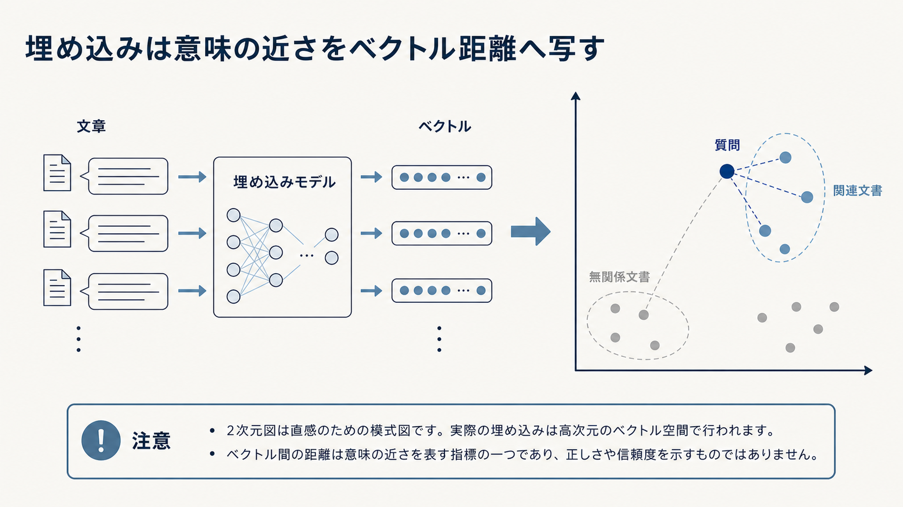

# 3.6 埋め込み設計

埋め込みは、質問と文書を数値ベクトルへ変換し、意味的に近い候補を検索するために利用します。
モデル名だけで選ばず、距離尺度、文書分割、対象言語、専門語、インデックス、再生成の運用を一体として設計します。

## 3.6.1 ベクトル空間の意味

**埋め込み（embedding）**は、テキストを固定長の数値ベクトルへ写す処理です。
意味や用法が近いテキストは、学習されたベクトル空間でも近くなることが期待されます。
検索では、質問のベクトルに近いチャンクを候補として取得します。

[Sentence-BERT](https://arxiv.org/abs/1908.10084)は、文を独立して埋め込み、文同士の類似度を効率的に計算する方法を提案しました。
[DPR](https://arxiv.org/abs/2004.04906)は、質問と文書を別のエンコーダーで埋め込み、質問応答の文書検索へ利用しました。

ベクトルの近さは、学習された表現上の類似度です。
主張の真偽、情報源の信頼度、文書の版、アクセス権を表すものではありません。
これらはメタデータ、ACL、検証で扱います。

図3-3は、左側で文章をベクトルへ変換し、右側で質問に近い文書を候補として選ぶ流れを示します。
右側では点同士の距離が意味的な近さを表し、質問に近い青い点群が関連文書、離れた灰色の点群が無関係な文書です。
二次元表示は直感を得るための模式図であり、実際の数百・数千次元の空間をそのまま可視化したものではありません。
埋め込みは文章をベクトル空間へ写し、ベクトル間の距離を近さの指標として使います。
距離自体が正しさや信頼度を表すわけではありません。

**図3-3　埋め込みによる文章のベクトル化と検索**

## 3.6.2 二塔型エンコーダー

**二塔型エンコーダー（bi-encoder / dual-encoder）**は、質問と文書を独立して埋め込みます。
文書側のベクトルを質問前に計算して保存できるため、大量の文書から高速に検索できます。

Sentence-BERTは同種のエンコーダーを共有する構成を扱い、DPRは質問と文書用のエンコーダーを質問応答向けに学習しました。
DPRでは、同じ一括処理内の別文書を負例にし、BM25が上位にした誤文書を難しい負例として利用しました。
モデル構造だけでなく、どの正例・負例で学習したかが検索品質へ影響します。

質問と文書を同時に読むクロスエンコーダーより、細かな語の相互作用は捉えにくくなります。
その代わり、文書ベクトルを事前計算して大規模検索へ利用できます。
二塔型を第一段階の候補収集へ使い、クロスエンコーダーを少数候補の再順位付けへ使う役割分担が可能です。

## 3.6.3 距離尺度と正規化

代表的な比較方法には、コサイン類似度、内積、ユークリッド距離があります。
同じ「類似度スコア」という名前でも、値の範囲、大小の意味、埋め込みモデルの学習条件が異なります。

埋め込みモデルが想定する正規化と距離尺度を、文書登録時と質問時で一致させます。
ベクトルの長さを1に揃えるL2正規化を行った場合、コサイン類似度と内積の順位が同じになる条件があります。
ただし、その性質を理由に、モデルや検索製品の推奨設定を確認せず置き換えてはいけません。

モデルID、次元数、正規化、距離尺度を一つの版契約へ含めます。
距離尺度だけを変えても検索順位は変わるため、同じ評価質問で再現率、順位指標、スコア分布を再評価します。

類似度スコアを、回答が正しい確率として扱いません。
スコアしきい値を回答保留へ使う場合は、正解・不正解の検証データを使って調整し、質問群ごとの差を確認します。

## 3.6.4 モデル選定の基準

埋め込みモデルを比較する前に、文書のスナップショット、解析結果、チャンク分割、評価質問を固定します。
近似探索の設定差を混ぜないため、まず完全探索でモデル固有の検索品質を比べます。

候補は次の順に絞ります。

1. 対応言語、最大入力長、商用利用条件、データ送信先、提供版を確認し、利用条件を満たさないモデルを除外します。
2. 同じ文書と質問を各モデルで埋め込み、正解チャンクが上位候補へ入る割合と順位を測ります。
3. 型番、否定、短い質問、複数言語、長いチャンクなど、失敗しやすい質問群ごとに結果を分けます。
4. ベクトルの次元数、埋め込み生成時間、検索時間、保存容量、要求当たり費用を同じ環境で測ります。

[MTEB](https://arxiv.org/abs/2210.07316)は、多様なタスクと言語で埋め込みモデルの性能が一様ではないことを示します。
共通評価の順位だけで決めず、業務の質問と正解根拠で合否を判断します。

合格基準には、全体値だけでなく、重要な質問群ごとの最低値、応答時間、費用、利用条件を含めます。
すべての条件を満たす候補がない場合は、キーワード検索との併用、対象範囲の限定、別モデルへの振り分けを検討します。
採用モデルはID、提供版、前処理、次元数、距離尺度とともに記録します。

## 3.6.5 対象分野への適合

共通の条件で比較する公開評価（ベンチマーク）で上位のモデルが、社内略語、法令、コード、日英混在文書でも最良とは限りません。
[MTEB](https://arxiv.org/abs/2210.07316)は、検索、分類、意味類似など多様なタスクと言語で埋め込みモデルを評価する枠組みです。
タスクによってモデルの順位が変わるため、一般ベンチマークは候補を絞るために利用します。

対象業務の質問、正解チャンク、難しい誤候補を用意します。
言語、製品、文書種別、識別子、専門語、複数言語の質問へ分け、対象分野で追加学習していないモデルを基準として評価します。
検索再現率だけでなく、上位順位、応答時間、費用も比較します。

基準で不足が明確な場合に、分野データによる追加学習を検討します。
合成質問を作る場合は、同じ元文書由来の質問が学習と評価へまたがらないよう分割します。
製品体系や用語が変わった後も、同じ質問群で性能の変化を監視します。

## 3.6.6 埋め込みが苦手な情報

型番、条文番号、URL、短い略語、数値は、意味的に近い別の表現と混同される場合があります。
`Model-10` と `Model-100` は意味空間で近くても、業務上は別製品です。
「利用できます」と「利用できません」のような否定差も、単一ベクトルでは近くなる可能性があります。

DPRの分析では、BM25が希少なキーフレーズを正確に取得した例も示されています。
密検索だけがすべての質問で優位ではありません。
完全一致、項目別検索、BM25、メタデータによる絞り込みと役割を分けます。

長いチャンクを一つのベクトルへまとめると、複数の話題や表の細かな値が圧縮されます。
[ColBERT](https://arxiv.org/abs/2004.12832)は、文書内の各トークン表現を保持し、質問との遅延相互作用でスコアを計算します。
単一ベクトルと多ベクトルには、検索品質、保存量、応答時間の違いがあります。

モデルを交換する前に、失敗が埋め込み表現、文書分割、質問変換、ANNのどこで生じたかを分けます。

## 3.6.7 文書長とチャンク分割

チャンクが長いほど、一つのベクトルへ複数の意味が混ざります。
チャンクが短いほど、前後で定義された用語、代名詞、条件を失います。
埋め込みモデルとチャンキングは相互に影響します。

見出しや文書名をチャンク本文へ付けて埋め込む方法と、別項目で絞り込み・順位の引き上げへ使う方法を比較します。
本文へ付けると検索表現が自己完結しやすくなる一方、同じ見出しが多数のチャンクへ繰り返され、類似度を支配する可能性があります。

[Late Chunking](https://arxiv.org/abs/2409.04701)は、長い文書を先にエンコードし、後からチャンク表現へまとめる方法です。
通常のチャンク単位の埋め込みと、対応モデル、計算量、検索品質を比較します。

チャンキングと埋め込みモデルを同時に変えると、改善原因を特定できません。
一方を固定して比較し、代名詞の多い文書、表、複数話題の文書などの質問群で結果を確認します。

## 3.6.8 次元数

埋め込みの次元数は、検索品質だけでなく、保存容量、メモリ、ネットワーク転送、ANNの応答時間へ影響します。
次元数を増やせば常に品質が上がるとは限りません。
モデルがその次元で学習・提供されているかを確認します。

[Matryoshka Representation Learning](https://arxiv.org/abs/2205.13147)は、一つの表現の先頭部分を異なる次元数で利用できるよう学習する方法を提案しました。
この性質を持たない任意のベクトルを単純に切り詰めても、同じ効果は得られません。

モデルが複数の次元数を正式に対応する場合、256、512、1024などを別インデックスで比較します。
検索再現率、正しい候補が上位にあるほど高く評価するnDCGなどの順位指標、応答時間、インデックス容量、費用を記録します。
次元数をスキーマの一部として固定し、変更を再埋め込みのリリースとして扱います。

## 3.6.9 一括処理、キャッシュ、処理量

大量の文書を埋め込む場合は、複数件をまとめてモデルへ渡す一括処理を利用できます。
一括件数を増やすと処理効率が上がる場合がありますが、GPUメモリ、APIの入力上限、失敗時の再処理範囲も増えます。
対象環境で処理量と失敗率を測ります。

内容ハッシュと埋め込みモデル版をキャッシュキーにすると、変更していないチャンクの再計算を避けられます。
チャンク本文が同じでも、モデル、前処理、質問・文書接頭辞、正規化が変わればキャッシュを再利用しません。
ACLやメタデータだけの変更は、ベクトルキャッシュとは別にインデックスへ反映します。

失敗したチャンクを隔離し、文書・チャンク・ベクトルの件数を照合します。
埋め込みサービスのレート制限に合わせてキューと再試行を制御し、オンライン検索の容量を使い切らないようにします。
文書当たり費用、エラー率、95パーセンタイルの処理時間、更新反映時間を観測します。

## 3.6.10 版管理と埋め込みの再生成

埋め込みの版には、モデルID、改訂番号（リビジョン）、次元数、正規化、距離尺度、質問・文書用の接頭辞、トークナイザーを含めます。
一つでも互換性に関係する値が変わった場合は、新しい版として扱います。

異なるモデルのベクトルを、同じ空間へ混在させません。
新モデルの文書ベクトルは別インデックスへ全件生成し、対応する質問エンコーダーと組み合わせます。
旧ベクトルと新質問を比較しても、距離の意味は保証されません。

一般ベンチマークと業務の正解集合で新旧を比較します。
実際の質問を回答へ影響しない形で新インデックスにも送り、候補、スコア分布、応答時間を確認します。
合格後に検索先を切り替え、旧インデックスの保持期間とロールバック条件を定めます。

モデル提供者が同じ名前のまま内部版を更新する場合にも備えます。
取得したリビジョン、モデル成果物のハッシュ、実行環境を記録し、検索分布の変化を検知します。
再埋め込みは単なる一括ジョブではなく、検索結果を変えるリリースです。
