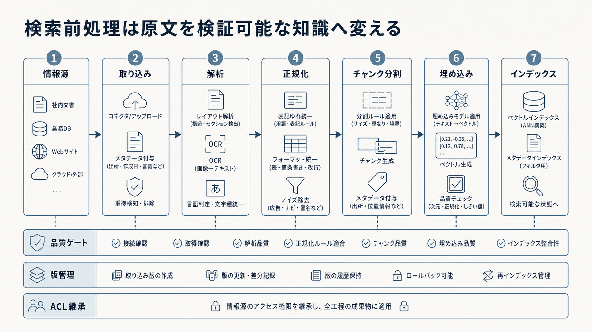

# 3. 回答に使う資料を準備する

RAGの回答品質は、LLMと検索モデルの性能だけでは決まりません。
正本が登録されていない、旧版が現行版として扱われる、表の列が崩れる、アクセス権が欠けるといった問題は、後段のモデルでは修復できません。
質問を受け取る前に、資料を検索・引用・更新できる知識へ変える必要があります。

本章では、情報源の棚卸し、取り込み、文書解析、検索単位への分割、メタデータとアクセス制御リスト（Access Control List：ACL）、埋め込み、インデックス、公開前検査を順に扱います。
各処理の入力、出力、版、失敗状態を記録し、原資料から検索結果までを追跡できる流れとして設計します。

目的は、できるだけ多くの資料を登録することではありません。
正しい資料を、適切な権限と版を保ったまま検索でき、誤りや欠落がある成果物を公開前に止められることです。

図3-1は、本章で行う準備を、情報源の選定から検索インデックスまで左から右へ示します。
まず上段の七工程で成果物を作り、下段の品質検査、版管理、ACL継承を各工程へ適用します。
一度作って終える処理ではなく、更新と削除を反映しながら、問題のある版を公開せず以前の版へ戻せる状態を保ちます。

**図3-1　資料を検証可能な検索知識へ変える全体の流れ**
