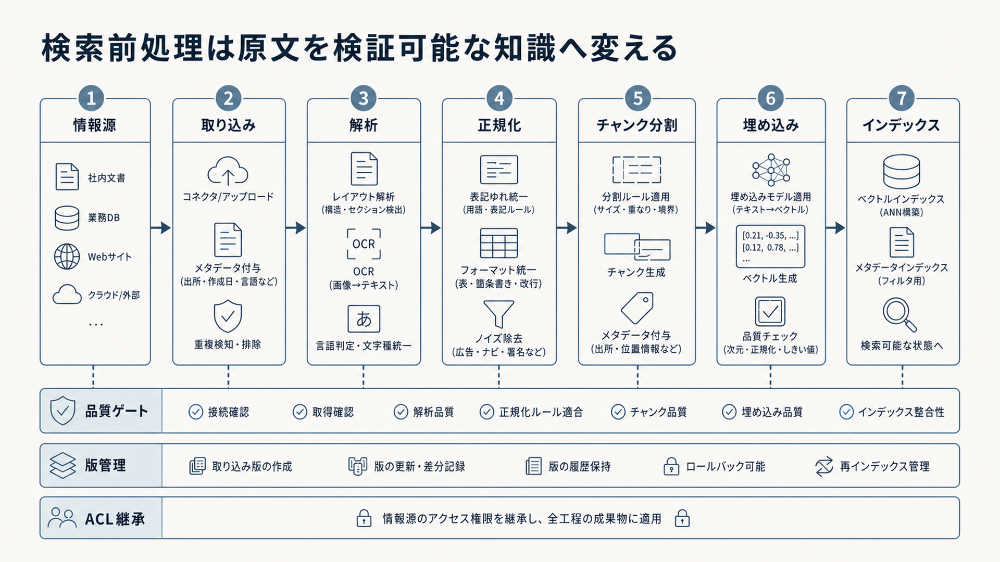

# 3. 回答に使う資料を準備する

良い回答は、質問が来てから急に作られるわけではありません。どの資料を正しい情報源とするか、古い版や重複をどう扱うか、表やPDFをどう解析するかという事前準備が、検索品質の上限を決めます。

本章では、データソースの棚卸しからindexの構築までを扱います。最後のPublish前ゲートは壊れた成果物を公開しないための最小確認に限定し、品質指標、golden dataset、回帰評価、release判定は第7章へ委ねます。

資料準備の成果物は、本文だけでなく、文書ID、chunk ID、出典位置、版、時点、権限属性、変換履歴を持つ検索可能な知識です。これらを一緒に管理すると、更新、削除、引用、認可、再索引を同じ単位で追跡できます。

設計時は、正常に登録できた文書だけでなく、解析できなかった文書、欠損した属性、公開を止めた理由も記録します。検索品質の評価へ進む前に、対象資料が欠けず、再現可能な形で公開されていることを確認します。

**図3-1　資料を検証可能な検索知識へ変える全体の流れ**
