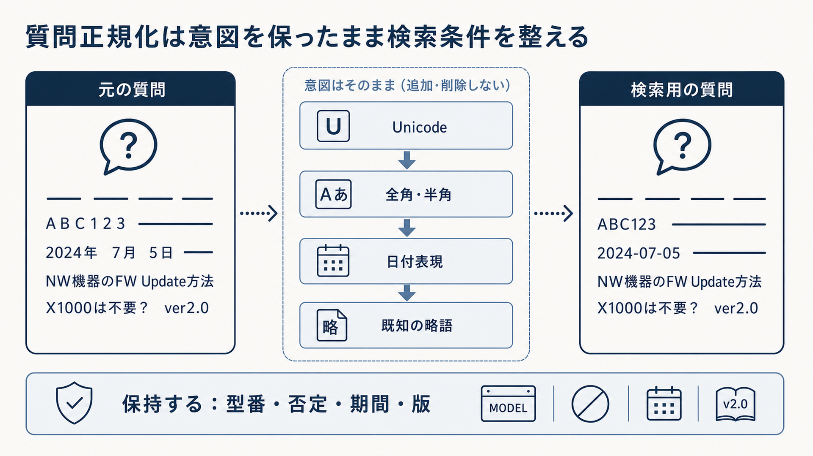

# 4.1 質問理解と検索計画

質問理解は、利用者が何を尋ねているかを整理する処理です。
検索計画は、その答えをどこからどのように探すかを決めます。
二つを分けると、質問の解釈を誤った失敗と、正しく解釈したが検索経路を誤った失敗を区別できます。

## 4.1.1 質問理解と検索計画の分離

「前の契約の最新版を見せてください」という質問には、会話中のどの契約を指すか、最新版の基準時点はいつかという解釈が必要です。
解釈後には、契約文書のキーワード検索と意味検索を使い、版と権限で絞るという計画が必要です。

[Query Resolution for Conversational Search](https://arxiv.org/abs/2005.11723)は、会話中の質問へ必要な情報を補う方法を扱いました。
[Adaptive-RAG](https://arxiv.org/abs/2403.14403)は、質問の複雑さに応じて検索処理を選びました。
会話の参照先を解決できても、検索器、検索件数、反復回数は自動的に決まりません。

元質問、解釈結果、検索計画を別の成果物として保存します。
同じ解釈へ複数の検索計画を適用し、どの方式が必要根拠を取得できたかを比較できます。

## 4.1.2 入力契約

検索計画は質問文だけから作れません。
少なくとも、次の情報を入力として扱います。

- 利用者が入力した元の質問
- 会話履歴と現在のターン
- 認証済みの利用者、利用組織を分離する単位（テナント）、役割、グループ
- 利用できる情報源と、稼働中の検索インデックスの版
- 回答の基準時刻、地域、標準時との時差（タイムゾーン）
- 応答時間、検索回数、費用の上限
- 許可された検索器、データベース、外部情報源

入力が欠けた場合に、推測、確認質問、標準値のどれを使うかを項目ごとに決めます。
推測した値には推定であることと確信度を記録します。
アクセス制御リスト（Access Control List：ACL）やテナントを質問文から推測してはいけません。

会話履歴をすべて検索質問へ追加すると、過去の話題や誤った回答が混ざります。
現在の質問に必要な対象と条件だけを解決します。

## 4.1.3 会話文脈

「それは旧版でも同じですか」という質問では、「それ」と「旧版」の参照先が省略されています。
直前の製品機能、参照した規程、比較していた版を候補として取り出します。
参照した会話ターンと補った表現を記録します。

過去のAI回答を確認済みの事実として継承してはいけません。
過去回答が引用していた原文を再検索し、現在の版と権限で確認します。
利用者の発言も、検索条件と事実を区別します。

参照先が一つに決まらない場合は、複数の検索を限定的に実行するか、利用者へ確認します。
曖昧な状態で一つの製品や版へ強く絞ると、正しい根拠を検索前に除外する可能性があります。

## 4.1.4 表記と語彙の正規化

検索器は、`ＡＢＣ‐100` と `ABC-100` を別の語として扱う場合があります。
文字コード規格のUnicode、全角・半角、空白、既知の記号差を正規化します。
旧製品名、正式名称、組織で管理する略語は辞書で対応付けます。

誤字修正は候補として扱い、元表記を削除しません。
`ABC-100` を一般語の誤記だと判断して変えると、型番そのものを壊します。
数値、条文番号、URL、コード、否定表現を保護します。

完全一致とキーワード検索には元表記を、意味検索には正規化表現を使う二経路が基本です。
どの規則で変換したかを記録し、辞書・正規化規則を版管理します。

図4-2は、元の質問を左から右へ正規化する例です。
中央の処理ではUnicode、全角・半角、日付表現、既知の略語を整えますが、下段に示す型番、否定、期間、版は保持します。
右端では、検索用の表記が整っていても利用者の意図が変わっていないことを確認します。



**図4-2　意図を保った質問の正規化**

## 4.1.5 質問の種類

質問が必要とする根拠の形を分類すると、検索方式を選びやすくなります。

表4-1は、質問の種類を左列で見分け、右列で最初に試す検索経路を選ぶための対応表です。
一つの質問が複数の種類に当てはまる場合は、該当する経路を組み合わせます。

**表4-1　質問の種類と主な検索経路**

| 質問の種類 | 例 | 主な経路 |
|---|---|---|
| 識別子 | 「ERR-504の原因」 | 完全一致、疎検索 |
| 意味・説明 | 「起動できないときの対処」 | 密検索、ハイブリッド検索 |
| 比較 | 「製品AとBの違い」 | 対象別検索と根拠統合 |
| 複数段階 | 「創業者が設立した別会社」 | 分解・反復検索 |
| 時点指定 | 「2024年4月時点の規程」 | 有効期間フィルター |
| 会話依存 | 「それは旧版でも同じか」 | 参照解決後の検索 |
| 構造化 | 「現在の在庫数」 | データベース、外部システムとの連携窓口（API） |
| 文字と画像の組み合わせ | 「図中の接続方法」 | 画像・配置情報の検索 |

分類器の確信が低い場合は、最も高価な経路へ自動的に送らず、安全な標準経路を使います。
二つの種類が混在する場合は、識別子を完全一致で保護しながら意味検索も行うなど、経路を組み合わせます。

## 4.1.6 固有表現、期間、版、否定

質問から抽出する条件は名詞だけではありません。
「2024年4月以前のアジア太平洋（APAC）版を除き、現行の国内版を比較してください」では、対象、地域、時間境界、版、除外条件を保持する必要があります。

抽出値には、元質問中の範囲、正規化値、確信度、抽出方法を付けます。
利用者が明示した条件と、モデルが推定した条件を分けます。
明示条件を推定値で上書きしません。

製品、地域、版、期間はメタデータフィルターへ使えます。
「使いやすい」「影響」のような意味的表現は検索本文へ残します。
否定条件を落とすと、除外対象の資料が高い関連度で返るため、変換後に必須条件と否定が残っているか検査します。

## 4.1.7 ACLとメタデータ条件

ACLは質問理解から推定する情報ではありません。
認証済みの利用者情報と認可方針から導きます。
テナント、削除状態、失効、ACLは必須フィルターとして、すべての検索経路へ適用します。

製品、地域、文書種別など、利用者の目的を表す条件は、明示度と確信度に応じて必須フィルターまたは順位調整条件にします。
推定した分類値で候補を完全に除外する場合は、検索漏れを評価します。

フィルターによって候補集合が小さくなると、近似最近傍（Approximate Nearest Neighbor：ANN）検索で必要な候補を拾いにくくなる場合があります。
権限を緩めず、検索深度、条件に対応したANN検索、インデックス分割などの性能対策を検討します。
一時保存（キャッシュ）と処理記録にも同じ権限境界を適用します。

## 4.1.8 検索方式の振り分け

検索先は、質問の見た目ではなく、正解が存在する場所から選びます。
識別子は疎検索、言い換えは密検索、両方が混在する質問はハイブリッド検索、集計はデータベース問い合わせ（SQL）、関係探索は知識グラフが候補です。

[長いコンテキストとRAGの比較研究](https://arxiv.org/abs/2407.16833)では、質問ごとにRAGと長いコンテキストを選ぶSelf-Routeも評価されました。
すべての質問へ高価な長文入力を使わず、質問に応じた経路を選ぶ考え方です。
結果は特定のモデルとデータセットに依存するため、対象業務で再評価します。

経路の振り分け処理へは、利用可能な情報源、鮮度、権限、応答時間と費用の上限を渡します。
選んだ経路、理由、判定の確かさ、代替経路を保存します。
確信が低い場合は、許可された複数経路を候補数の上限付きで実行できます。

## 4.1.9 実行可能な検索計画

検索計画には、どの検索文をどの検索器へ送り、何件取得し、何件再順位付けし、いつ終了するかを記述します。
「検索する」という一項目だけでは、処理と費用を再現できません。

計画には、次の項目を含めます。

- 元質問と解決済み質問
- 検索経路と各経路の目的
- 検索文、必須フィルター、順位調整条件
- 検索器ごとの候補数と全体候補上限
- 再順位付けする件数
- 最大段階数、期限、費用上限
- 根拠不足時の次の経路
- 停止条件と代替処理

複数段階の質問では、各検索を部分質問へ結び付けます。
同じ質問と候補を反復する場合は停止します。
結果が不足した場合だけ次の経路へ進み、最初からすべての高価な処理を実行しません。

## 4.1.10 能動的・適応的な検索

能動的・適応的な検索は、初回の候補を観測し、追加処理が必要かを判断します。
候補数、検索器間の一致、必要根拠の充足度を使って、検索文の書き換え、検索深度の拡大、別情報源、質問分解を選びます。

[Adaptive-RAG](https://arxiv.org/abs/2403.14403)は質問の複雑さで経路を選び、[IRCoT](https://arxiv.org/abs/2212.10509)は途中の推論と検索を交互に進めました。
難しい質問だけに追加計算を使える一方、処理を選ぶ判定器も誤る可能性があります。

最大検索回数、応答時間、費用を定めます。
同一検索文、同一候補集合、新しい根拠が増えない状態を検出して停止します。
各段階で追加した根拠と費用を記録し、成果のない反復を削除します。

## 4.1.11 出力仕様

質問理解の出力は、後段が自然文を再解釈しなくてもよい、項目と型を定めた契約にします。

```json
{
  "original_query": "それは旧版でも同じですか",
  "resolved_query": "製品Aの暗号化機能はバージョン2でも同じですか",
  "query_type": ["conversation", "version_comparison"],
  "entities": [{"type": "product", "value": "製品A"}],
  "hard_filters": {"tenant_id": "認証情報から取得"},
  "soft_constraints": {"document_type": "manual"},
  "routes": ["sparse", "dense"],
  "max_steps": 2,
  "fallback": "clarify",
  "confidence": 0.78
}
```

例の値は説明用であり、実装では機密な識別情報を処理記録へそのまま保存しません。
元質問と解決済み質問の差、推定した条件、警告を併記します。
この構造を処理記録の起点にすると、誤答時に解釈、経路、検索のどこで崩れたかを追跡できます。
