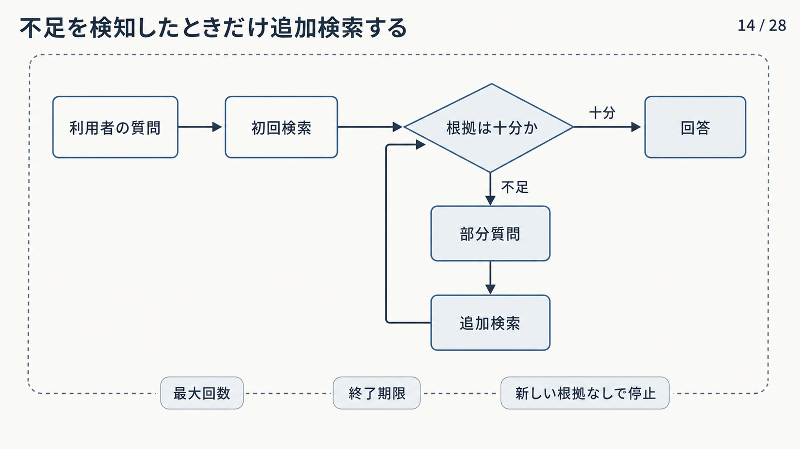

# 4.2 質問変換

質問変換は、利用者の質問と資料の言葉・詳しさの差を埋めるために、検索用の表現を作る処理です。
すべての質問へ適用せず、変換なしでは必要根拠を取得できない失敗が確認された場合に使います。

## 4.2.1 質問変換を使う条件

質問変換を始める主な条件は、短すぎる質問、旧称・略語、会話上の省略、複数段階の質問、初回検索で必要な根拠を拾えていないことです。
インデックスへ正式な原本（正本）が登録されていない問題や、アクセス制御リスト（Access Control List：ACL）が誤って候補を除外する問題は、質問変換では解決しません。

[Rewrite-Retrieve-Read](https://arxiv.org/abs/2305.14283)は、LLM向けの質問を検索器向けに書き換え、取得文書をLLMへ渡す構成を提案しました。
検索性能を高められる一方、書き換えが追加した語によって検索先を誤る可能性があります。

変換なしの検索結果を基準として保存します。
質問種類ごとに、必要根拠の回収率、上位順位、追加費用、意味変質を比較します。
改善が確認できない質問種類には変換を適用しません。

## 4.2.2 質問の書き換え

**質問の書き換え**は、元質問の意味を保ちながら、検索に必要な対象と条件を明示した検索文へ書き換えます。
文章を読みやすくすることではなく、検索器が利用できる語と条件を明示することが目的です。

例えば、「それは旧版でも使えますか」を「製品Aの暗号化機能はバージョン2でも利用できますか」へ変換します。
製品、機能、版を補う一方で、利用者が指定していない地域や型番を作りません。
否定、期間、比較対象などの必須条件を固定します。

元質問と書き換え後の質問を並行して検索し、候補を統合する方法があります。
書き換えが誤った場合でも、元質問の検索経路を残せます。
使用したモデル、プロンプト、差分、採用した候補を記録します。

## 4.2.3 規則に基づく質問展開

**質問展開**は、元の検索語へ関連する表現を追加します。
管理された略語・同義語辞書による展開は、同じ入力から同じ結果を得られ、追加語の根拠と版を説明できます。

例えば、組織内略語を正式名称へ、旧製品名を現行名称へ展開します。
元の型番と識別子は削除せず、完全一致経路へ残します。
上位・下位概念を無制限に追加すると、検索範囲が広がりすぎるため、質問種類と検索対象の項目で制限します。

[Document Expansion by Query Prediction](https://arxiv.org/abs/1904.08375)は、文書側へ、その文書に対して想定される質問を追加する方法を扱いました。
質問側でも、管理語彙を用いて質問と文書の言葉の差を狭められます。

辞書の変更を検索インデックスと評価データの版へ結び付けます。
一つの略語が複数の正式名称を持つ場合は、文脈で決めるか、複数候補を保持します。

## 4.2.4 LLMによる質問展開

辞書にない言い換えや観点を補う場合、LLMへ少数の検索文を生成させられます。
各検索文は、元質問の対象、期間、版、否定を保持しながら、異なる語彙や側面を使う必要があります。

[Query2doc](https://arxiv.org/abs/2303.07678)やRewrite-Retrieve-Readは、LLMが生成した表現を検索へ利用する方法です。
生成表現によって必要根拠の回収率が上がる可能性がある一方、もっともらしい固有名、製品名、数値が作られる可能性があります。

最初は生成する検索文を2〜5件程度にするなど、明示した上限から評価します。
互いにほぼ同じ検索文を除き、各検索文が追加した語を記録します。
生成文は検索用の仮説であり、回答の根拠として引用しません。

一つの生成文が候補を占有しないよう、検索文ごとの候補上限を設けます。
追加検索文当たりの新しい正解根拠と費用を測り、寄与のない生成を削除します。

## 4.2.5 複数質問による検索

**複数質問検索（Multi-query retrieval）**は、一つの利用者質問から複数の検索文を作り、それぞれ検索して結果を統合します。
元質問、同義語展開、対象別の部分質問など、検索文ごとの目的を記録します。

各検索文を疎検索と密検索へ送る場合、検索文数、検索器数、候補数の積で処理量が増えます。
まず検索文ごとの候補を整理し、その後に重複をまとめた全候補（和集合）を作るか、順位統合を行います。

[相互順位統合（Reciprocal Rank Fusion：RRF）](https://dl.acm.org/doi/10.1145/1571941.1572114)は、各一覧の順位を使うため、検索文や検索器ごとにスコア尺度が異なる場合にも利用できます。
同じ文書・チャンクを安定IDでまとめ、どの検索文が候補へ寄与したかを保持します。

全体候補上限、検索文ごとの上限、重複統合、処理期限を決めます。
正解根拠の増分が小さい検索文を削除し、候補数だけが増える状態を避けます。

## 4.2.6 Query2doc

Query2docは、短い質問から、答えが書かれていそうな擬似文書をLLMで生成し、検索語または検索表現として利用します。
文書らしい語彙を増やすことで、質問と資料の表現差を埋めます。

疎検索では擬似文書中の語を検索語へ利用でき、密検索では文書に近い長さ・表現の埋め込みを作れます。
[Query2docの論文](https://arxiv.org/abs/2303.07678)は、評価した複数の検索器と評価用データで改善を報告しました。
結果はモデル、生成設定、データセットに依存するため、対象業務で再評価します。

擬似文書は事実ではなく、検索用の仮説です。
生成された人名、製品名、数値を回答や引用へ流用しません。
元質問の検索結果と統合し、どの追加語が候補取得へ寄与したかを記録します。

誤った固有名による検索先の偏りが多い分野では、管理辞書など、同じ入力から同じ結果を得られる展開へ戻します。

## 4.2.7 HyDE

**Hypothetical Document Embeddings（HyDE）**は、質問から仮想的な回答文書を生成し、その文書の埋め込みに近い実文書を検索します。
正解文書を直接生成するのではなく、質問と文書の表現形式の差を埋めることが目的です。

[HyDE](https://arxiv.org/abs/2212.10496)は、関連度を示す教師データを使わず、新しい対象へ適用する密検索の方法として提案されました。
仮想文書に誤った事実が含まれても、一般的な語彙が検索に役立つ場合があります。
一方で、誤った型番、数値、固有名が検索ベクトルを別の文書群へ引く可能性があります。

元質問のベクトルによる検索を残し、HyDEの結果と和集合または順位統合します。
型番、条文番号、否定条件は疎検索とメタデータフィルターで保持します。
一般説明、識別子、数値、複数言語などの質問群別に効果を測ります。

## 4.2.8 質問分解

**質問分解**は、複数の対象、条件、推論段階を含む質問を、検索可能な部分質問へ分解します。
「A社とB社の2024年の変更点を比較し、利用者への影響を説明してください」では、会社ごとの変更点と、その影響を分けられます。

部分質問と依存関係を有向非巡回グラフ（Directed Acyclic Graph：DAG）として表せます。
独立した部分質問は並行して検索し、前の結果が必要な部分質問は後から実行します。

[IRCoT](https://arxiv.org/abs/2212.10509)が扱った複数段階の質問では、途中で得た根拠が次の検索文へ影響します。
最初にすべての部分質問を固定する方法と、根拠を見ながら逐次生成する方法を使い分けます。

各部分質問の根拠を別に管理し、最終統合で未解決の枝を表示します。
最大部分質問数と停止条件を設定し、分解器が元質問にない論点を増やすことを防ぎます。

## 4.2.9 検索と推論の交互実行

**交互検索（Interleaved retrieval）**は、検索と推論を交互に進めます。
例えば、最初の検索で組織の創業者を特定し、その根拠を使って創業者が設立した別組織を検索します。
後の検索文が前の根拠に依存する質問に適しています。

途中の根拠が誤っていると、その誤りが後続検索へ連鎖します。
各段階で、根拠の関連性、十分性、新規性を確認します。
同じ検索文、同じ文書集合、新しい根拠がない状態を検出して停止します。

根拠のつながり、生成した検索文、候補の採否理由、停止理由を保存します。
単純な一回検索で答えられる質問をこの経路へ送らず、追加段階による改善と費用を測ります。

図4-3は、初回検索の後に根拠が十分かを判断する流れです。
左から読み、十分なら回答へ進みます。
不足なら部分質問を作って追加検索し、根拠の十分性を再確認します。
下段の最大回数、終了期限、新しい根拠がない場合の停止は、処理が終わらない状態を防ぐ条件です。

**図4-3　根拠が不足した場合だけ追加検索する流れ**

## 4.2.10 意図保持と安全性

質問変換には、元質問の意図を保つ契約が必要です。
利用者が指定した対象、否定、期間、版、比較軸を必須項目として固定し、変換後に削除・反転されていないか検査します。

ACL、テナント、削除状態は言語モデルへ渡して書き換えさせません。
認証・認可から得た強制フィルターとして、すべての検索文へ論理積で適用します。
外部のウェブへ検索を広げる場合も、許可された情報源、送信できる検索語、保存条件を越えません。

変換結果を解析できない、必須条件が欠ける、元質問との意味差が大きい、確信が低い場合は、元質問の検索へ戻すか確認質問を行います。
必要根拠の回収率の改善は、利用者の意図や権限の逸脱を正当化しません。

変換前後の検索結果を質問種類別に比較します。
新しい正解根拠、追加された不要な候補、応答時間、費用、意味逸脱を記録し、適用範囲を更新します。
