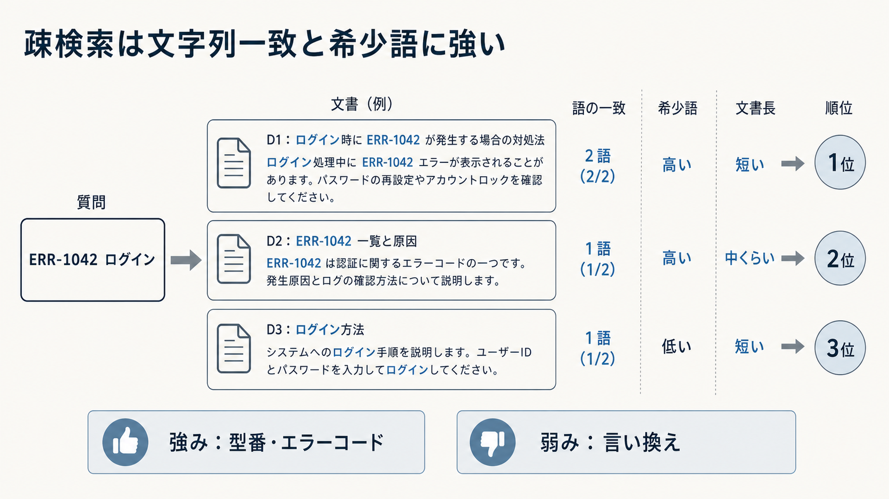

# 4.3 疎検索（Sparse retrieval）

疎検索（Sparse retrieval）は、検索文と資料に現れる語や文字列の一致を主な手掛かりにします。
型番、エラーコード、条文番号など、一文字の違いが意味を変える質問で、意味検索とは別の強みがあります。

## 4.3.1 位置付け

疎検索を、密検索より古いという理由だけで置き換えてはいけません。
どの語が一致したかを観測でき、希少な識別子を正確に検索できます。
一方で、同じ意味を別の語で表す言い換えは取り逃がす場合があります。

[BEIR](https://arxiv.org/abs/2104.08663)は、多様な検索課題で疎検索と密検索を比較し、方式の優劣がデータセットによって変わることを示しました。
最初にBM25を再現可能な基準として固定し、密検索やハイブリッド検索による増分を質問の種類別に測ります。

## 4.3.2 転置インデックス

**転置インデックス**は、語から、その語が現れる文書やチャンクへ逆引きするデータ構造です。
各語のリストには、文書ID、出現頻度、位置、本文・見出しなどの項目を保存できます。
検索時に全資料を読み直さず、検索語に対応する候補を取得できます。

文書をどの語へ分けるかは、解析器と、文字列を検索単位へ分ける処理（トークナイザー）によって決まります。
同じ原文でも解析規則が変われば、転置インデックスの語と出現位置が変わります。
文書側と質問側で対応する解析規則を使います。

追加、更新、削除、版切り替えを転置インデックスへ反映します。
解析器、辞書、検索対象から除外する頻出語（ストップワード）、項目設定を版管理し、検索結果の変化を説明できるようにします。

## 4.3.3 日本語のトークン化

日本語は空白で単語が区切られていないため、どこを語の境界とするかで検索結果が変わります。
主な方法には、形態素解析と文字n-gramがあります。

形態素解析では、文章を単語と品詞へ分けられます。
「障害対応手順」を一語として扱うか、「障害」「対応」「手順」へ分けるかによって、一致する文書が変わります。
利用分野の製品名・略語を利用者辞書へ追加できます。

文字n-gramは、連続する一定数の文字を語として扱います。
未知語や製品名にも対応しやすい一方、候補語数が増え、短い共通文字列による不要な一致が生じます。

英数字、ハイフン、全角・半角、大文字・小文字の扱いを項目ごとに決めます。
型番・コード用項目へ一般文章向けの誤字補正や語幹処理を適用しません。
解析規則の変更はインデックスの再作成と、変更前の品質を保つ試験（回帰試験）を伴う仕様変更です。

## 4.3.4 TF-IDF

**単語頻度・逆文書頻度（Term Frequency-Inverse Document Frequency：TF-IDF）**は、文書中で多く現れる語を重くし、文書集合全体で広く現れる語を軽くします。
その文書を特徴付ける語を数値化する基本的な考え方です。

[語の重み付けを比較した研究](https://doi.org/10.1016/0306-4573%2888%2990021-0)は、語の出現頻度、希少性、文書長の補正を組み合わせ、複数の文書集合で単純な一致数より良い検索結果を示しました。
評価対象は1980年代の比較的小さな英語文書集合であるため、現在の日本語業務データではBM25などを含む基準を改めて測ります。

例えば、すべての社内文書に現れる会社名は、特定文書を見分ける手掛かりになりにくくなります。
一部の障害記録だけに現れるエラーコードは、強い手掛かりになります。

ただし、同じ語が増えるほど重要性が直線的に増えるとは限りません。
文書長の影響もあります。
実務の基準には、語の反復効果と文書長を調整するBM25を使うことが多いですが、IDFの考え方は順位理由の理解に役立ちます。

TF-IDFは語の意味や語順を直接扱いません。
言い換えへの対応は辞書、文書拡張、学習型疎検索、密検索で補います。

## 4.3.5 BM25

BM25は、検索語の出現頻度、語の希少性、文書長を使って関連度を計算します。
同じ語の反復による効果を飽和させ、長い文書が多くの検索語を偶然含む影響を補正します。
[BM25の確率的枠組み](https://doi.org/10.1561/1500000019)は、現在の実務検索でも基礎となる整理です。

代表的なパラメーター `k1` は語頻度の飽和、`b` は文書長補正の強さへ影響します。
最適値は、チャンク長の分布、質問、検索エンジンの実装によって変わります。
短いチャンク中心のRAGでも既定値を無条件に使わず、正解集合で比較します。

フレーズ一致、最低一致語数、項目ごとの重みも検索結果へ影響します。
パラメーターを変更したときは、平均指標だけでなく、どの質問・文書が上がり下がりしたかを確認します。

図4-4は、質問語との一致数だけでなく、語の希少性と文書長も順位へ影響する例です。
左から質問と三つの候補を比べ、右端の順位を読みます。
エラーコードと「ログイン」の両方が一致し、短いD1が1位です。
一方、一般語だけが一致するD3は、識別子が一致しないため3位です。

**図4-4　BM25が語の一致、希少性、文書長から順位を付ける例**

## 4.3.6 項目別検索とBM25F

本文、見出し、FAQの質問、製品コードを一つの文字列へ混ぜると、重要度の異なる一致が同じスコアへ入ります。
**項目別検索（フィールド検索）**は、本文、見出し、製品IDなどの項目ごとに検索統計と重みを持ちます。
BM25Fは、BM25を項目別検索へ拡張し、項目ごとの重みや文書長を考慮する方式です。

例えば、タイトルやFAQ質問の一致を本文一致より重くできます。
製品IDと版は専用項目で完全一致させ、本文の語彙一致と区別します。
メタデータフィルターは候補を許可・除外する条件であり、項目ごとの重みとは役割が異なります。

タイトルの重みを上げすぎると、本文が質問を支えない文書が上位を占めます。
文書種別ごとに重みを評価し、各項目がスコアへ寄与した内訳を処理記録へ残します。

## 4.3.7 完全一致と検索演算子

検索演算子は、意味を広げる前に、確実な条件で候補を得るために利用します。
フレーズ、接頭辞、数値範囲、論理演算子を質問の種類に合わせて使います。

エラーコードや型番は完全一致、規程名はフレーズ一致、日付や版は範囲条件が候補です。
厳密な条件で結果がない場合だけ、段階的に表記揺れや部分一致へ緩和します。

識別子へ曖昧一致を最初から適用すると、別型番を取得する可能性があります。
コード用項目では曖昧一致を禁止または厳しく制限します。
どの演算子と語によって候補が取得されたかを記録します。

## 4.3.8 語彙辞書と文書展開

利用者と資料が異なる用語を使う場合、質問側の辞書または文書側の拡張によって言葉の差を狭められます。
略語、旧称、正式名称、管理された同義語を辞書へ登録します。

[Document Expansion by Query Prediction](https://arxiv.org/abs/1904.08375)は、文書に対して想定される質問を生成し、文書表現へ追加する方法です。
生成した語を原文とは別項目へ保存すれば、引用内容を変更せず検索語だけを広げられます。

生成した質問が誤っていると、インデックスへ継続的な不要情報が入ります。
モデル、プロンプト、辞書、生成語の版をインデックスの構成記録へ残します。
原文だけのBM25と同じ評価質問で比較し、必要根拠の回収率と不要な候補の差を確認します。

## 4.3.9 学習型疎検索

学習型疎検索は、学習済みモデルが語彙ごとの重みや展開語を予測し、疎な検索表現を作ります。
転置インデックスを利用しながら、原文にない関連語を検索へ取り込めます。

[SPLADE](https://arxiv.org/abs/2107.05720)は、Transformerという構造の言語モデルから語彙単位の疎な表現を作り、第一段階検索へ利用しました。
[DeepImpact](https://arxiv.org/abs/2104.12016)は、文書中の語が検索へ与える影響を学習しました。
[SPLADE v2](https://arxiv.org/abs/2109.10086)は、語ごとの値をまとめる方法と、教師モデルの出力を学ぶ知識蒸留による改善を扱っています。

[学習型疎検索の分野適応](https://aclanthology.org/2022.aacl-main.57/)では、対象分野の語彙追加、追加学習、IDF補正によって、評価した五つの専門データセットでSPLADE系の検索を改善しました。
ただし、計算資源、検索時間、インデックス容量の評価は不足しています。
専門語の検索漏れが確認された場合に、BM25との併用を残したまま効果と運用費用を比べます。

展開語が増えると転置インデックスの容量と検索処理量が増えます。
対象言語と専門分野の語彙差にも影響されます。
BM25を置き換える前提にせず、追加の検索器として検索表現に含める語の少なさ、検索品質、応答時間、追加学習していない分野での性能を比較します。

## 4.3.10 メタデータフィルター

語彙一致が高くても、権限外、失効、別製品の文書は候補にできません。
テナント、アクセス制御リスト（Access Control List：ACL）、削除状態、有効期間を必須フィルターとして適用します。
製品、地域、文書種別は、利用者が明示した場合は必須フィルター、推定した場合は順位調整条件にできます。

フィルター後の集合が小さい場合、候補数と語の統計の挙動が変わります。
条件の選択率ごとに必要根拠の回収率を測ります。

項目ごとの重みでACLを代替してはいけません。
結果がゼロ件でも権限を緩めず、検索深度を増やす、確認質問を行う、回答を保留する処理へ進みます。
適用したフィルターと結果件数を処理記録へ残します。
