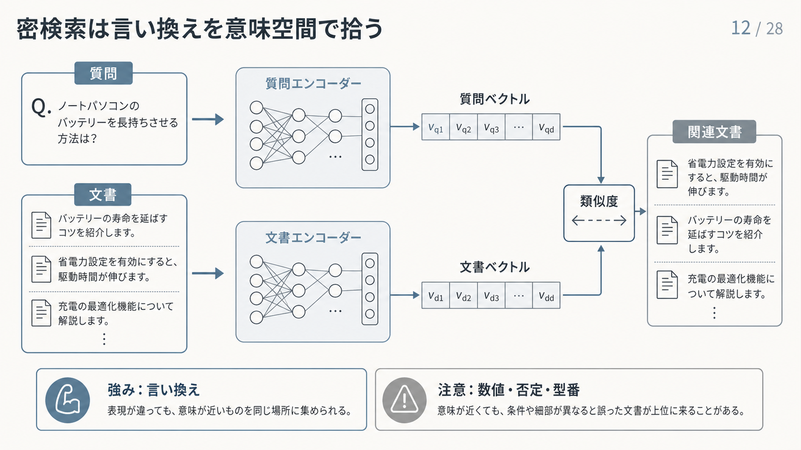

# 4.4 密検索（Dense retrieval）

密検索（Dense retrieval）は、質問と文書を埋め込みベクトルへ変換し、語が一致しなくても意味的に近い候補を検索します。
言い換えへ対応できる一方、識別子、数値、否定、版、権限を別の仕組みで補う必要があります。

## 4.4.1 直感と適用範囲

「悪役」と「敵対する人物」のように、同じ概念が異なる語で表される場合があります。
密検索は、学習済みの意味空間で質問と文書を比較し、語の一致だけでは取得できない候補を探します。

[Dense Passage Retrieval（DPR）](https://arxiv.org/abs/2004.04906)は、質問と文書を別々の符号化器でベクトル化し、複数の公開質問応答データセットでBM25を上回る結果を報告しました。
結果は学習データと評価条件に依存し、すべての業務で疎検索を上回ることを意味しません。

ベクトルの類似度は、文章の真偽、情報源の信頼度、文書の鮮度、利用者の権限を表しません。
密検索を候補生成の一つの手掛かりとして使い、メタデータフィルターと再順位付けで補います。

## 4.4.2 二塔型符号化器

**二塔型符号化器（Bi-encoder）**は、質問と文書を別々にベクトルへ変換します。
文書ベクトルを事前に計算してインデックスへ保存し、質問時には質問ベクトルだけを作って近傍検索できます。
大量の文書を毎回モデルへ入力せずに検索できる点が利点です。

DPRでは、質問の符号化器と文書の符号化器を質問応答向けに学習し、内積で候補を検索しました。
[Sentence-BERT](https://arxiv.org/abs/1908.10084)のように、質問と文書で同種の符号化器を共有する構成もあります。

質問と候補を同時に読む交差符号化器（Cross-encoder）より、語と条件の細かな関係は捉えにくくなります。
二塔型符号化器で広く候補を回収し、交差符号化器で少数候補を再順位付けする役割分担ができます。

図4-5は、上段の質問と下段の各文書を別々の符号化器でベクトルへ変換し、中央右の類似度で比べる流れです。
右端では、語が完全に一致しなくても「バッテリーを長持ちさせる」と意味が近い文書が上位に入ります。
下段の注意書きが示すとおり、数値、否定、型番などの細部は別の検査で補います。

**図4-5　二塔型符号化器による密検索**

## 4.4.3 学習データと負例

密検索器の品質は、正例だけでなく、どの文書を負例として学習するかに影響されます。
無作為に選んだ負例は区別しやすく、実際の検索上位に現れる似た誤文書への判別を十分に学べない場合があります。

DPRは、同じ一括処理内の別文書を負例にするバッチ内負例（In-batch negative）と、BM25が上位へ返した誤文書を難しい負例（Hard negative）として利用しました。
[ANCE](https://arxiv.org/abs/2007.00808)は、近似最近傍（Approximate Nearest Neighbor：ANN）インデックスから難しい負例を継続的に取得して学習しました。

旧版と新版、言い換えた同じ根拠、同一文書の隣接チャンクを誤って負例にすると、必要な近傍を遠ざけます。
無作為負例、難しい負例、実際には正例となる偽負例（False negative）を区別します。
文書系列、版、重複を考慮して学習対を作ります。

## 4.4.4 埋め込みモデル

公開評価の総合順位だけでモデルを選びません。
[MTEB](https://arxiv.org/abs/2210.07316)は、検索、分類、類似度など、多様な課題を同じ枠組みで比べる埋め込みモデルの評価基盤です。
単一の総合値では、対象業務の検索適性を判断できません。

日本語、日本語と英語の混在、言語をまたぐ検索、専門略語、型番を質問群へ分けます。
最大入力長、次元数、ライセンス、処理量、費用も比較します。

[E5](https://arxiv.org/abs/2212.03533)のように、質問と文書へ異なる接頭辞や指示を付けるモデルがあります。
モデルの仕様どおりに入力を作り、業務の正解集合で評価します。
モデル名が同じでも版や前処理が違う結果を混ぜません。

[Contriever](https://arxiv.org/abs/2112.09118)は、人手の関連度ラベルを使わない学習で候補を広く拾う方法を示しました。
ただし、BEIRの上位100件への回収では多くのデータセットでBM25を上回った一方、平均値や上位順位を重視する指標ではBM25を下回りました。
教師データが少ない場合の候補生成器として比較し、最終順位の品質と分けて判断します。

## 4.4.5 質問と文書の符号化条件

文書ベクトルをモデルAで作り、質問をモデルBで作った場合、次元数が同じでも比較できる保証はありません。
同じモデルでも、接頭辞、文字列を処理単位へ分ける機能（トークン化器）、最大長、切り捨て、正規化が違えば順位が変わります。

モデルID、モデルの版、質問・文書接頭辞、トークン化器、最大長、正規化、距離尺度を一つの版契約にします。
質問ベクトルを一時保存する際の識別子にも契約版を含めます。
インデックスの構成記録と質問処理の版が一致しない場合は検索を拒否します。

長い文書が切り捨てられた場合、末尾の重要情報が埋め込みへ入っていない可能性があります。
切り捨て件数と影響文書を記録し、チャンク分割または対応する長文モデルを見直します。

## 4.4.6 類似度指標

代表的な比較方法は、コサイン類似度、内積、ユークリッド距離です。
コサイン類似度は方向、内積は方向と大きさ、ユークリッド距離は点間の距離を利用します。
どの尺度が常に優れるという関係ではありません。

Sentence-BERTは文類似度へコサイン類似度を利用し、DPRは内積による検索を用いました。
学習時に想定された尺度と、インデックス・質問時の正規化を一致させます。

類似度スコアは相対的な近さであり、正答確率ではありません。
固定しきい値を回答の信頼度と呼ばず、モデル・文書集合・質問群ごとに調整します。
距離尺度の変更も検索順位を変える仕様変更として評価します。

## 4.4.7 近似最近傍検索

完全探索は、質問ベクトルをすべての文書ベクトルと比較します。
文書数が増えると計算量が大きくなるため、ANN検索で探索範囲を絞ります。

[階層的近傍グラフ（Hierarchical Navigable Small World：HNSW）](https://arxiv.org/abs/1603.09320)は、近傍グラフを階層化し、入口から近いノードへ移動して候補を探します。
接続数、構築時探索幅、質問時探索幅を変えると、再現率、メモリ、構築時間、応答時間が変わります。

[LuceneへHNSWを統合した研究](https://arxiv.org/abs/2304.12139)は、検索品質だけでなく、インデックス構築時間、保存容量、同時検索の処理量も比較しました。
単一処理と並行処理でLuceneとFaissの優劣が入れ替わり、差の原因も完全には分離されていません。
製品名だけで選ばず、本番に近い同時実行数と機器で測ります。

ANN検索は近似であるため、候補数を増やすだけでなく、一部の質問について完全探索と結果を比べる必要があります。
フィルター後の集合が小さい質問も分けて評価します。
応答時間のためにアクセス制御リスト（Access Control List：ACL）を外すことは認めません。

## 4.4.8 近似検索の評価と切替条件

評価には、代表的な質問、正解根拠、同じ文書集合に対する完全探索の結果、実運用と同じフィルター条件を使います。
完全探索の上位`k`件をANN検索が拾えた割合、必要根拠の順位、応答時間、メモリ使用量、処理期限超過の割合を測ります。

合格条件は、質問の種類とフィルターの選択率ごとに事前に定めます。
全体平均が改善していても、厳しい権限条件、数値・型番、少数の重要質問で必要根拠を落とす場合は合格にしません。

品質が基準を下回る場合は、上限内で探索幅や候補数を増やします。
認可済みの候補集合が小さい場合は完全探索へ切り替え、処理期限を超えた場合は認可済みの疎検索または統合順位へ戻すか、回答を保留します。
どの代替経路でもACLを緩めません。

インデックス版、埋め込みモデル、HNSWの設定、フィルター選択率、完全探索との差、切替理由を処理記録へ残します。
設定変更後は同じ質問群を再実行し、品質と応答時間の両方が合格条件を満たすことを確認します。

## 4.4.9 遅延相互作用とColBERT

単一ベクトル方式は、文書全体の情報を一つのベクトルへ圧縮します。
[ColBERT](https://arxiv.org/abs/2004.12832)は、質問と文書のトークンごとのベクトルを保持し、各質問トークンに最も近い文書トークンのスコアを統合します。
この方式を**遅延相互作用（Late interaction）**と呼びます。

文書表現を事前計算しながら、専門語と周辺文脈を細かく照合できます。
[ColBERTv2](https://arxiv.org/abs/2112.01488)は、残差圧縮などでインデックス量を抑える方法を扱いました。

単一ベクトルより保存容量と質問時の計算量が増えます。
長い技術文書、専門語、同じ語の異なる文脈で改善が確認できる場合に限定して導入します。

## 4.4.10 複数ベクトル検索

一つの文書・チャンクへ複数のベクトルを持たせると、見出し、文、表の行、画像領域などを別々に検索できます。
どの部分が質問へ反応したかを保持でき、単一ベクトルへの情報圧縮を減らします。

ColBERTのトークン表現は、複数ベクトル検索（Multi-vector retrieval）の細かな単位の例です。
[M3-Embedding](https://arxiv.org/abs/2402.03216)は、密検索、疎検索、複数ベクトル検索という複数機能を一つのモデルで扱いました。

複数ベクトルの結果を文書候補へまとめる方法によって順位が変わります。
最大スコア、平均、部分ごとの候補上限などを評価します。
重複候補を安定IDで統合し、最終引用は一致したベクトルではなく、対応する原文範囲へ結び付けます。

## 4.4.11 多言語と領域適合

多言語対応モデルでも、日本語同士、日本語質問から英語資料、英語質問から日本語資料の性能は同じとは限りません。
方向ごとに正解質問を用意します。

社内略語、製品コード、否定、数値、分野固有語を別の質問群として評価します。
分野データで追加学習していないモデルを基準にし、必要な場合だけ追加学習を検討します。
学習後は分野質問だけでなく、一般質問と他言語の性能が悪化していないかも確認します。

翻訳して検索する経路を使う場合は、元質問と訳文を両方記録します。
型番、数値、否定、固有名が翻訳で変わっていないか検査します。

## 4.4.12 メタデータフィルター

意味的に近い文書でも、別テナント、別製品、失効版であれば利用できません。
事前フィルターは認可済み集合内で検索できますが、集合が小さい場合にANN探索が難しくなることがあります。
広く検索した後のフィルターは実装しやすい一方、上位候補が除外され、必要件数を得られない場合があります。

[ACORN](https://arxiv.org/abs/2403.04871)は、条件式をベクトル探索へ組み込み、条件付きANN検索の性能課題を扱いました。
実装では、フィルターの選択率ごとに再現率と応答時間を測ります。

候補を必要数より多めに取得する方法や、完全探索への代替経路を用意できます。
ただし、ACLを緩めず、権限外本文をプロンプト、一時保存、処理記録へ入れません。
