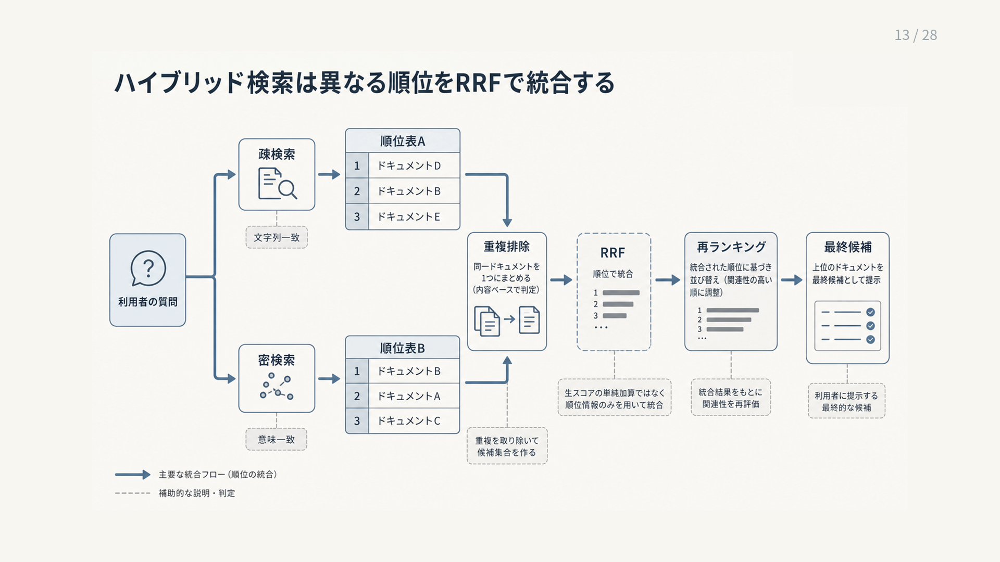

# 4.5 ハイブリッド検索

ハイブリッド検索（Hybrid retrieval）は、疎検索と密検索など、異なる検索方式の候補を統合します。
語彙一致と意味一致の失敗を補い合い、識別子と自然な症状説明が同居する業務質問へ対応します。

## 4.5.1 利用する理由

「ERR-1042が出てログインできません」という質問には、エラーコードの完全一致と、ログイン障害の意味一致が含まれます。
疎検索は識別子を正確に取得し、密検索は言い換えられた症状を広く取得できます。

[BEIR](https://arxiv.org/abs/2104.08663)の評価でも、検索方式の優劣はデータセットによって変わりました。
どちらか一方を万能と見なさず、異なる候補生成器として組み合わせます。

[語の一致と意味の一致を組み合わせた研究](https://arxiv.org/abs/2010.01195)では、BM25と意味検索が別々の関連文書を取得し、評価したニュース記事集合では統合によってBM25単独より再現率が相対約2.8%上がりました。
ただし、評価は一つの古い文書集合と121件の質問に限られ、処理時間や保存容量も報告されていません。
この値を導入目標にはせず、二方式が互いの検索漏れを補うかを対象業務で確かめます。

ハイブリッド検索自体が常に単独方式を上回るわけではありません。
疎検索、密検索、ハイブリッド検索を同じ正解集合で比較し、改善がない質問群には単純な経路を残します。

## 4.5.2 基本の処理手順

ハイブリッド検索は、二つのスコアを最初から足す処理ではありません。
次の段階へ分けます。

1. 同じ認可・時点条件を疎検索と密検索へ適用します。
2. 各検索器を独立して実行し、候補と順位を得ます。
3. 文書版とチャンクIDで同一候補を統合します。
4. 必須フィルターを再確認します。
5. 順位または調整済みのスコアで候補を統合します。
6. 統合候補を必要に応じて再順位付けします。

各段階の候補IDと順位を保存します。
必要根拠が取得されなかったのか、フィルターで落ちたのか、統合後に下がったのかを区別できます。

## 4.5.3 必須フィルター

権限と文書の有効性は、順位を調整する特徴ではなく候補集合の境界です。
テナント、許可主体、削除・剥奪状態、有効期間を統合前に強制します。
BM25やベクトル類似度が高くても境界を越えさせません。

条件付き近似最近傍（Approximate Nearest Neighbor：ANN）検索は、認可済み候補を効率的に探索するために利用できますが、認可方針そのものを決めません。
認可サービスの結果を各検索器へ渡します。

権限外本文を候補、処理記録、一時保存、プロンプトへ保存しません。
監査には、本文ではなく、拒否件数、方針の版、検索経路を必要な範囲で記録します。

## 4.5.4 順位調整条件と重み付け

製品、地域、言語、鮮度などは、利用者が明示したか、モデルが推定したかによって扱いを変えます。
明示条件は必須フィルター、推定条件は順位調整条件や別経路として使うと、誤推定で正解を完全に除外しにくくなります。

情報源の信頼度も、関連度とは別の軸です。
信頼度の低い文書が質問に近い場合に、そのまま正式資料より優先されない規則を設けます。

順位をどの程度引き上げるかを数値で定め、その値の意味を記録します。
版違いを同時に返す用途では、現行、過去、例外の優先規則を決めます。
重みの変更を評価し、どの質問と候補へ影響したかを記録します。

## 4.5.5 候補の同一性と重複

二つの検索器が同じチャンクを返しても、独立した二件の根拠にはなりません。
文書ID、文書版ID、チャンクIDを基本として、同一候補を統合します。
どの検索器が候補の取得に役立ったかを分析できるよう、発見元を保持します。

親子チャンク、同内容を載せる別の情報源（ミラー）、言語版、地域版、旧版は関係を持ちます。
内容が似ているだけで一つにまとめると、適用条件と出所を失う可能性があります。
完全重複、近似重複、同一文書系列の別版を区別します。

一つの文書・情報源が候補を占有しないよう上限を設けられます。
ただし、複数箇所が必要な質問で根拠を落とさないかを評価します。

## 4.5.6 相互順位統合

**相互順位統合（Reciprocal Rank Fusion：RRF）**は、各順位一覧での順位から候補の統合スコアを計算します。
一般的な形は `1 / (k + rank)` を一覧ごとに合計します。
BM25スコアとコサイン類似度の尺度を直接揃える必要がありません。

[RRFの原論文](https://dl.acm.org/doi/10.1145/1571941.1572114)は、複数の順位付け結果を単純な式で統合し、評価した条件で個別方式や他の統合法を上回る結果を報告しました。
結果は入力する順位一覧、検索深度、定数 `k` に依存します。

検索器間だけでなく、複数の検索文の間の統合にも利用できます。
候補を返さなかった検索器の扱いと、各検索器が統合スコアへ与えた寄与を記録します。

図4-6は、左側の疎検索と密検索が作った二つの順位表を、右へ向かって統合する流れです。
同じ文書を一件にまとめた後、RRFは元の点数を直接足さず、各順位表での順位だけを使います。
再順位付けはその後に候補本文を読み直す別工程であり、RRFと役割が異なります。
図中の「再ランキング」は本文の「再順位付け」と同じ処理です。

**図4-6　疎検索と密検索の順位をRRFで統合する流れ**

## 4.5.7 スコア正規化と重み付き統合

元スコアを使う統合では、BM25とコサイン類似度を未調整のまま加算しません。
BM25は質問と文書集合によって広い値を取り、コサイン類似度は別の範囲と分布を持ちます。

最小・最大、標準得点、順位への変換などの正規化があります。
正規化後に重み付き和を取る場合、重みは質問群と正解集合で調整します。
[ハイブリッド検索の統合法を比べた研究](https://arxiv.org/abs/2210.11934)では、正規化を完全に省くと、検索器間のスコア尺度の違いによって性能が不安定になりました。
一方、最小・最大による方法や標準得点など、正規化方法が変わっても、重みを調整した後の最大性能はおおむね同等でした。
また、RRFは設定値によって性能が大きく変わりました。

検索モデル、インデックス、文書集合が変わるとスコア分布も変わります。
重みを再調整し、変更前の品質を保つ試験を行い、元スコア、変換後スコア、特徴ごとの寄与を保存します。

## 4.5.8 質問に応じた統合

質問の種類が分かる場合は、検索方式の比重を質問ごとに変えられます。
型番・条文番号は疎検索、説明的な自然文は密検索へ比重を置きます。
識別子と症状が混在する質問では、両方式に最低候補数を確保します。

経路の振り分け処理が誤ると、正しい検索器の候補を減らす可能性があります。
確信が低い場合は、方式を一つに絞らず、事前に定めたRRFへ戻すなどの代替経路を使います。

選んだ検索器、重み、質問分類、判定の確かさを処理記録へ残します。
質問の種類ごとに振り分け処理と検索結果を評価し、全体平均で誤判定を隠しません。

## 4.5.9 複数質問との組み合わせ

三つの検索文を二つの検索器へ送ると、六つの順位一覧が生まれます。
すべてを一度に統合すると、似た検索文が同じ文書を繰り返し押し上げ、誤って生成された検索文が候補を支配する可能性があります。

検索文ごとに疎検索と密検索を統合し、その後に検索文間を候補上限付きで統合するなど、順序を定めます。
互いに似た検索文と重複候補を早い段階でまとめます。

検索文数、検索器数、各候補数の積を処理予算として監視します。
候補には発見元の検索文と検索器を結び付け、正解根拠を追加しない検索経路を評価で削除します。

## 4.5.10 検索前後のフィルターと条件付きANN検索

**検索前フィルター（Pre-filter）**は、条件に合う集合を作ってから検索します。
認可済み集合内で探せますが、集合が小さい場合にANNグラフの探索品質が下がることがあります。

**検索後フィルター（Post-filter）**は、広く検索してから条件外の候補を除きます。
上位候補がすべて除外され、必要な件数を得られない可能性があります。
権限外本文を取得する設計は、機密性の要件に適さない場合があります。

[ACORN](https://arxiv.org/abs/2403.04871)は、属性条件を考慮したANN探索を扱いました。
実装方式は、文書集合の規模、フィルター選択率、返す候補数で比較します。
検索後フィルターを使う場合も本文を後段へ渡す前に認可を完了し、候補を多めに取得する方法と不足時の処理を定めます。

[NaviX](https://arxiv.org/abs/2506.23397)は、属性条件やグラフの関係条件を先に評価し、その結果をHNSW検索へ渡す構成を扱いました。
単純な範囲条件では専用索引が上回る場合もあり、評価は一つのグラフデータベースが中心です。
複雑な関係条件を使う場合の候補として扱い、検索前・検索後フィルターや専用索引と同じ環境で比べます。

## 4.5.11 結果統合と再順位付けの境界

順位統合は、複数の順位一覧を一つにまとめます。
候補本文と質問を新たに精読して、関連性を判定する処理ではありません。
再順位付けは、質問と各候補を同時に入力し、候補間の順序をより精密に見直します。

最初に疎検索と密検索で必要な根拠を拾い、順位統合後の数十件を再順位付けして、LLMへ渡す数件へ絞る構成が候補です。
候補数は例であり、対象質問、応答時間、費用で評価します。

アクセス制御リスト（Access Control List：ACL）の判定を再順位付け器のスコアへ委ねません。
再順位付け器が時間内に終わらない場合は、認可済みの統合順位へ戻すか、回答を保留します。

## 4.5.12 処理記録

ハイブリッド検索を診断するには、最終順位だけでなく候補が通った経路を記録します。
少なくとも、次の情報を結び付けます。

- 検索器ごとの検索文、フィルター、候補数
- 候補ID、元順位、元スコア
- 重複統合と除外の理由
- 順位統合方式、設定、質問に応じた重み
- 統合後順位と再順位付け前後の順位
- 応答時間、処理期限超過、代替経路
- インデックス、モデル、辞書、方針の版

候補IDをすべての段階で固定します。
正解根拠が「取得されなかった」「フィルターで除かれた」「順位統合で下がった」「再順位付けで落ちた」を区別します。
同じインデックスと設定を再現できる記録があって初めて、変更前後を比較できます。
