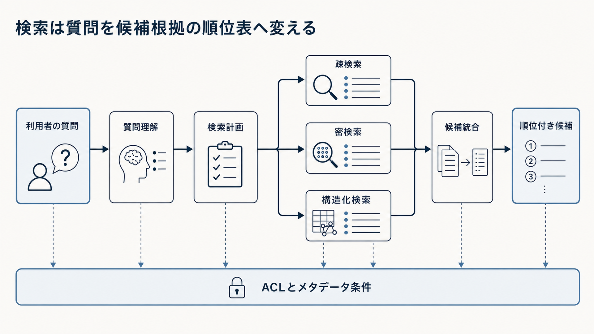

# 4. 質問に合う根拠を探す

利用者の質問と資料は、同じ言葉で書かれているとは限りません。
略語、旧称、言い換え、会話上の省略を解決する必要がある一方、型番、条文番号、否定条件は原形を保つ必要があります。
質問の種類によって、キーワード検索、意味検索、構造化データ、複数段階の検索を使い分けます。

本章では、質問の理解、検索計画、質問変換、疎検索、密検索、ハイブリッド検索を扱います。
質問から対象、期間、版、権限条件を取り出し、必要な根拠を候補集合へ入れるまでが範囲です。

この段階で正しい資料を候補へ入れられなければ、後段のLLMはその資料を根拠として使えません。
検索の目的を回答生成と分け、必要な根拠を候補へ入れられた割合、権限境界、検索経路を評価します。

図4-1は、利用者の質問を左から右へ処理する順序を示します。
上段では質問理解と検索計画の後に三つの検索方式を使い分け、候補を統合して順位を付けます。
下段の帯は、アクセス制御リスト（Access Control List：ACL）とメタデータ条件を、検索の一部だけでなく全段階へ適用することを表します。

**図4-1　質問から順位付き候補を作る検索処理**
