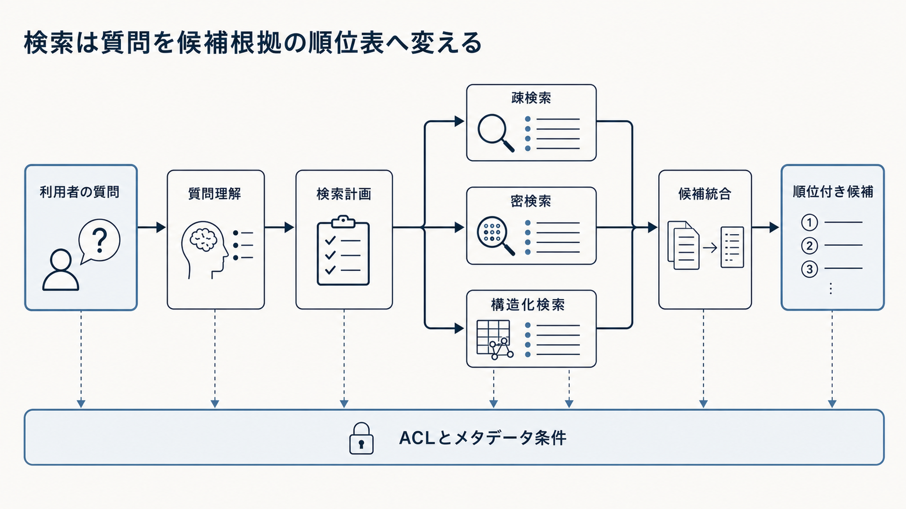

# 4. 質問に合う根拠候補を探す

利用者の質問は、資料に書かれた言葉と同じとは限りません。会話の省略、略語、誤字、期間や版の条件を解決し、権限と鮮度を満たす根拠候補を集める必要があります。

本章では、query理解、query変換、sparse・dense・hybrid retrieval、検索時filteringを整理します。最後に、検索失敗を語彙、embedding、filter、routing、chunk、indexの問題へ切り分けます。

本章の節を、次のラベル付きトピック群に分けます。

| トピック群 | 対象節 | 設計上の問い |
|---|---|---|
| G4-A 質問解釈 | 4.1、4.2 | 検索に必要な意図と条件を保持できるか |
| G4-B 候補取得 | 4.3、4.4、4.5 | 語彙一致と意味一致を補完的に使えるか |
| G4-C 制約適用 | 4.6 | 権限、期間、版を検索時に適用できるか |
| G4-D 失敗診断 | 4.7 | 正解根拠が落ちた最初の工程を特定できるか |

各トピック群では、設計対象、実行制御、評価・停止条件の順に確認します。

**図4-1　質問から順位付き候補を作る検索処理**
