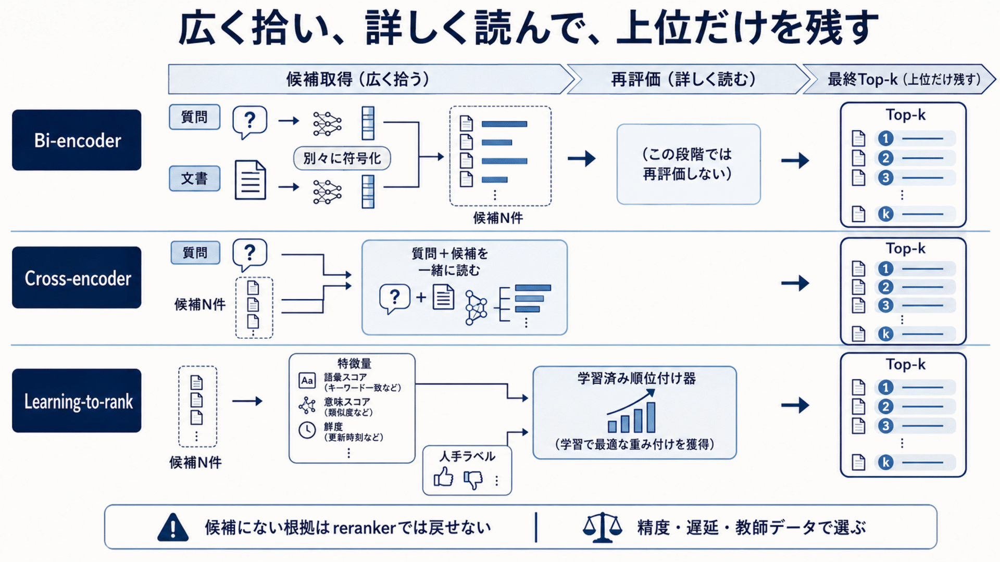

# 5.3. Reranking

再順位付け（Reranking）は、第一段階の検索が集めた候補をより精密に評価し、LLMへ渡す根拠の順序を決めます。
候補に入らなかった根拠を回復する処理ではないため、必要根拠の回収率と分けて評価します。

## 5.3.1. Rank fusionとの違いとcross-encoder

順位統合（Rank fusion）は、複数の検索器や検索文が返した順位一覧を統合します。
再順位付けは、質問と候補本文を改めて読み、関連性を再判定します。

RRFはBM25とdense retrievalの生scoreを同じ尺度へ変換せず、各rank list内の順位から統合順位を計算します。
ただし、文中の否定、条件、版の違いを新たに読み取るわけではありません。
交差符号化器（Cross-encoder）は、質問と候補を同時に入力し、細かな対応を評価します。

候補生成、順位統合、精密順位付けを別の段階として記録します。
正解が候補にない場合は候補生成を、候補にはあるが順位が低い場合は順位統合または再順位付けを調べます。

**交差符号化型の再順位付け器**は、質問と候補文書をBERTなどの言語モデルへ一緒に入力し、両者の語の関係を使って関連度を判定します。
[BERT passage reranking](https://arxiv.org/abs/1901.04085)は、第一段階の候補へBERTを適用し、文書順位付けを改善しました。

文書集合全体へ交差符号化器を適用すると計算量が大きいため、疎検索と密検索が取得した数十件から数百件へ適用します。
計算量と応答時間は候補数に応じて増えます。

入力には、本文だけでなく、必要に応じてタイトル、見出し、版、有効期間を含めます。
最大入力長による切り捨てで、回答箇所や否定条件が落ちていないかを確認します。
日本語、専門用語、長文を含む業務の正解集合で、順位品質と、要求の95%が収まる応答時間（95パーセンタイル）を測ります。

図5-2は、bi-encoderが広く候補を集め、cross-encoderが質問と候補を一緒に読んで再評価し、上位だけを残す二段階を示します。
Learning-to-rankは、語彙スコア、意味スコア、鮮度などの特徴と人手ラベルから順位付け器を学習します。
どの方式でも、第一段階の候補に入らなかった根拠は再順位付けだけでは回復できません。

**図5-2　候補取得と再順位付けで用いるモデルの違い**

## 5.3.2. Pointwise・pairwise・listwiseとmodelの選択

再順位付けの判定方法は、候補を比較する単位で分けられます。

- **単独評価（Pointwise）**は、候補を一件ずつ独立に採点します。
- **一対比較（Pairwise）**は、二件の候補のどちらが適するかを比較します。
- **一覧比較（Listwise）**は、候補一覧全体を見て順序を決めます。

単独評価は並行処理しやすい一方、候補間の相対順位を直接扱いません。
一対比較は細かな比較ができますが、候補数が増えると比較回数が増えます。
一覧比較は全体の順序を直接扱えますが、入力長、候補の初期順、位置による偏りに影響されます。

Zero-Shot Listwise Document Rerankingは、候補IDの順序をLLMに生成させ、document ranking用の追加教師dataなしでlistwise rerankingを評価しています。
入力順を反転する試験や、長い候補一覧を窓へ分ける処理が必要です。

[monoT5](https://arxiv.org/abs/2003.06713)は、質問と文書を系列変換モデルへ入力し、「関連」「非関連」に対応する処理単位（トークン）のスコアを順位付けへ利用します。
生成モデルを文書順位付けへ転用する方法です。

[RankT5](https://arxiv.org/abs/2210.10634)は、分類時の誤差だけでなく、順位を意識した学習目標を扱いました。
どの学習目標を使うかだけでなく、正例と難しい負例（Hard negative）の品質が結果へ影響します。

旧インデックスから作った負例や、別版の正解文書を誤って負例にすると学習が歪みます。
文書系列と版を考慮してラベルを作ります。
追加学習前の公開モデルを基準として残し、学習データ、質問群、モデル版を固定して比較します。

LLM-based rerankerは、複数条件、比較、multi-hop relevanceを自然言語instructionとして受け取るcandidate方式です。採否は固定したreranking datasetで決めます。
一方で、候補本文に埋め込まれた命令によってLLMを誤操作するプロンプトインジェクションの影響も受けます。
候補を信頼できないデータとして構造的に分離します。

出力は候補IDと順位だけに限定し、重複、欠落、未知IDを出力形式の検証で拒否します。
理由を出力する場合も、その理由を回答の根拠として扱わず、監査できる短い判定属性にします。

一覧比較では、候補順を反転・入れ替えて位置の影響を測ります。
長い一覧は、一定幅ずつ重ねながら処理する移動窓へ分け、窓間の統合方法を定めます。

[GPT-4などを再順位付けに使った研究](https://arxiv.org/abs/2304.09542)では、一覧比較が複数の検索評価で強い結果を示しました。
LLM rerankerは元BM25順とshuffle順の両方で評価し、model、language、query sliceごとの順位依存を記録します。
LLM単独の能力とは見なさず、初期順位を変える試験と、出力形式を固定した交差符号化型の再順位付け器との比較を行います。

費用、応答時間、出力のばらつきが大きいため、契約比較や複数段階の質問など、交差符号化器で不足する質問群へ限定します。
失敗時は認可済みで検証済みの交差符号化型再順位付け器または統合順位へ戻します。

## 5.3.3. 本番pipelineと対象件数

本番の一例は、次の流れです。

`候補取得 N件 → 結果統合 → 必須フィルターの再確認 → 再順位付け → K件選択`

ここで、`N`は最初に取得する候補数、`K`は再順位付け後に残す件数です。
reranking対象数Nを増やすとgold evidenceがcandidateへ入る余地が増える一方、reranker呼出し量、latency、costも増えます。
Kを小さくしすぎると、複数根拠を必要とする質問の一部を落とします。
NとKを固定の慣習で決めず、必要根拠の回収率、順位指標、最終回答、応答時間、費用から選びます。

一括処理、候補スコアの一時保存、同時実行制御、モデルの代替経路を設けます。
一時保存の識別子には質問、候補本文の版、再順位付け器の版を含めます。
入力順、元順位、再順位付けスコア、処理時間を記録します。

再順位付け器が利用できない場合は、認可済みの第一段階・統合順位へ戻せます。
根拠集合が空の場合は、LLMの内部知識だけで回答へ進まず、追加検索または回答保留を行います。

## 5.3.4. 評価・失敗分析・選定

評価には、同じ候補一覧、候補ごとの人手判定、初期順位、版・期間・否定などの重要条件を使います。
質問の種類と重要度ごとに、正解根拠の順位、上位`K`件へ必要根拠を保持した割合、誤除外、応答時間、費用を測ります。

採用条件は事前に定めます。
全体平均が改善しても、重要質問で必要根拠を落とす、未知の候補IDを出す、処理期限や費用上限を超える場合は採用しません。

正解根拠が候補にないのか、候補にはあるが順位を下げたのか、入力を切り捨てたのか、出力形式が壊れたのか、処理期限を超えたのかを分けます。
候補順を反転・入れ替える試験も行い、初期順位や位置への依存を確認します。

出力検証または処理時間の条件を満たさない場合は、検証済みの再順位付け器か認可済みの統合順位へ戻します。
必要根拠が上位`K`件から落ちた場合は、`K`を上限内で広げる、候補生成へ戻る、または回答を保留します。
代替経路でも必須フィルターを再確認し、未知IDを追加しません。

relevance labelがない初期段階では、RRFと事前学習済みcross-encoderを比較baselineとして使用します。
十分な人手判定が蓄積した後に、分野向け追加学習、monoT5、RankT5を比較します。
複雑な少数候補に限り、LLMの一覧比較を検討します。

選定では、次の項目を確認します。

- 再順位付け前後の正解順位
- 上位K件へ必要根拠をすべて保持した割合
- 版、否定、数値、専門語を含む重要質問での誤除外
- 50、95、99パーセンタイルの応答時間
- 要求当たりの費用と失敗率
- 同じ入力に対する出力の再現性

効果が小さい場合はモデルを大型化する前に、第一段階で必要根拠を拾えているか、チャンクの大きさ、フィルターの過剰制限を確認します。
gold evidenceが初期candidateにないqueryはreranker評価から分離し、retrieval failureとして検索段階へ戻します。
