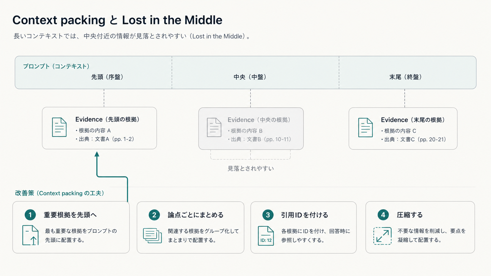

# 5.5 コンテキスト生成

コンテキスト生成は、選別した候補を、LLMへ入力する文脈（コンテキスト）として構造化した根拠集合へ変換します。
根拠の役割、原文への対応と変換履歴、トークン予算、配置、矛盾を明示します。

## 5.5.1 質問の論点

最終コンテキストを作る前に、質問を回答に必要な論点へ分けます。
「導入条件、例外、費用を比較してください」という質問には、少なくとも三つの論点があります。
各候補がどの論点を支えるかを記録します。

[FActScore](https://arxiv.org/abs/2305.14251)は、長文回答をこれ以上分けにくい小さな事実へ分け、知識源による支持を評価します。
この考え方を生成前へ適用し、部分質問または予想される主張へIDを付けます。

どの論点にも割り当てられない候補は、背景情報か不要な候補かを再評価します。
一つの論点だけに高スコアの候補が多くても、他の論点の根拠不足は解消しません。

## 5.5.2 根拠単位

**根拠単位（Evidence unit）**は、回答中の一つ以上の主張を支持または反証する最小の根拠です。
常に検索チャンクと同じではありません。

数値では表の対象行と見出し、規程では条文と但し書き、図では画像領域と説明文、外部システムとの連携窓口（API）では応答項目と取得時刻が一単位になります。
検索しやすい単位、LLMが条件を理解するための文脈、引用する原文範囲を分けます。

根拠単位に型を付け、元ページ、表セル、画像範囲、時刻へ戻れるようにします。
結合・圧縮後も元の単位を失いません。

## 5.5.3 根拠の役割

関連する文書をすべて同じ「根拠」と呼ぶと、反対根拠と旧版を同じ扱いにしてしまいます。
各論点に対して役割を付けます。

- `SUPPORTING` は主張を支持します。
- `CONFLICTING` は主張と矛盾します。
- `BACKGROUND` は定義や背景を説明します。
- `OUTDATED` は対象時点には失効しています。
- `INSUFFICIENT` は関連しますが主張を確定できません。

[FEVER](https://aclanthology.org/N18-1074/)のSUPPORTS、REFUTES、NOT ENOUGH INFOは、関連性と支持性を分ける基礎的な枠組みです。
役割を検索スコアだけで決めず、版、有効期間、情報源の公式性と優先度、適用範囲、本文を確認します。
同じ文書でも、論点ごとに異なる役割を持つことがあります。

## 5.5.4 情報源と引用情報

引用情報には、文書名だけでなく、文書ID、版、ページ、節、原文範囲、表・図ID、保存時点の情報源の複製（スナップショット）を含めます。
URLが変わっても、回答時に参照した原文を識別できる必要があります。

[ALCE](https://arxiv.org/abs/2305.14627)は、引用先が主張を支持する正しさと、引用を必要とする主張を覆う網羅性を分けました。
引用番号があることだけでは検証可能性を保証しません。

生成器へ渡す短い引用IDと、内部の詳細な出所情報を分けます。
同じ引用IDを異なる本文へ再利用せず、一つの回答または一回の処理内で一意にします。

## 5.5.5 根拠の十分性

候補が多いことと、質問へ答えられることは異なります。
各論点について、対象、期間、版、単位、例外など、回答に必要な情報を根拠が満たすかを確認します。

十分性は、検索スコア一つで判断しません。
必要な論点をどれだけ含むか、必要根拠の数、根拠間の一貫性、情報源の公式性と優先度を使います。
支持する根拠があっても、同等の反対根拠があれば確定回答には不足する場合があります。

不足時は、質問の書き換え、追加検索、利用者への確認、限定付き回答、回答保留へ進みます。
矛盾を黙って削除しません。

## 5.5.6 トークン予算

LLMが一度に読める入力の上限（コンテキストウィンドウ）をすべて根拠へ使うことはできません。
システム命令、会話、質問、出力形式、回答を生成する余地を先に確保し、残りを根拠へ配ります。

全候補の上位から順番に詰めると、複合質問の一論点が予算を占有します。
論点ごとに最低枠を置き、文書・情報源ごとの上限で偏りを抑えます。
支持、反対、背景にも役割別の予算を設定できます。

入力上限まで詰めることを成功とせず、必要な根拠と回答余地を確保します。

## 5.5.7 グループ化、統合、変換履歴

根拠を文書、節、論点、時系列でグループ化すると、LLMが断片間の関係を読みやすくなります。
隣接チャンクは重複範囲だけを除いて結合し、異なる情報源の境界は保持します。

転載や同内容の別形式を、独立した根拠として数えません。
元の情報源一覧は出所情報として残します。

再順位付け、フィルター、重複排除、統合、圧縮の前後IDを連鎖として記録します。
後から回答を再検証できるよう、最終根拠から検索候補と原文へ戻れる記録にします。

## 5.5.8 順序と位置の影響

同じ根拠でも、配置する順序によってLLMの利用結果が変わる場合があります。
関連度順、論点順、時系列、情報源の優先度順、複数段階の推論順を対象質問で比較します。

最も重要な根拠を前方へ置く方法が候補です。
複数段階の質問では、前提となる根拠から結論に必要な根拠へ並べます。
版差の説明では時系列へ並べます。

同じ根拠を先頭と末尾へ複製すると利用率が変わる可能性がありますが、重複と引用が曖昧になります。
標準処理にはせず、効果と副作用を比較します。

[Lost in the Middle](https://arxiv.org/abs/2307.03172)は、評価したモデルと課題で、重要情報が入力の中央にあると先頭や末尾より利用されにくい傾向を報告しました。
図5-2は、入力を左から先頭、中央、末尾の三区画に分け、中央の根拠Bが見落とされやすいという傾向を示す模式図です。
中央の根拠Bを薄く示しています。
図は同じ根拠を三つの位置で比較した実験結果ではありません。
位置だけで利用しやすさが決まるわけではなく、モデル、質問、入力長によって結果は変わります。

**図5-2　長い入力で中央の根拠が見落とされやすい傾向**

[Attention Sorting](https://arxiv.org/abs/2310.01427)は、モデルの注意の強さを使って関連文書を末尾側へ並べ直す方法を、合成した単一段階の質問応答で評価しました。
実際の業務文書、誤情報、複数段階の質問、追加計算の費用は十分に評価されておらず、査読済み論文としての採録も確認されていません。
並べ替えを使う場合は、質問群ごとの改善と費用を測り、位置だけを根拠の正しさの代わりにしません。

## 5.5.9 矛盾と旧版の入力形式

矛盾する根拠を区別せず一列の入力形式へまとめると、LLMが件数や位置によって一方を選ぶ可能性があります。
役割ごとの別ブロックへ分け、版、有効日、情報源の公式性と優先度、適用範囲を添えます。

解決済みの旧版と、未解決の事実矛盾を区別します。
正式な後継版が分かる場合は、現行根拠を主ブロック、旧版を変更説明ブロックへ置きます。
同等の公式性と優先度で矛盾が残る場合は、未解決であることを生成器へ明示します。

新しい日付だけで正しさを決めません。
質問の時点と適用範囲、正本の優先規則を使います。

## 5.5.10 プロンプトの入力形式

プロンプトでは、システム命令、利用者の質問、根拠、出力形式の定義を別の区画へ置きます。
根拠本文は信頼できない参照データであり、本文中の命令を実行しません。

各根拠を安定した区切りで囲み、引用ID、役割、版、有効日、情報源の公式性と優先度を必要な範囲で付けます。
本文とメタデータの境界を明確にし、根拠中の構文が出力形式として解釈されないようにします。

[間接プロンプトインジェクションの研究](https://arxiv.org/abs/2302.12173)は、ウェブや文書中の指示がLLM統合アプリを操作する危険を示しました。
構造分離に加え、ツール、外部送信、認証情報を別の方針で制限します。

## 5.5.11 切り詰めと代替経路

トークン上限を超えたときに文字列の末尾を切ると、文、表、コード、引用IDの途中が失われます。
優先度が低い根拠の除外、抽出型圧縮、質問分割の順で縮めます。

主要論点の根拠が収まらない場合は、追加検索、質問分割、限定付き回答、回答保留へ戻します。
コンテキスト生成が処理期限を超えた場合は、検証済みの短い上位原文を代替として使います。
根拠なし生成へは進みません。

予算によって除外した根拠と論点を記録します。
回答の不足が検索、選別、切り詰めのどこに由来するかを区別します。

## 5.5.12 検証と再現性

完成したコンテキストに構造検査を行います。
引用IDの重複、原文範囲の欠損、アクセス制御リスト（Access Control List：ACL）の判定なし、期間不明、未支持論点、変換履歴欠損を検出します。
セキュリティと出所・変換履歴の重大な欠損では、生成を停止します。

配置処理と、文字列を処理単位へ分ける機能（トークン化器）の版、予算、入力候補、順序、除外理由、同点時の規則を保存します。
同じ入力と版から同じコンテキストを再構築できるようにします。

コンテキストウィンドウへ収まったことだけを成功と見なしません。
必要根拠を保持し、LLMが対象質問で利用でき、原文へ戻れることを確認します。
