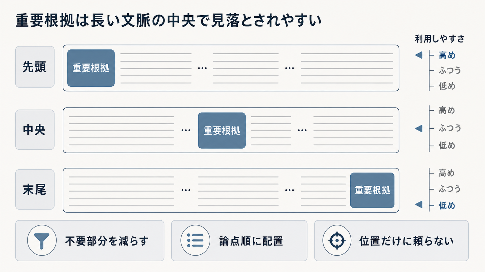

# 5.6. Context packing

Context packingは、Evidence Setから回答に必要な根拠を選び、限られた入力長の中へ配置する処理です。
単なる連結ではなく、質問の論点、根拠の役割、親子関係、引用位置を保ちながら、どの情報をどの順序でLLMへ渡すかを決めます。

本節ではtoken budget、選択と順序、position bias、parent-child展開、serialization、truncationをまとめて扱います。
矛盾や旧版の優先順位は先に5.7で決め、packingで都合よく消さないことが前提です。

## 5.6.1. token budgetとevidence選択

LLMが一度に読める入力の上限（コンテキストウィンドウ）をすべて根拠へ使うことはできません。
システム命令、会話、質問、出力形式、回答を生成する余地を先に確保し、残りを根拠へ配ります。

全候補の上位から順番に詰めると、複合質問の一論点が予算を占有します。
論点ごとに最低枠を置き、文書・情報源ごとの上限で偏りを抑えます。
支持、反対、背景にも役割別の予算を設定できます。

入力上限まで詰めることを成功とせず、必要な根拠と回答余地を確保します。

根拠を文書、節、論点、時系列でグループ化すると、LLMが断片間の関係を読みやすくなります。
隣接チャンクは重複範囲だけを除いて結合し、異なる情報源の境界は保持します。

転載や同内容の別形式を、独立した根拠として数えません。
元の情報源一覧は出所情報として残します。

再順位付け、フィルター、重複排除、統合、圧縮の前後IDを連鎖として記録します。
後から回答を再検証できるよう、最終根拠から検索候補と原文へ戻れる記録にします。

## 5.6.2. orderingとposition bias

同じ根拠でも、配置する順序によってLLMの利用結果が変わる場合があります。
関連度順、論点順、時系列、情報源の優先度順、複数段階の推論順を対象質問で比較します。

最も重要な根拠を前方へ置く方法が候補です。
複数段階の質問では、前提となる根拠から結論に必要な根拠へ並べます。
版差の説明では時系列へ並べます。

同じ根拠を先頭と末尾へ複製すると利用率が変わる可能性がありますが、重複と引用が曖昧になります。
標準処理にはせず、効果と副作用を比較します。

[Lost in the Middle](https://arxiv.org/abs/2307.03172)は、評価したモデルと課題で、重要情報が入力の中央にあると先頭や末尾より利用されにくい傾向を報告しました。
図5-6は、入力を左から先頭、中央、末尾の三区画に分け、中央の根拠Bが見落とされやすいという傾向を示す模式図です。
中央の根拠Bを薄く示しています。
図は同じ根拠を三つの位置で比較した実験結果ではありません。
Lost in the Middleの位置効果は、同論文が評価したモデル、質問、入力長での結果であり、位置だけを利用可否の決定要因とはみなしません。

**図5-6　長い入力における根拠の配置（位置効果を考える概念図）**

[Attention Sorting](https://arxiv.org/abs/2310.01427)論文は、model attentionに基づいてrelevant documentを入力末尾側へ並べ替える方法を、同論文のsynthetic single-hop QA条件で評価しています。
Attention Sortingの報告範囲には実業務文書、誤情報、複数段階質問、追加計算費用の評価が含まれないため、これらの条件へ結果を外挿しません。
並べ替えを使う場合は、質問群ごとの改善と費用を測り、位置だけを根拠の正しさの代わりにしません。

## 5.6.3. 矛盾・旧版とPrompt入力形式

矛盾する根拠を区別せず一列の入力形式へまとめると、LLMが件数や位置によって一方を選ぶ可能性があります。
役割ごとの別ブロックへ分け、版、有効日、情報源の公式性と優先度、適用範囲を添えます。

解決済みの旧版と、未解決の事実矛盾を区別します。
正式な後継版が分かる場合は、現行根拠を主ブロック、旧版を変更説明ブロックへ置きます。
同等の公式性と優先度で矛盾が残る場合は、未解決であることを生成器へ明示します。

新しい日付だけで正しさを決めません。
質問の時点と適用範囲、正本の優先規則を使います。

プロンプトでは、システム命令、利用者の質問、根拠、出力形式の定義を別の区画へ置きます。
根拠本文は信頼できない参照データであり、本文中の命令を実行しません。

各根拠を安定した区切りで囲み、引用ID、役割、版、有効日、情報源の公式性と優先度を必要な範囲で付けます。
本文とメタデータの境界を明確にし、根拠中の構文が出力形式として解釈されないようにします。

[間接プロンプトインジェクションの研究](https://arxiv.org/abs/2302.12173)は、ウェブや文書中の指示がLLM統合アプリを操作する危険を示しました。
構造分離に加え、ツール、外部送信、認証情報を別の方針で制限します。

## 5.6.4. truncation・fallback・再現性

token上限超過時は末尾を文字数で切らず、文、表、code block、citation IDの境界単位で削減します。
優先度が低い根拠の除外、抽出型圧縮、質問分割の順で縮めます。

主要論点の根拠が収まらない場合は、追加検索、質問分割、限定付き回答、回答保留へ戻します。
コンテキスト生成が処理期限を超えた場合は、検証済みの短い上位原文を代替として使います。
根拠なし生成へは進みません。

予算によって除外した根拠と論点を記録します。
回答の不足が検索、選別、切り詰めのどこに由来するかを区別します。

完成したコンテキストに構造検査を行います。
引用IDの重複、原文範囲の欠損、アクセス制御リスト（Access Control List：ACL）の判定なし、期間不明、未支持論点、変換履歴欠損を検出します。
セキュリティと出所・変換履歴の重大な欠損では、生成を停止します。

配置処理と、文字列を処理単位へ分ける機能（トークン化器）の版、予算、入力候補、順序、除外理由、同点時の規則を保存します。
同じ入力と版から同じコンテキストを再構築できるようにします。

コンテキストウィンドウへ収まったことだけを成功と見なしません。
必要根拠を保持し、LLMが対象質問で利用でき、原文へ戻れることを確認します。
