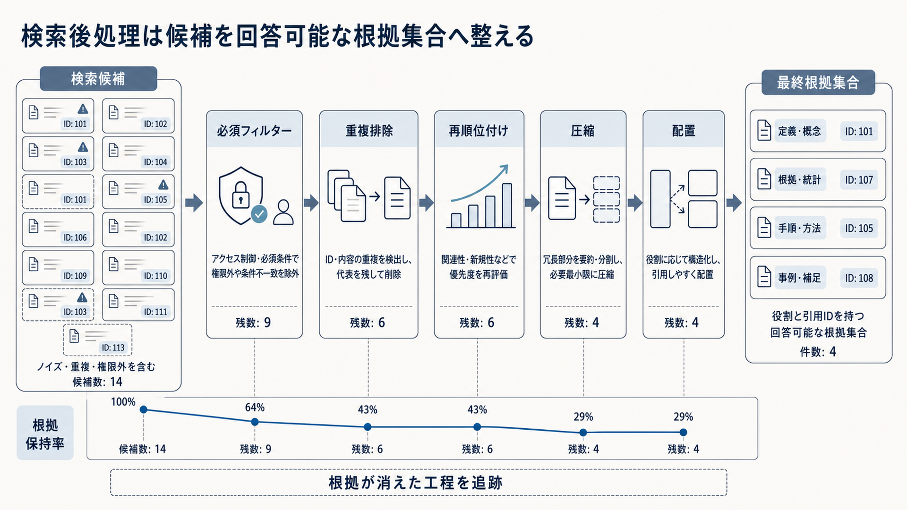

# 5. 根拠を選別・整形する

検索で得た候補をそのままLLMへ渡すと、重複、無関係な文書、旧版、矛盾が、LLMへ渡せる限られた入力（コンテキスト）を占めます。
必要な根拠を広く集める検索と、回答に使う根拠を選ぶ検索後処理では、目的が異なります。

本章では、フィルター、重複排除、再順位付け、コンテキスト圧縮、コンテキスト生成、矛盾と旧版の処理を扱います。
各処理で候補を消した理由と、原文へ戻れる出所・変換履歴を保持します。

目的は、候補数を最小にすることではありません。
質問へ答えるために必要な根拠を残し、不要または利用禁止の情報を除き、LLMと利用者が根拠の役割と出所を確認できる状態を作ることです。

図5-1は、検索候補を左から右へ絞り込み、最終的な根拠集合を作る流れです。
上段の件数は説明用の例であり、下段の割合は候補数の減少を示します。
正解根拠を保持できた割合ではありません。
候補が減った工程だけでなく、必要な根拠がどの工程で消えたかを候補IDで追跡します。

**図5-1　検索候補を回答可能な根拠集合へ整える流れ**
