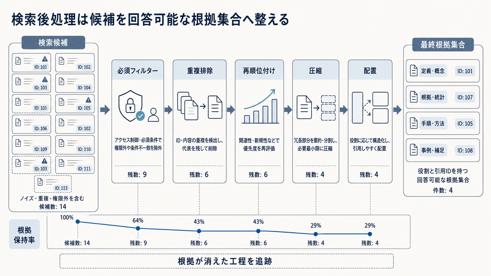

# 5. 根拠候補をEvidence Setに整える

検索で見つけた資料は、重複、古い版、低信頼source、矛盾、token超過を整理し、回答に必要な根拠を追跡可能な形へまとめます。この処理によって、検索候補を生成モデルが利用できる根拠集合へ変換します。

本章では、候補の正規化、重複排除、reranking、compressionを経てEvidence Setを作り、contextへ配置するまでを扱います。回答文の生成、引用表示、回答保留は第6章で扱います。

検索scoreが高い候補でも、同じ内容の重複、失効した版、質問の一部しか支えない断片が含まれます。候補を比較可能なschemaへそろえ、重複を抑え、必要ならrerankやcompressionを適用してから、回答に使う根拠集合を確定します。

Evidence Setは単なる本文の配列ではありません。各根拠の出典、版、位置、役割、採用理由を保持し、矛盾や不足を表現します。生成へ渡す情報量を減らす場合も、主張と原文を対応付けられる粒度を残します。

**図5-1　検索候補を回答可能な根拠集合へ整える流れ**
