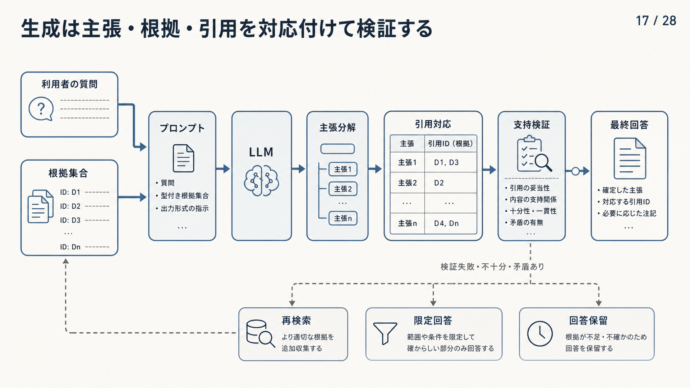

# 6. 根拠に基づいて回答する

回答生成では、選別済みの根拠集合を、利用者の質問に対応する回答へ変換します。
根拠に書かれている内容、根拠から条件付きで導ける内容、モデルの内部知識を混同しません。
根拠が不足・矛盾する場合は、回答の範囲を狭めるか、確認質問・回答保留を行います。

本章では、プロンプトを生成契約として設計し、命令と参照データを分離する方法を説明します。
続いて、主張と引用の対応、引用の正しさと網羅性、版・鮮度・矛盾、生成後の検証を扱います。

最終的な目標は、自然な文章を返すことだけではありません。
利用者が回答の出所と適用条件を確認でき、システムが根拠不足や危険な操作を安全に止められることです。

図6-1は、利用者の質問と根拠集合を左からプロンプトへ入れ、回答を検証する流れです。
生成した文章を主張へ分け、中央の表で各主張を引用IDと対応付けます。
支持を確認できない場合は下段へ分岐し、再検索、支持できる範囲だけの回答、回答保留のいずれかを選びます。

**図6-1　主張、根拠、引用を対応付けて回答を検証する流れ**
