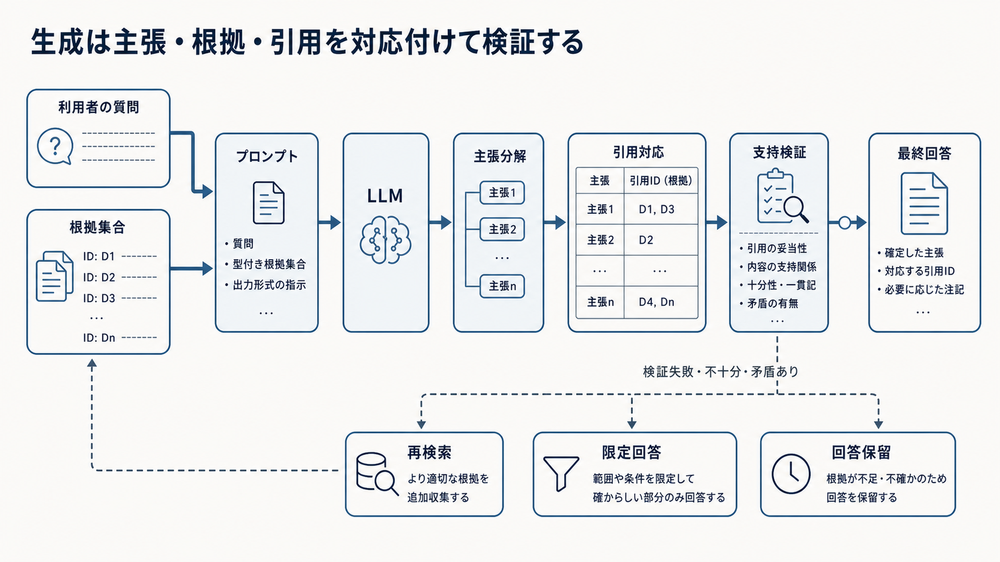

# 6. 根拠に基づいて回答する

本章では、Evidence Setから根拠に基づく回答を作ります。資料に書かれていることとモデルの推測を混ぜず、根拠が足りない場合は回答範囲を狭めるか、回答を保留します。

回答形式、answerability、citation、複数根拠の統合、claim単位の検証、会話履歴を扱います。業務システムへのaction実行は本章の中心に置かず、境界だけを示して、詳細を第9章のAgentic RAGと第8章の認可・監査へ委ねます。

生成では、質問、命令、取得した根拠、出力schemaを区別します。回答中の主張をcitation IDへ対応付け、根拠が支えない断定を検出できる形で返します。形式が正しいことと、内容が根拠に支持されることは別に検証します。

根拠不足や矛盾がある場合は、無理に一つの結論へまとめません。答えられる範囲を限定し、不足情報、確認質問、回答保留を出力契約へ含めます。

**図6-1　主張、根拠、引用を対応付けて回答を検証する流れ**
