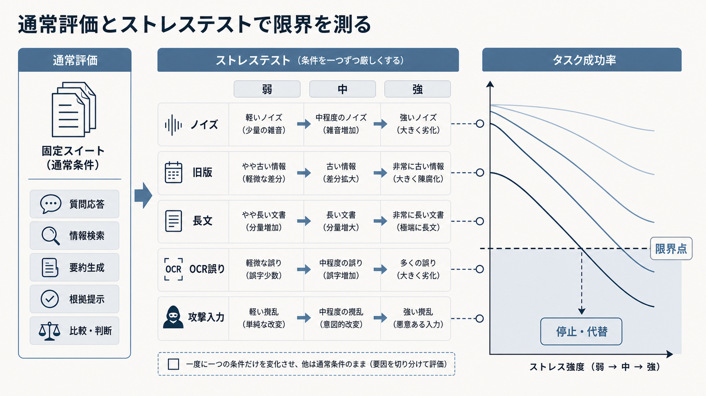

# 7.2. 評価データセット

評価データセットは、RAGの変更前後を同じ条件で比較し、どのfailureが改善または悪化したかを再現するための基準です。質問だけでなく、基準時点、利用者権限、期待する根拠、期待回答、回答不能条件、評価rubricを一組として管理します。

本節では通常質問、negative case、権限・矛盾・ノイズを含むstress case、synthetic data、version管理を扱います。単一の平均scoreを作るためではなく、重要なsliceとrelease停止条件を固定することが目的です。

## 7.2.1. 評価目的・仮説・dataset schema

評価を始める前に、目的と変更仮説を一文で記録します。
たとえば、「疎検索と密検索の併用により、型番スライスのRecall@10が上がる」のように、変更、対象、期待する指標を結び付けます。

開発中の比較、リリース判定、障害原因の調査では、評価の目的が異なります。
開発比較では改善量、リリース判定では最低基準、障害調査では失敗段階の特定を重視します。

[CheckList](https://aclanthology.org/2020.acl-main.442/)が能力ごとの振る舞いを試験するように、RAGでも狙う失敗パターンを明示します。
成功条件、非劣化条件、中止条件は結果を見る前に決め、後から目的を合わせないようにします。

模範回答や正解根拠を人が確認した評価用データを、正解付き評価データと呼びます。
質問と模範回答だけでなく、正解となる文書、チャンク、スパン、回答可能性、利用者の権限、基準日時、質問形式、重大度を保存します。

[KILT](https://arxiv.org/abs/2009.02252)のように情報源も正解へ含めると、回答は合っていても誤った資料を使った事例を検出できます。
正解が複数ある場合は、代替可能な根拠と許容する表現を列挙します。

[SQuAD 2.0](https://arxiv.org/abs/1806.03822)が回答できない質問を含むように、RAGの評価にも回答不能、曖昧、資料間の矛盾、権限不足を含めます。
文書の更新日と評価基準日を記録し、情報源の更新に合わせて正解も版管理します。

目的と実行頻度が近い評価例をまとめた集合を、評価項目群と呼びます。
すべての評価を毎回実行するのではなく、目的と実行時期に応じて分けると、短い開発周期と広い検査範囲を両立できます。
表7-4は、行ごとに評価項目群を、列ごとに目的と実行時期の例を示します。
上から下へ進むほど、確認範囲と実行費用が増える構成です。

**表7-4　評価項目群の役割と実行時期**

| 項目群 | 目的 | 実行例 |
|---|---|---|
| 基本動作 | 基本機能の破損を早く検出 | コード変更ごと |
| 主要項目 | 主要な質問と重要スライスを確認 | 毎日 |
| 拡張 | まれな事例を含む幅広い回帰確認 | 公開前 |
| 限界条件 | ノイズや長文など限界条件を確認 | 定期、主要変更時 |
| 安全性 | 権限、注入攻撃、危険操作を確認 | 定期、公開前 |

実際の質問は運用分布を、専門家が作る質問は重要論点を、合成質問は網羅性を、障害事例は再発防止を担います。
開発用、最終試験用、長期保留用のデータを分け、同じ質問へのプロンプトの過適合を防ぎます。

## 7.2.2. negative・権限・矛盾・stress case

ストレステストは、通常より厳しい条件を与え、品質がどこから急に崩れるかを調べる試験です。
ノイズ文書の割合、文書長、検索件数、OCR誤り、必要根拠数などの強度を段階的に変えます。

[RGB](https://arxiv.org/abs/2309.01431)は、RAGをノイズ耐性、答えがない場合の回答保留、情報統合、反事実への耐性に分けて評価します。
旧版と新版の混在、多言語、複数文書をまたぐ質問も、通常の平均値では見えにくい弱点を明らかにします。

プロンプトインジェクション、知識汚染、テナントをまたぐ検索、権限のない操作は隔離環境で試します。
安全性を本番の利用要求で初めて試してはいけません。

図7-2は、左から通常条件の固定評価、条件を一つずつ厳しくする試験、タスク成功率の変化の順に読みます。
中央ではノイズ、旧版、長文、OCR誤り、攻撃入力のうち一種類だけを弱、中、強へ変えます。
右の曲線が下限を下回った強度を限界として記録し、停止または代替経路へ切り替えます。
右側の曲線は読み方を示す模式図であり、特定のシステムを測った結果ではありません。

**図7-2　通常評価とストレステストの組み合わせ**

通常質問だけでなく、根拠がない質問、権限外資料を誘う質問、古い版と新しい版が競合する質問、ノイズ文書を混ぜた質問を固定します。sliceごとの件数と重要度を記録し、平均値で高risk failureを隠しません。

## 7.2.3. synthetic data

合成データは、モデルによって作った質問、回答、根拠、攻撃入力などの評価例です。
実際の利用履歴だけでは少ない例外条件や難しい負例を増やせます。

[ARES](https://arxiv.org/abs/2311.09476)は、合成した質問と回答に少量の人手ラベルを組み合わせて自動評価器を構築します。
ただし、生成モデルの癖が評価データと採点者の双方へ入り、実際より解きやすい問題になる場合があります。

合成例の自然さ、正解の一意性、根拠との整合を無作為抽出した標本で人が確認します。
実データと合成データの結果は分けて表示します。
攻撃パターンの多様化に使った場合も、その成功率を実環境での発生頻度とは解釈しません。

## 7.2.4. version管理と再現性

比較結果を再現するには、コーパス、インデックス、検索設定、モデル、プロンプト、採点者、評価データ、コードの版を一組で保存します。
外部APIのモデルは同じ名前でも挙動が更新される場合があるため、提供元が示す版と実行日時も記録します。

変更前後には同じ評価例を使い、質問ごとの差を対応させて比較します。
平均値には信頼区間を添え、人手評価には評価者間一致を添えます。
差が信頼区間の幅より小さい場合や、重要スライスの標本が少ない場合は、勝敗を断定しません。

すべての外部挙動を再現できない場合でも、要求、応答、取得候補、最終コンテキスト、採点結果を保存します。
再現できる範囲とできない範囲を明記することで、後の判断を監査可能にします。

datasetの質問、gold evidence、期待回答、rubric、生成方法、review履歴をversion管理します。source更新で正解が変わった場合は、過去datasetを上書きせず、新しい基準時点として追加します。
