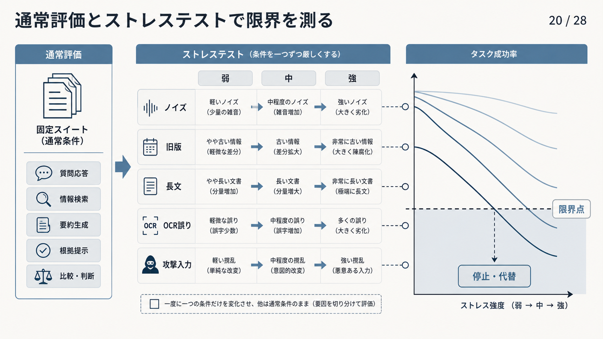

# 7.2 評価手法

評価手法は、指標を再現可能な手順で測り、変更の効果を判断する方法です。
評価データ、採点者、実行条件を固定し、失敗を再現できる記録を残します。

## 7.2.1 評価目的と仮説

評価を始める前に、目的と変更仮説を一文で記録します。
たとえば、「疎検索と密検索の併用により、型番スライスのRecall@10が上がる」のように、変更、対象、期待する指標を結び付けます。

開発中の比較、リリース判定、障害原因の調査では、評価の目的が異なります。
開発比較では改善量、リリース判定では最低基準、障害調査では失敗段階の特定を重視します。

[CheckList](https://aclanthology.org/2020.acl-main.442/)が能力ごとの振る舞いを試験するように、RAGでも狙う失敗パターンを明示します。
成功条件、非劣化条件、中止条件は結果を見る前に決め、後から目的を合わせないようにします。

## 7.2.2 正解付き評価データ

模範回答や正解根拠を人が確認した評価用データを、正解付き評価データと呼びます。
質問と模範回答だけでなく、正解となる文書、チャンク、スパン、回答可能性、利用者の権限、基準日時、質問形式、重大度を保存します。

[KILT](https://arxiv.org/abs/2009.02252)のように情報源も正解へ含めると、回答は合っていても誤った資料を使った事例を検出できます。
正解が複数ある場合は、代替可能な根拠と許容する表現を列挙します。

[SQuAD 2.0](https://arxiv.org/abs/1806.03822)が回答できない質問を含むように、RAGの評価にも回答不能、曖昧、資料間の矛盾、権限不足を含めます。
文書の更新日と評価基準日を記録し、情報源の更新に合わせて正解も版管理します。

## 7.2.3 評価項目群

目的と実行頻度が近い評価例をまとめた集合を、評価項目群と呼びます。
すべての評価を毎回実行するのではなく、目的と実行時期に応じて分けると、短い開発周期と広い検査範囲を両立できます。
表7-4は、行ごとに評価項目群を、列ごとに目的と実行時期の例を示します。
上から下へ進むほど、確認範囲と実行費用が増える構成です。

**表7-4　評価項目群の役割と実行時期**

| 項目群 | 目的 | 実行例 |
|---|---|---|
| 基本動作 | 基本機能の破損を早く検出 | コード変更ごと |
| 主要項目 | 主要な質問と重要スライスを確認 | 毎日 |
| 拡張 | まれな事例を含む幅広い回帰確認 | 公開前 |
| 限界条件 | ノイズや長文など限界条件を確認 | 定期、主要変更時 |
| 安全性 | 権限、注入攻撃、危険操作を確認 | 定期、公開前 |

実際の質問は運用分布を、専門家が作る質問は重要論点を、合成質問は網羅性を、障害事例は再発防止を担います。
開発用、最終試験用、長期保留用のデータを分け、同じ質問へのプロンプトの過適合を防ぎます。

## 7.2.4 人手評価の基準

人手評価では、「良い回答か」という一問だけを尋ねません。
正確性、根拠忠実性、完全性、引用、実用性、安全性を独立した項目として採点します。

このような採点基準をルーブリックと呼びます。
各点数には代表例を置き、境界事例を誰が裁定するかを決めます。
たとえば根拠忠実性を三段階にするなら、「すべての主張が支持される」「一部に支持不足がある」「主要な結論が支持されない」のように観察可能な条件を書きます。

[HAGRID](https://arxiv.org/abs/2307.16883)は、情報源を伴う情報探索回答を人とLLMの協働で構築したデータセットです。
評価者には質問時点の情報源を提示し、自分の知識ではなくその情報源に基づいて判定してもらいます。

影響の大きい事例は二人以上が独立して評価し、不一致を裁定します。
Cohenのカッパ係数などで評価者間一致を測り、基準の曖昧さを発見します。

## 7.2.5 ルールによる評価

機械的に判定できる条件は、意味を判断するモデルより先にコードで検査します。
決定的なルールは、同じ入力に同じ結果を返し、違反箇所を直接示せます。

JSON Schemaへの適合、必須項目、引用IDの存在、URL形式、引用文の一致、数値や日付、アクセス権、禁止ツールの呼び出しは、ルール評価に向いています。
これらを自然言語による評価へ任せると、採点ごとに判定が揺れる可能性があります。

ルール検査を安価で厳密な合否判定として実行し、それを通過した回答だけを人やモデルによる意味評価へ渡します。
失敗時には、期待値、実際の値、該当するトレースIDを保存します。

## 7.2.6 LLMによる評価

LLMを採点者として使う方法を、LLM-as-a-Judgeと呼びます。
一つの回答へ点数を付ける直接採点、二つの回答を比べる一対比較、複数回答を並べる順位付けを目的に応じて使い分けます。

[G-Eval](https://arxiv.org/abs/2303.16634)は、評価手順と採点欄を明示することで、自然言語生成の自動評価を構成します。
一方、[MT-BenchとChatbot Arenaの研究](https://arxiv.org/abs/2306.05685)は、回答位置、長さ、自身と同系統のモデルを好む傾向など、LLM採点の偏りを報告しています。

候補モデル名を隠し、回答の順番を入れ替え、評価プロンプト、出力スキーマ、温度を固定します。
人手正解との一致率と混同行列を測り、言語、回答長、質問形式ごとの誤差も確認します。
採点モデルや版を変えた場合は人手基準との一致を再確認し、高得点を真実そのものとはみなしません。

## 7.2.7 合成データ

合成データは、モデルによって作った質問、回答、根拠、攻撃入力などの評価例です。
実際の利用履歴だけでは少ない例外条件や難しい負例を増やせます。

[ARES](https://arxiv.org/abs/2311.09476)は、合成した質問と回答に少量の人手ラベルを組み合わせて自動評価器を構築します。
ただし、生成モデルの癖が評価データと採点者の双方へ入り、実際より解きやすい問題になる場合があります。

合成例の自然さ、正解の一意性、根拠との整合を無作為抽出した標本で人が確認します。
実データと合成データの結果は分けて表示します。
攻撃パターンの多様化に使った場合も、その成功率を実環境での発生頻度とは解釈しません。

## 7.2.8 ストレステスト

ストレステストは、通常より厳しい条件を与え、品質がどこから急に崩れるかを調べる試験です。
ノイズ文書の割合、文書長、検索件数、OCR誤り、必要根拠数などの強度を段階的に変えます。

[RGB](https://arxiv.org/abs/2309.01431)は、RAGをノイズ耐性、答えがない場合の回答保留、情報統合、反事実への耐性に分けて評価します。
旧版と新版の混在、多言語、複数文書をまたぐ質問も、通常の平均値では見えにくい弱点を明らかにします。

プロンプトインジェクション、知識汚染、テナントをまたぐ検索、権限のない操作は隔離環境で試します。
安全性を本番の利用要求で初めて試してはいけません。

図7-2は、左から通常条件の固定評価、条件を一つずつ厳しくする試験、タスク成功率の変化の順に読みます。
中央ではノイズ、旧版、長文、OCR誤り、攻撃入力のうち一種類だけを弱、中、強へ変えます。
右の曲線が下限を下回った強度を限界として記録し、停止または代替経路へ切り替えます。
右側の曲線は読み方を示す模式図であり、特定のシステムを測った結果ではありません。

**図7-2　通常評価とストレステストの組み合わせ**

## 7.2.9 要素除去実験

構成要素を一つずつ外して効果を比べる実験を、アブレーションと呼びます。
複数の変更を同時に入れると、どの変更が改善や悪化を生んだか分かりません。

疎検索、密検索、融合、再順位付け、重複除去、圧縮を順番に有効化または無効化します。
解析器、チャンク分割、埋め込みモデル、プロンプト、生成モデルも、可能な限り別の実験にします。

[RAGGED](https://arxiv.org/abs/2403.09040)が検索件数と生成モデルのノイズへの強さの関係を調べたように、構成要素の効果は別の要素との組み合わせで変わります。
一要素の効果を調べた後、必要な組み合わせだけを追加で比較します。
基準構成、乱数シード、コーパスのスナップショットを固定します。

## 7.2.10 回帰テスト

回帰テストは、変更によって以前動いていた機能が壊れていないかを確認する試験です。
コード変更ごとに基本動作、夜間に主要項目、公開前に拡張、限界条件、安全性の各評価項目群を実行します。

平均値だけでなく、質問ごとの改善と悪化、重要スライスの下限を比較します。
本番で発生した障害は、修正後に固定の評価例へ追加します。

解析器やチャンク分割を変えると、正解スパンのチャンクIDが変わることがあります。
元文書の位置から正解ラベルを移行し、単にID不一致を無視しないようにします。
失敗時の入力、取得候補、最終コンテキスト、回答、設定を保存し、同じ条件を再現可能にします。

## 7.2.11 オンライン実験

オフライン評価に合格した候補でも、実際の利用者にとっての使いやすさや遅延は変わる可能性があります。
A/Bテストでは、利用者またはセッションを基準構成と候補構成へ固定的に割り当て、結果を比較します。

主要指標、安全性や遅延の監視指標、必要な標本数、実験期間、停止条件を事前に登録します。
[オンライン比較実験の実践指針](https://doi.org/10.1145/1281192.1281295)に沿って、割り当て比率の異常や同時に行われた変更も監視します。

安全性を十分に確認していない候補は、利用者へ回答を返さない並行実行から始めます。
次に少量の利用要求だけで試す段階的公開へ進み、重大違反や遅延急増があれば統計的な有意差を待たずに停止します。

## 7.2.12 トレースによる失敗分析

トレースは、一回の要求が各工程を通った記録です。
共通のトレースIDで、元の質問、変換後の質問、フィルター、取得候補、再順位付け結果、最終コンテキスト、回答、引用、利用者の反応を結び付けます。

[RAGChecker](https://arxiv.org/abs/2408.08067)は検索と生成を細かい指標に分け、主張単位でRAGの失敗を診断します。
必要な根拠を検索できなかった場合と、根拠を取得したのに生成時に無視した場合では、修正する構成要素が異なります。

失敗をデータ、検索、検索後処理、生成、方針、システムへ分類します。
各候補を除外した理由と構成要素の版も残し、原因に対応する改善作業を登録します。

## 7.2.13 再現性と統計的判断

比較結果を再現するには、コーパス、インデックス、検索設定、モデル、プロンプト、採点者、評価データ、コードの版を一組で保存します。
外部APIのモデルは同じ名前でも挙動が更新される場合があるため、提供元が示す版と実行日時も記録します。

変更前後には同じ評価例を使い、質問ごとの差を対応させて比較します。
平均値には信頼区間を添え、人手評価には評価者間一致を添えます。
差が信頼区間の幅より小さい場合や、重要スライスの標本が少ない場合は、勝敗を断定しません。

すべての外部挙動を再現できない場合でも、要求、応答、取得候補、最終コンテキスト、採点結果を保存します。
再現できる範囲とできない範囲を明記することで、後の判断を監査可能にします。
