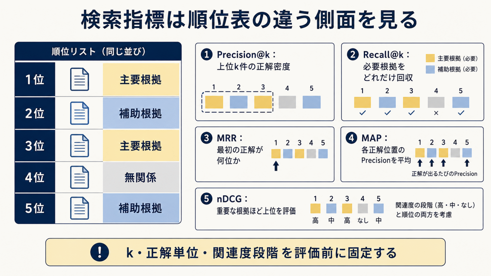
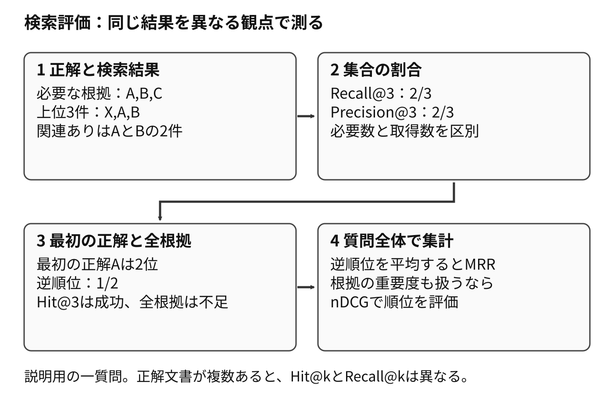

# 7.4. Retrieval評価

検索評価は、質問に必要な根拠を候補集合へ回収し、後段へ届く順位に置けたかを測ります。
質問変換やフィルターの影響を分離し、検索方式ごとの得意な条件と費用を比較します。

**Hit@k**は、上位k件に正解が一件以上入った質問の割合です。
DPRのtop-k retrieval accuracyは、この質問単位の成功率を測ります。
**Recall@k**は、質問に必要な正解根拠のうち、上位k件で回収した割合です。
複数の根拠が必要な質問では、一件の回収成功と、必要な根拠全体の回収を分けて測ります。

## 7.4.1. 入出力とgold evidenceの固定

retriever比較ではquery変換、corpus snapshot、filter、candidate数を固定し、順位差をretrieverの変更へ帰属できるrunだけ採用します。
元の質問、会話履歴、変換後の質問、フィルター、基準日時、コーパスのスナップショットを保存します。

各候補には、文書ID、チャンクID、順位、検索器固有のスコア、使用した検索器を記録します。
キャッシュから返した場合や別方式へ切り替えた場合も、実際に通った経路を残します。

[BEIR](https://arxiv.org/abs/2104.08663)が共通の文書、質問、関連度判定を使って検索手法を比べるように、実験の境界を固定します。
同じ入力を再実行し、候補と順位の差を確認できる状態にします。

正解根拠は、答えと同じ文字列を含むチャンクとは限らない前提で、反例を含む対象データを評価します。
同じ文字列を偶然含む無関係な文書や、値は含むものの条件を欠く断片があるためです。

文書、チャンク、文、主張のどの単位を正解とするかを決めます。
主要根拠、代替可能な根拠、補助根拠を区別し、評価基準日時も付けます。
関連か無関係かの二値判定は回収確認に、関連度の段階判定はnDCGに使います。

複数の評価者が根拠の範囲と時点を確認します。
チャンク分割を変えた場合は、古いチャンクIDをそのまま使わず、元文書の正解スパンから新しいチャンクへ対応付けます。

## 7.4.2. candidate recallとranking quality

候補の回収率は、生成モデルが正解へ到達できる上限を表します。
Recall@5、10、20、50を並べ、候補数を増やしたときに得られる追加の正解と、増える遅延を確認します。

[DPR](https://arxiv.org/abs/2004.04906)は、Top-20やTop-100で正解を取得できた割合を使って検索器を比較しています。
後段へ10件しか渡さない構成でも、最初の候補を50件取って再順位付けするなら、両方の段階で回収率を測ります。

複数の根拠が必要な質問では、どれか一件を取得した割合に加え、必要な根拠をすべて取得した質問の割合である全根拠回収率を使います。
質問者の権限では利用できない文書を正解集合へ残さず、その権限で利用可能な代替根拠を設定します。

正解が候補に含まれても、後段へ渡す件数より下の順位では利用できません。
最初の正解順位を見るMRR、段階的な関連度と順位を見るnDCG、上位の正解密度を見るPrecision@kを併用します。

[nDCGの基礎となる研究](https://doi.org/10.1145/582415.582418)は、順位が下がるほど利得を割り引く考え方を示しています。
主要根拠には高い利得、補助根拠には低い利得を設定できますが、段階の定義は評価前に固定します。

アルゴリズム図A10は、同じ順位表に対して各指標が見る位置と対象を示します。
Precision@kは上位の正解密度、Recall@kは必要根拠の回収、MRRは最初の正解順位、MAPは複数の正解位置、nDCGは段階的な関連度と順位を扱います。
図の色は関連度区分を表し、具体的な点数は評価契約に従って別途計算します。

**アルゴリズム図A10　検索評価指標が同じ順位表のどこを見るか**

複数正解、同点、隣接して内容が重なるチャンクをどう数えるかを評価コードで決めます。
小さな固定データで期待する指標値を検査し、ライブラリや実装の違いで結果が変わらないようにします。

本書の再現例では、質問へ単独で答えられる主要根拠を関連度2、回答を補うが単独では足りない根拠を1、無関係を0とします。
順位`i`の利得を`(2^rel_i - 1) / log2(i + 1)`とし、上位`k`件の合計をDCG@kとします。
同じ関連度を理想順へ並べた値をIDCG@k、`DCG@k / IDCG@k`をnDCG@kとします。

取得順の関連度が`[2, 0, 1, 0, 1]`なら、DCG@5は`3/1 + 1/2 + 1/log2(6) = 3.8869`です。
理想順`[2, 1, 1, 0, 0]`のIDCG@5は`3/1 + 1/log2(3) + 1/2 = 4.1309`なので、nDCG@5は`0.9409`です。
表示値は小数第4位へ丸めますが、集計には丸め前の値を使います。

正解根拠が0件の質問はIDCGが0になるため、nDCGを0と定義し、回答不能質問の件数と分けて報告します。
同じ根拠を含む重複チャンクは正本の文書IDと原文スパンで一件へまとめ、最上位の順位だけを使います。
スコア同点は安定した候補IDで順序を固定します。
別の利得関数や0件時の規約を使う場合は、評価契約の版を変え、同じ結果へ混ぜません。

図7-3では、必要な根拠が三件あり、検索結果には二件が入っています。
同じ結果でも、測る対象によって評価値が変わります。

**図7-3　Recall・Precision・Hit・MRRの数え方**

## 7.4.3. slice・retriever・query処理の比較

retrieverの弱点は識別子、言い換え、複数hop、表、長文のquery slice別にRecallとnDCGを集計して診断します。
型番、条文、固有名詞、自然文、略語、誤字、複数段階、日本語、英語、言語横断、頻出、低頻度に分けます。

[BEIR](https://arxiv.org/abs/2104.08663)の収録datasetではBM25とdense retrievalの相対的な優劣がdatasetごとに異なるため、対象dataset別に両方式を比較します。
業務への一般化性能は、単一ベンチマークの全体平均だけで決めず、対象業務データの主要区分ごとの結果も確認して判定します。

各スライスの評価件数と信頼区間を示します。
件数は少なくても業務影響が大きいスライスには独立した合格下限を置きます。

BM25、密検索、学習型疎検索、ハイブリッド検索を、同じ正解集合と候補件数で比較します。
[SPLADE](https://arxiv.org/abs/2107.05720)は語彙の重みと展開を疎な表現へ取り込み、[DPR](https://arxiv.org/abs/2004.04906)は質問と文章の意味表現を学習します。
BM25とSPLADE系疎検索は、同じ平均値だけでなく、固有名詞、専門語、言い換えを含む質問sliceごとの改善差を比較します。

複数の検索結果を統合する場合は、スコアそのものを合わせる方法と、順位を合わせる方法を分けて試します。
[Reciprocal Rank Fusion](https://dl.acm.org/doi/10.1145/1571941.1572114)は、各rank listの候補順位へ定数を加えた逆数を合計し、複数の順位表を一つの順位へ統合します。

一つの勝者だけを選ばず、方式が互いを補うスライスを確認します。
品質に加えて、インデックス容量、構築時間、一秒当たりの処理件数、更新のしやすさを同じ比較表へ載せます。

質問処理を評価するときは検索器を固定し、正規化、書き換え、展開、HyDE、分解を一つずつ有効または無効にします。
HyDEは、仮の回答文を生成してその埋め込みで検索する手法です。
HyDEが改善を報告したzero-shot dense retrieval条件を型番検索へ適用する場合は、生成documentに加わった語が元queryの型番や意図を変えていないかを別途検査します。

会話の省略を補った単独で読める質問が、参照対象を正しく保持したかを人が確認します。
元の質問から追加または削除した条件、検索候補の重なり、意図保持率を測ります。
書き換えで失敗した事例を、検索器自体の失敗として数えないようにします。

## 7.4.4. metadata・ACL filter評価

フィルターは、権限外の情報を防ぐことと、利用可能な正解を残すことの両面で評価します。
テナント、役割、日付、状態、版、情報源種別を単独と組み合わせで試します。

権限外候補の混入率と、過剰な絞り込みによる正解欠落率を別々に測ります。
構造化条件付きベクトル検索は、条件へ一致する文書の割合ごとにRecallと遅延を測ります。

アクセス制御違反は許容件数ゼロの安全条件にします。
製品や言語のように誤りが直ちに漏えいへつながらない条件は、検索品質の指標として分離します。

## 7.4.5. 性能・cost・統計的比較

検索品質には、検索工程の中央値、95パーセンタイル、99パーセンタイルの遅延、タイムアウト率、一質問当たりの費用を添えます。
候補件数、複数質問数、融合数、近似検索の探索幅を増やすとRecallは上がり得ますが、遅延と後段の費用も増えます。

HNSWを使う場合は検索時探索幅を段階的に変え、品質と遅延の曲線を作ります。
フィルターの厳しさや同時要求数を変えた負荷試験も実施します。

全体平均だけでなく、テナントや質問形式ごとの遅い要求を確認します。
サービス水準目標を超えたときに簡易検索へ切り替えるなら、その切り替えによる品質低下も評価します。

基準構成と候補構成は、同じ質問に対する差として比較します。
平均nDCGの差だけでなく、改善件数、悪化件数、重大事例の変化、ブートストラップ信頼区間を示します。

少数の質問が平均を大きく動かしていないか、質問ごとの差の分布を確認します。
多くの設定を試した後に同じ試験データで最良値を選ぶと、試験データへの選択の偏りが生じます。
開発データで設定を選び、未使用の保留データで最終確認します。

統計的に有意な改善でも、対象負荷での品質増分が追加費用と運用複雑性の受入基準を満たさない場合は採用しません。
重要スライスには、業務上許容できる非劣化幅を設定します。

## 7.4.6. failure reason

検索失敗は、正解がコーパスにない、インデックスが古い、解析や分割で欠けた、埋め込みが合わない、質問変換が逸脱した、フィルターが過剰だった、順位が低かった、という原因へ分類します。
正解文書が存在しない事例を検索モデルの再学習へ回しても解決しません。

トレースを候補生成の前から追い、正解が最初に失われた工程を失敗理由にします。
[RAGChecker](https://arxiv.org/abs/2408.08067)のように検索と生成を分け、生成結果が誤っていても、まず根拠が候補へ入っていたかを確認します。

各分類に担当者と代表的な修正手段を割り当てます。
新しい失敗は固定事例として回帰試験へ追加します。
