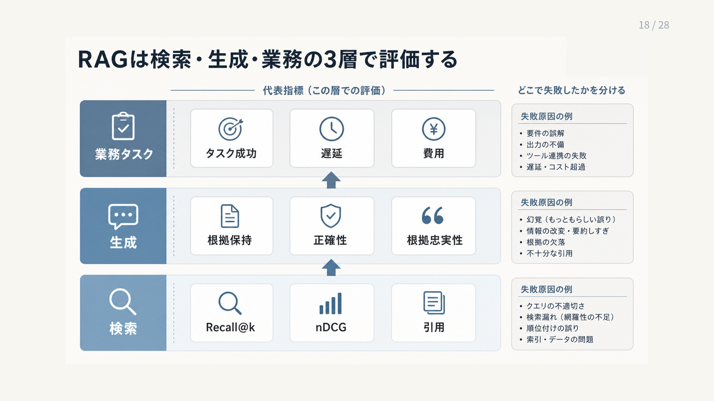

# 7. 品質を評価し改善する

RAGの品質は、最終回答だけを見ても正しく判断できません。
回答の誤りは、資料の準備、検索、候補の選別、生成、権限制御のいずれでも発生するためです。

本章では、評価対象と指標を定義し、各工程を個別に測ってから、利用者の目的を達成できたかを端から端まで確認します。
変更前後を同じ条件で比較し、改善した箇所と悪化した箇所を特定できる評価の仕組みを目指します。

図7-1は、下から検索、生成、業務タスクの順に読みます。
各段の中央はその段で測る指標、右側はその段で起こる失敗の例です。
図中の検索段にある「引用」は、取得した根拠の位置情報を後段へ渡せるかという確認を表します。
回答中の引用が主張を支えるかは、生成段で別に評価します。

**図7-1　検索、生成、業務タスクの3層評価**
