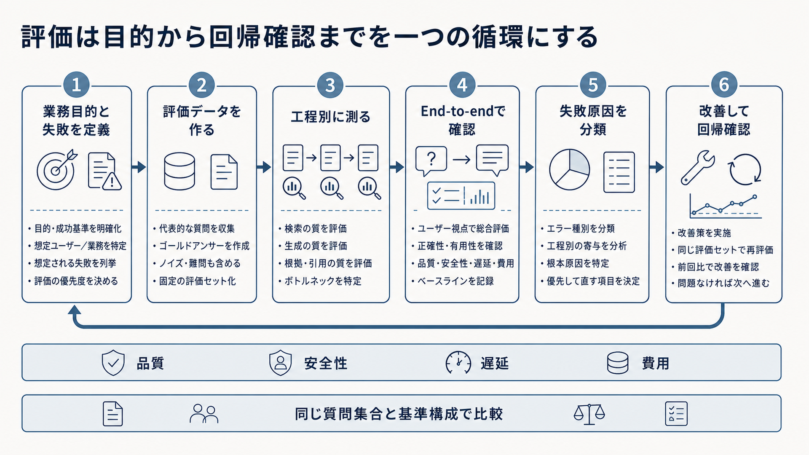

# 7. 品質を評価し改善する

RAGの品質は、最終回答だけを見ても正しく判断できません。
回答の誤りは、資料の準備、検索、候補の選別、生成、権限制御のいずれでも発生するためです。

本章では、評価対象と指標を定義し、各工程を個別に測ってから、利用者の目的を達成できたかを端から端まで確認します。
変更前後を同じ条件で比較し、改善した箇所と悪化した箇所を特定できる評価の仕組みを目指します。

図7-1は、評価の目的を決めてから、改善結果を同じ条件で確かめるまでの全体像です。
左から順に、業務目的と想定する失敗を定義し、評価データを作り、工程別評価と端から端までの評価を行います。
結果から失敗原因を分類して改善したら、同じ質問集合と基準構成で回帰確認します。
この循環を一度で終わらせず、品質、安全性、遅延、費用を見ながら繰り返すことが本章の基本です。

**図7-1　目的の定義から改善後の回帰確認までの評価サイクル**
