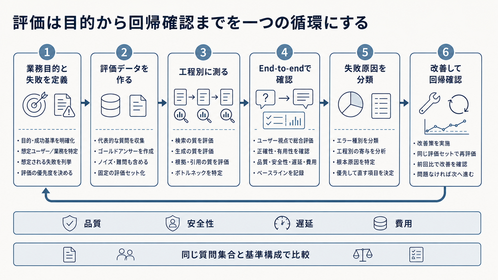

# 7. 品質を評価し改善する

RAGの良し悪しは、最終回答だけを見ても判断できません。資料準備、検索、根拠整形、生成のどこで失敗したかを分け、変更による改善と回帰を測る必要があります。

本章では、評価データセット、各layerの指標、end-to-end評価、regression、A-B、canary、trace分析を扱います。第3章のPublish前ゲートから受け取った成果物について、品質面のpublish可否とrelease gateをここで判断します。

**図7-1　目的の定義から改善後の回帰確認までの評価サイクル**
