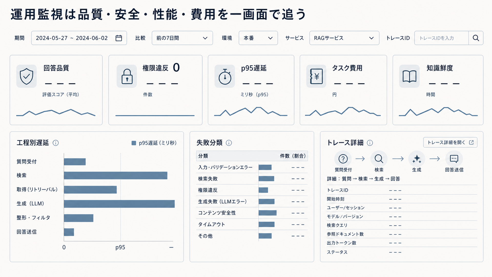

# 8.4 監査とトレーサビリティ

監査は、誰が、どの情報と構成を使い、何を判断または実行したかを後から確認する活動です。
トレーサビリティは、一回の要求を各工程の記録と結び付け、結果に至った経路を追える性質です。

## 8.4.1 監査の目的と利用者

必要な記録は、監査の目的と利用者によって異なります。
開発者は検索候補とプロンプト、信頼性担当者は遅延と再試行、セキュリティ担当者は主体と拒否判断、法令順守担当者は承認と版、利用者は引用と訂正履歴を必要とします。

目的ごとに記録項目、粒度、保存期間、閲覧権限を定めます。
すべての質問とコンテキストを無期限に保存することは、監査性の向上ではなく新たな漏えいリスクになる場合があります。

[ALCE](https://arxiv.org/abs/2305.14627)や[情報源への帰属を測る研究](https://arxiv.org/abs/2112.12870)の考え方を、回答品質の証跡へ利用できます。
機密本文を保持できない場合は、除去済みの複製、安定ID、内容のハッシュを目的に応じて使います。

## 8.4.2 端から端までのトレース

一回の要求に一意なトレースIDを付け、認証、質問変換、検索、再順位付け、配置、生成、検証、ツール実行、応答の記録をぶら下げます。
各工程の処理単位をスパンと呼び、親子関係と開始終了時刻を記録します。

要求、セッション、テナント、利用者、サービスを別の識別子として保持します。
再試行、代替経路、タイムアウト、回答拒否、人の承認は、時系列上のイベントとして残します。

[RAGChecker](https://arxiv.org/abs/2408.08067)のような工程別診断には、検索から生成までを結ぶ記録が必要です。
分散したサービスで時刻とID形式を統一し、同時に処理した別要求のコンテキストを誤って結合しないようにします。

図8-2は、上段の全体指標、左下の工程別遅延、中央下の失敗分類、右下の個別トレースの順に読みます。
全体値に異常があれば工程別と失敗分類で範囲を絞り、最後にトレースIDから一件の処理を追います。
図中の数値欄が空いているのは画面構成を示すためです。
線と棒も表示例であり、実測値ではありません。
「検索」と「取得」の区分を含む工程名は表示例であり、実装のトレース区分に合わせて置き換えます。

**図8-2　運用指標から個別トレースへ進む監視画面の例**

## 8.4.3 検索の証跡

検索記録には、元の質問、変換後の質問、検索方式、フィルター、候補件数、生のスコア、順位、インデックスの版を含めます。
取得した根拠について、文書ID、チャンクID、ページ、節、版、有効日、信頼度を残します。

これらがあれば、当時どの候補が利用可能だったかを再構成できます。
[KILT](https://arxiv.org/abs/2009.02252)が回答と情報源をともに評価するように、検索工程でも情報源を識別可能にします。

権限外候補の本文をログへ書きません。
拒否した件数、適用した方針の版、判断結果だけを必要な範囲で残します。
根拠がコーパスになかった場合と、存在したものの権限や有効期間により使えなかった場合を区別します。

## 8.4.4 主張、引用、情報源

回答を検証可能な主張へ分け、各主張を支持するチャンクと表示上の引用へ結び付けます。
引用が付いているだけでなく、主張を支えているか、必要な主張を網羅しているか、矛盾がないかを記録します。

[RARR](https://arxiv.org/abs/2210.08726)は、生成した主張を調査し、根拠に基づいて修正する流れを提案しています。
同じ考え方で、支持なし主張、反証された主張、修正前後の内容を追跡できます。

情報源が後日更新または削除されても、回答時のスナップショットIDとハッシュを識別できるようにします。
利用者向けURLと、監査用の証拠保存先は役割が異なるため分けて管理します。

## 8.4.5 構成の版管理

同じ質問でも、モデル、プロンプト、検知器、検索器、再順位付け器、埋め込み、解析器、チャンク分割、インデックス、認可方針が違えば結果は変わります。
これらの版を一つのリリースIDへまとめたマニフェストを作ります。

評価報告、機能フラグ、A/Bテストの割り当て、障害時の代替先も同じIDへ結び付けます。
[Model Cards](https://arxiv.org/abs/1810.03993)がモデルの用途、性能、制約を記録するように、RAG全体について対象用途、非対象用途、重要スライス、既知の制約を版ごとに記します。

外部サービスの挙動を完全に再現できない場合は、提供元の版、実行日時、入力と出力を保存します。
障害時に当時の構成を説明できることを、公開条件に含めます。

## 8.4.6 ログの安全性とプライバシー

ログは監査に役立つ一方、質問、取得文書、回答が集まる高密度な機密情報です。
目的に応じて、全文、除去済みの複製、ハッシュ、メタデータだけの記録を使い分けます。

暗号化、追記専用の保存、閲覧記録、改ざん検知、保存期間、法的保全を設定します。
問い合わせ対応、利用分析、モデル改善への二次利用は別の権限と目的として扱います。

[個人情報漏えいに関する研究](https://arxiv.org/abs/2302.00539)を踏まえ、検索本文だけでなく利用者の質問、拒否理由、ツール引数にも個人情報がある前提で除去します。
ログ閲覧者にも最小権限を適用し、定期的に権限を棚卸しします。

## 8.4.7 監査記録の検証と出力

監査記録は、必要な項目が存在するだけでなく、工程間で正しく対応している必要があります。
固定した要求を実行し、トレースID、根拠ID、引用ID、構成版が最後までつながることを自動試験します。

監査用の出力には、調査対象の期間、検索条件、抽出者、抽出日時、内容のハッシュを付けます。
本文を含む出力は、元データと同等以上の機密区分で扱います。

ログの欠落率、トレース結合失敗率、記録の到着遅延、改ざん検知の失敗を監視します。
障害時にログが増えすぎて本処理を圧迫しないよう、優先して残す監査イベントと詳細度の低下条件を決めます。

## 8.4.8 インシデントと定期監査

インシデント時は、影響を受けた要求、情報源、主体、構成版、ツール操作を時系列で再構成します。
証拠を抽出して受け渡す場合は、保管者、閲覧者、複製、ハッシュを記録し、証拠の管理経路を明確にします。

[内部アルゴリズム監査の枠組み](https://arxiv.org/abs/2001.00973)が設計から運用までを対象とするように、RAGでも設計判断、公開承認、本番記録をつなぎます。
原因だけでなく、検知、防御、復旧のどこが機能しなかったかを確認します。

定期監査では、利用されていないログの削除、制御の有効性、閲覧権限、保存期間、対策後に残る危険を見直します。
保存量の多さを監査の成熟度とはみなさず、必要な問いへ安全かつ再現可能に答えられるかで評価します。
