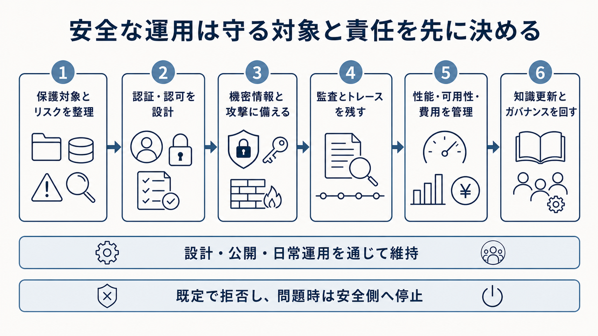

# 8. 安全に運用する

業務でRAGを使い続けるには、回答品質に加えて、情報を守り、安定して提供し、問題を追跡できる仕組みが必要です。
利用者の質問、検索した資料、モデルへ渡すコンテキスト、回答、ログのすべてが管理対象になります。

本章では、権限制御、プライバシー、攻撃対策、監査、可用性、費用、知識更新、ガバナンスを扱います。
これらを後から追加する機能ではなく、設計、公開、日常運用を通じて維持する制御として整理します。

図8-1は、安全な運用を始めるときに検討する順序の全体像です。
まず、守る情報や業務と起こり得るリスクを整理し、認証・認可を設計します。
次に、機密情報や攻撃への対策、監査とトレース、性能・可用性・費用の管理を整え、最後に知識更新とガバナンスを継続して回します。
判断できない要求は既定で拒否し、問題が起きたときは安全側へ停止できるようにすることが共通原則です。

**図8-1　守る対象と責任を起点に安全な運用を整える流れ**
