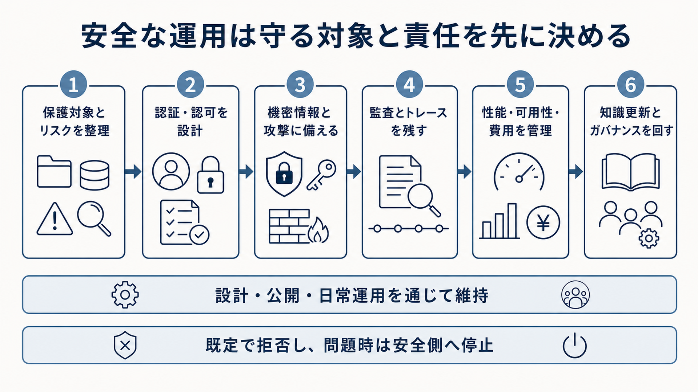

# 8. 安全に運用する

業務でRAGを使うには、正しい回答だけでなく、権限外資料を見せないこと、機密情報を守ること、遅延と費用を管理すること、問題の原因を追えることが必要です。

本章では、セキュリティ、privacy、攻撃対策、監査、性能、cost、知識更新、governanceを横断的に扱います。これらは後付けの機能ではなく、第3章から第7章の全工程へ適用する制約です。

**図8-1　守る対象と責任を起点に安全な運用を整える流れ**
