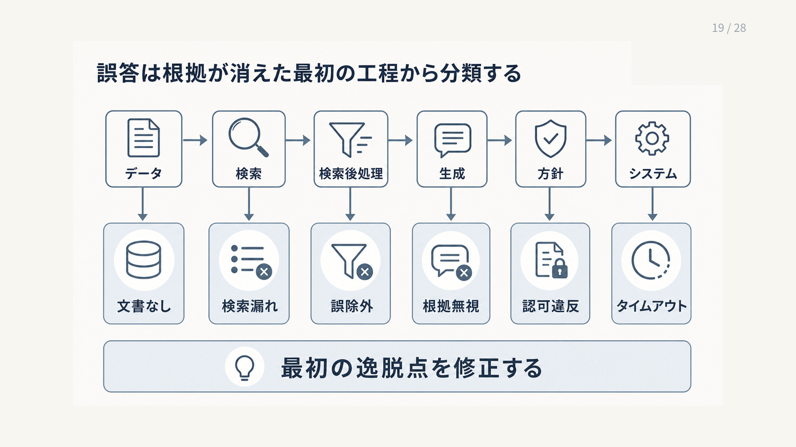

# 9.1 高度化は失敗パターンから選ぶ

高度化は、機能の多さを競う活動ではありません。
現在の構成で再現できる失敗を起点に、原因へ直接働く最小の変更を選びます。

## 9.1.1 高度化の前提

発展的な手法へ進む前に、比較対象となる本番基準構成を固定します。
疎検索と密検索の併用、再順位付け、引用、回答保留、トレースを備え、主要な失敗を正解付き評価データで再現できる状態が目安です。

[RAGのサーベイ](https://arxiv.org/abs/2312.10997)は、RAGを基本的な構成、高度な構成、部品を組み替える構成へ整理しています。
この分類は、部品を増やすこと自体ではなく、解く問題に応じて構成を選ぶために使います。

変更前の正確性、検索Recall、根拠忠実性、遅延、費用、安全指標を保存します。
新技術を導入することではなく、基準構成で観測した失敗を減らすことを目的にします。

## 9.1.2 判断に使う記録

最終回答だけでは、失敗の原因を判断できません。
元の質問、変換後の質問、取得チャンク、再順位付け結果、最終コンテキスト、回答、引用、遅延、費用をトレースで結びます。

オフライン評価、本番から抽出した事例、利用者の反応、人手評価を、性質の異なる情報源として扱います。
[RAGChecker](https://arxiv.org/abs/2408.08067)のように回答を主張単位で調べると、根拠を取得できなかった失敗と、取得した根拠を生成モデルが使わなかった失敗を分けられます。

一件の印象的な事例だけで一般化しません。
発生頻度、影響の大きさ、再現性、該当する利用者群を確認してから手法を選びます。

## 9.1.3 失敗パターンの分類

失敗を、検索漏れ、検索ノイズ、根拠の矛盾、会話文脈の不足、構造化データの誤読、長文全体の把握不足、複数段階の探索不足、外部操作の必要、図表未対応へ分けます。
最終回答の症状ではなく、正解根拠または期待動作から最初に外れた工程を分類します。

[RGB](https://arxiv.org/abs/2309.01431)は、ノイズ、回答拒否、情報統合、反事実への耐性を別々に評価します。
同様に、「回答が間違った」という一つの分類へまとめず、再現可能な条件へ落とします。

アクセス制御違反、根拠のない重大な断定、回答不能時の危険な操作は、高度化の候補ではありません。
まず該当経路を安全側で停止し、基本的な制御の欠陥として修正します。

図9-1は、左からデータ、検索、検索後処理、生成、方針、システムの順に読みます。
各列の下段は、その工程で最初に期待動作から外れる失敗例です。
最終的な誤答だけで分類せず、左から追って最初に外れた工程を修正対象にします。

**図9-1　根拠が最初に失われた工程による失敗分類**

## 9.1.4 失敗と手法の対応

表9-1は、観測した失敗を行に、候補手法と導入前の確認事項を列に示します。
まず右端の確認事項を試し、それで解けない場合に中央の手法を検討します。

**表9-1　失敗パターンと候補手法の対応**

| 失敗パターン | 候補手法 | 最初に確認すること |
|---|---|---|
| 会話中の省略や指示語 | 会話型RAG | 質問書き換えで解けるか |
| 最新値や正確な集計 | 構造化データRAG | 正本となるAPIやDBがあるか |
| 長い文書の全体傾向 | 長文、階層型RAG | チャンク拡張で解けるか |
| 文書間の関係探索 | GraphRAG | 関係の定義と品質を保てるか |
| 図、画像、複雑な表 | マルチモーダルRAG | テキスト抽出の欠落箇所はどこか |
| 複数回の検索や外部操作 | エージェント型RAG | 固定手順で代替できるか |

複数手法が当てはまる場合は、固定パイプラインへの小さな変更から試します。
[Corrective RAG](https://arxiv.org/abs/2401.15884)のような再検索も、通常検索が不十分と判定した質問だけへ適用できます。

対応表には、期待効果だけでなく、新たな遅延、費用、出力のばらつき、アクセス権、安全上の責任を併記します。

## 9.1.5 経路制御と段階的な引き上げ

すべての質問を高度で高価な経路へ送りません。
検索なし、通常RAG、再順位付け強化、反復検索、長文入力、エージェント型処理へ段階的に引き上げます。

[Adaptive-RAG](https://arxiv.org/abs/2403.14403)は質問の複雑さに応じて、検索なし、単発検索、反復検索を選びます。
[RAGと長文入力を比較する研究](https://arxiv.org/abs/2407.16833)は、質問とモデルの確信に応じた経路選択も扱っています。

質問の複雑さ、必要な情報源、リスク区分、残り時間、費用上限を経路条件にします。
各段階で根拠が十分かを確認し、確信が低い場合の上位経路と、期限切れ時の安全な停止を決めます。

## 9.1.6 導入実験と公開条件

一つの手法を追加し、対象とする失敗スライスと全体の両方を変更前後で比較します。
成功件数だけでなく、改善しなかった事例、新たに悪化した事例、別経路へ誤って送った事例を確認します。

品質、95パーセンタイル遅延、一タスク当たりの費用、安全条件を公開条件にします。
高度な経路を使わない質問で性能が悪化していないことも確認します。

最初はオフライン、次に利用者へ返さない並行実行、少量公開の順に進めます。
構成の版、経路判断、中間成果物をトレースへ残し、異常時に基準構成へ戻せるようにします。

## 9.1.7 高度化のアンチパターン

GraphRAGやエージェントを先に導入して基準構成との差を測れなくすることは、典型的な失敗です。
すべての質問を同じ高価な処理へ送り、最終回答だけで検索と生成の改善を判断することも避けます。

[Modular RAG](https://arxiv.org/abs/2407.21059)は構成要素を組み替える考え方を示しますが、明確な入出力、個別評価、切り戻しがなければ複雑さだけが増えます。
一変更ずつ要素除去実験を行い、対象失敗を改善しない部品は外します。

手法名を成果として報告しません。
減らした失敗、残った失敗、新たな副作用、適用する質問の範囲をリリース報告へ記録します。
