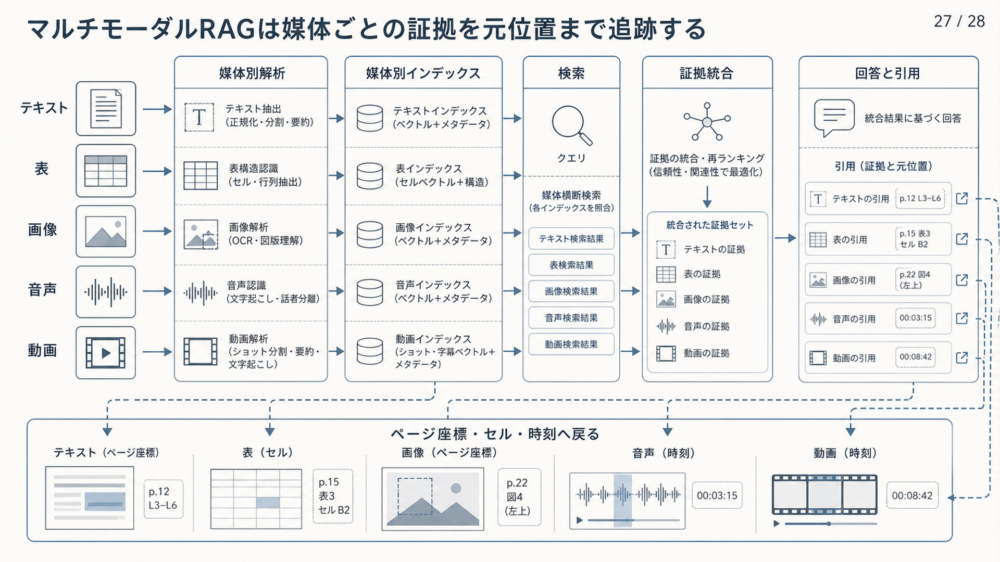

# 9.10 マルチモーダルRAG

マルチモーダルRAGは、テキストに加えて、文書画像、図、表、画面、音声、動画を検索し、回答の根拠として使います。
媒体ごとの証拠単位と解析誤りを区別し、回答から元の領域や時間区間へ戻れるようにします。

図9-7は、左から媒体別の解析、媒体別のインデックス、検索、証拠の統合、回答と引用の順に読みます。
下段は、回答の引用からテキストの行、表のセル、画像の領域、音声と動画の時刻へ戻る経路です。
媒体を共通形式へ変換しても、この元位置との対応を失わないことが要点です。

**図9-7　媒体ごとの解析から元位置付きの引用までの流れ**

## 9.10.1 対象媒体と利用場面

文書ページ、図、グラフ、表、画面、音声、動画を同じ画像としてまとめません。
UIの状態、グラフの傾向、会議中の発言箇所では、必要な検索単位と引用単位が異なります。

質問がテキストで証拠が画像、質問が画像で回答がテキスト、質問と証拠が時間区間を持つ場合を分けます。
[ColPali](https://arxiv.org/abs/2407.01449)は、文書ページの画像を複数ベクトルで表現し、OCRテキストだけに依存しない文書検索を提案しています。

利用場面ごとに、テキストから画像、画像からテキスト、時間区間の検索が必要かを定義します。
テキスト抽出だけで十分な質問まで、高価な視覚経路へ送りません。

## 9.10.2 取り込み

取り込みを、OCR、レイアウト解析、表抽出、図と説明文の対応、音声認識、動画の代表画像と区間生成へ分けます。
ページ、ページ上の座標、表のセル、音声と動画の時刻へ安定したIDを付けます。

テキスト化した内容から、元の画像領域または時間区間へ戻れるようにします。
[LayoutLMv3](https://arxiv.org/abs/2204.08387)はテキスト、画像、レイアウトを統合した文書理解を扱い、[PubTables-1M](https://arxiv.org/abs/2110.00061)は表の検出と構造認識を支えます。

OCRや音声認識の確信度をメタデータへ残します。
数値、固有名詞、表の列対応が不確かな成果物を、確定事実として公開しません。

## 9.10.3 テキスト中心、画像中心、混合方式

テキスト中心方式は、OCRや説明文を通常RAGへ載せるため、検索理由を確認しやすい方式です。
画像中心方式はページ画像を直接表現し、レイアウトや図を保てますが、インデックスと推論の費用が高くなります。
混合方式は両方の候補を統合します。

ページの意味的な配置や図には画像経路、エラーコードや細かな数値にはテキスト経路が向く場合があります。
文書種別、質問形式、言語、OCR品質ごとに三方式を比較します。

一つの方式をすべてへ適用せず、テキスト抽出の失敗が回答へ影響する質問だけに画像経路を使います。

## 9.10.4 インデックス設計

テキスト、表、画像またはページ、動画区間を別のインデックスへ分ける方法と、共通の埋め込み空間へ置く方法があります。
別インデックスでは媒体に合う検索器を選べ、共通空間では媒体をまたぐ検索を行いやすくなります。

説明文、OCRテキスト、座標、セル見出し、時刻、媒体種類、アクセス権をメタデータにします。
同じページのテキスト、表、画像をグループIDで結び付けます。

統合方式を選んでも、媒体ごとの解析誤りと更新責任は残ります。
インデックスの版、解析モデル、元ファイルのハッシュをマニフェストへ記録します。

## 9.10.5 検索

検索単位には、ページ、画像領域、表の行またはセル、音声と動画の区間があります。
「赤い警告が出る画面」のような視覚表現にはページ画像、具体的なエラーコードにはOCRテキストを優先します。

媒体ごとに候補件数と再順位付け器を変えます。
一致した領域を文書候補へまとめ、周辺の見出しや説明文を補います。

複数ベクトルによるページ検索では、どの画像領域が質問へ反応したかを保持します。
生成モデルへ渡す前に、ページと領域のアクセス権、解析の確信度、版を再確認します。

## 9.10.6 複数媒体の統合

同じページのOCR、図、表、説明文が別候補として返っても、単純な重複とは限りません。
ページ、図、表、時刻のIDで一つの証拠群へまとめます。

まず媒体内で順位を作り、その後に順位統合、質問経路、証拠間の関係を使ってまとめます。
異なる符号化器のコサイン類似度を、そのまま足しません。

情報源の信頼度と解析確信度を別の特徴として扱います。
一種類の媒体が候補を独占しない上限を置き、統合後も各証拠の元位置を保持します。

[RAG-Anything](https://arxiv.org/abs/2510.12323)は、テキストと画像、表、数式を二種類のグラフで結び、構造検索と意味検索を併用する構成を提案しています。
長い複合文書で改善を報告していますが、直接入力との比較には50ページの上限があり、同系統のモデルによる自動採点と、構築費用の未評価という制約があります。
この結果だけで方式を決めず、自組織の文書で媒体別の検索Recall、引用位置、回答不能時の動作、構築費用を比較します。

## 9.10.7 回答生成

OCRで十分な説明文にはテキストモデルを使い、図の位置関係、UI状態、グラフの傾向には元画像を視覚言語モデルへ渡します。
画像を一度だけ説明文へ変換してから答えると、細部、否定、配置を失う場合があります。

重要な視覚的主張には、対象領域の画像と周辺テキストを一緒に提示します。
視覚言語モデルにも、根拠にない推測の禁止と引用IDの出力を要求します。

数値の読み取りと計算は、抽出した表セルや専用計算ツールで再確認します。
視覚的な傾向の説明と、正確な数値の断定を分けます。

## 9.10.8 引用

マルチモーダルの引用には、文書IDとページだけでなく、図または表のID、ページ上の座標、セル、音声と動画の時刻を含めます。
利用者が元の領域や該当区間を再表示できる画面を用意します。

回答中の主張から視覚的な証拠へ直接移動できるようにします。
OCRテキストが原画像と違う場合に備え、抽出テキストと画像のスナップショットを対応付けて保存します。

音声と動画では、回答時の区間ハッシュ、文字起こしの版、元ファイルの版を残します。
後日の編集で引用時刻がずれた場合に検出できるようにします。

## 9.10.9 品質、安全性、費用

OCR、説明文生成、レイアウト、音声認識、視覚埋め込み、再順位付け、視覚言語モデルを工程別に評価します。
文字の認識率が高くても表の列が崩れれば回答は失敗するため、領域検索、セル対応、時間区間の重なり、視覚的主張の支持を測ります。

顔、個人情報、画面上の認証情報、画像内のプロンプトインジェクションを安全試験へ含めます。
不要なページ画像を外部モデルへ送らず、画像、音声、動画のアクセス権を変換後の成果物へ継承します。

保存容量、解析時間、視覚モデルの入力費用をテキスト中心の基準構成と比較します。
視覚情報が品質改善に必要な質問だけをマルチモーダル経路へ送ります。
