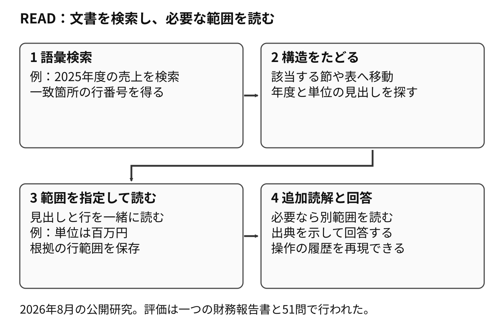
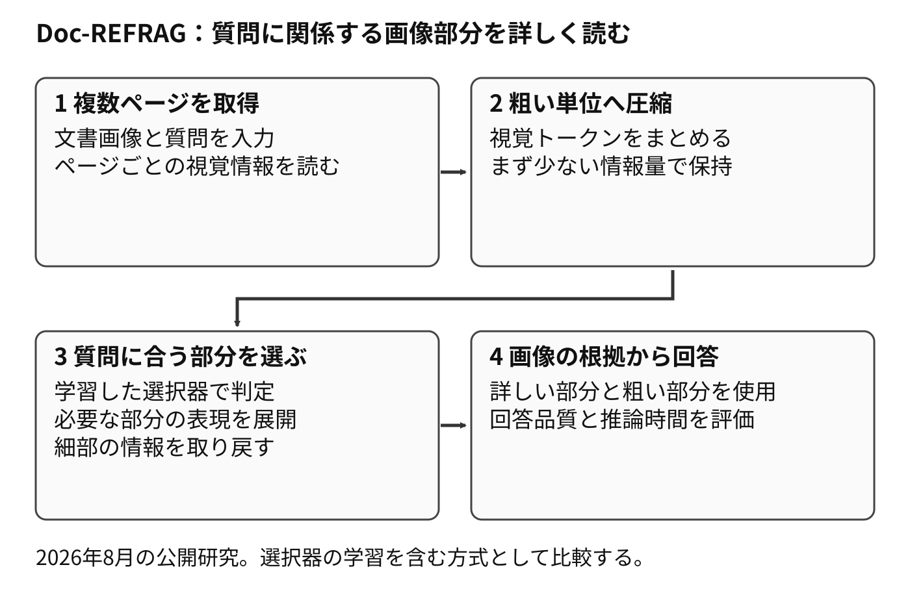

# 9.11 2026年夏の研究から設計を見直す

2026年7〜8月には、文書が増えたときの検索費用や、表・画像の扱いを調べる研究が公開されました。
ここでは、基本構成の評価へ加えやすい三つの研究を紹介します。
いずれも、本書が確認した版はarXivの公開論文です。
効果を確かめる範囲は、各研究のデータと実験条件に沿って読みます。

## 9.11.1 文書の規模も変えて検索方式を比べる

[BM25 Wins at Scale](https://arxiv.org/abs/2607.26497v3)は、文書集合を28段階に増やし、疎検索、密検索、グラフを使う方式、ファイルを探索するエージェントを比較しました。
質問と重要な文書を固定し、回答品質、構築費用、質問時の費用、応答時間を測っています。

評価条件では、最小規模のファイル探索型エージェントが有利な場面がありました。
文書集合が大きくなると、BM25が同じ規模で比較した方式を上回りました。
この結果から、検索方式の評価には、現在の文書量と将来の文書量の両方を含めるとよいと考えられます。
これは本書の設計上の提案です。

研究では、生成器や採点手順を揃えて比較しています。
別の日本語資料、埋め込みモデル、質問分布では順位が変わる可能性があります。
第7章の固定質問を使い、文書数と構築費用を変えた比較を追加します。

## 9.11.2 表の見出しまで戻って読むREAD

[READ](https://arxiv.org/abs/2608.06305)は、文書への操作を三つに分ける手法です。
語彙検索で一致箇所を探し、構造をたどって節や表へ移動します。
最後に、行範囲を指定して原文を読みます。
次の操作は、取得した結果を見ながら選びます。

図9-13は、売上の値と、その年度・単位を一緒に読む例です。
見出しが少し離れていても、必要な範囲まで読み広げられます。

**図9-13　READによる文書構造を保った読解**

原論文の評価対象は、780ページの一つの財務報告書と51問です。
READは比較した密検索構成を上回りました。
BM25との差は統計的に明確ではありませんでした。
表の値だけが取得され、年度や単位が欠ける場合の比較候補として位置づけます。

## 9.11.3 画像を圧縮して必要な部分を展開するDoc-REFRAG

[Doc-REFRAG](https://arxiv.org/abs/2608.30163)は、取得した文書画像の情報をいったん粗い単位へ圧縮します。
質問に関係する部分を選び、その部分の詳しいトークン表現を戻します。
画像の全領域を同じ詳しさで扱う方法に比べ、質問に必要な細部へ計算を配分する設計です。

**視覚トークン**は、画像をモデルで扱うために数値化した小さな単位です。
この手法では、粗い表現と詳しい表現を混ぜて読むようモデルを学習します。
どの部分を詳しく読むかを決める選択器にも学習を行います。

図9-14では、ページを取得し、圧縮し、質問に関係する領域を展開する順に示します。

**図9-14　Doc-REFRAGによる視覚情報の選択的な展開**

論文は、複数画像を含む質問応答データDocLongRAGも公開しています。
報告された改善は、その学習構成と六つのベンチマークでの結果です。
導入を比べる際は、推論時間に加えて学習費用、ページの検索品質、細かな数値の読み取りを測ります。
