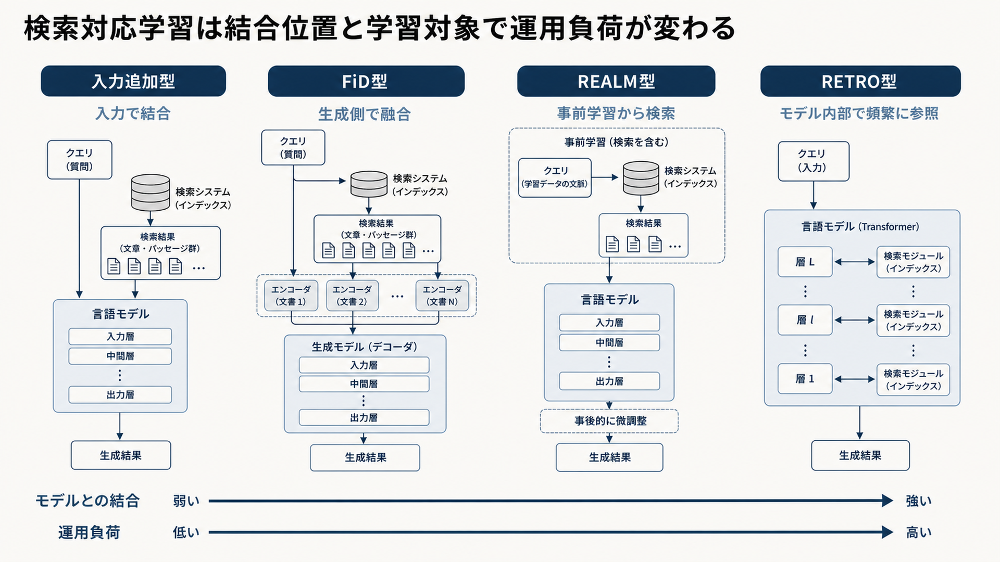

# 9.2 検索を前提とした言語モデルの学習

通常のRAGは、検索結果を入力へ追加して汎用の生成モデルに回答させます。
それでも根拠を無視する失敗が残る場合は、検索結果の利用方法をモデルへ学習させる選択肢があります。

## 9.2.1 対象範囲

検索拡張言語モデルをRA-LLMと呼びますが、その範囲は検索文をプロンプトへ貼る構成だけではありません。
複数文書を生成モデル内で融合する方式、検索器と生成器を共同学習する方式、事前学習から外部知識を参照する方式があります。

通常のRAGはインデックス更新によって知識を交換しやすい一方、学習型はモデルの重みと学習データも管理対象になります。
知識そのものを学習させる目的と、取得した根拠を選び引用する振る舞いを学習させる目的を分けます。

事実の更新頻度、切り戻し、監査、学習費用を含め、通常RAGより運用負荷が増えることを先に確認します。

## 9.2.2 主な構成の違い

[FiD](https://arxiv.org/abs/2007.01282)は、取得した各文章を個別に符号化し、生成側で情報を融合します。
[REALM](https://arxiv.org/abs/2002.08909)は事前学習中から検索器を含めて学習し、[RETRO](https://arxiv.org/abs/2112.04426)は大規模な外部データベースから近いチャンクを参照します。

表9-2は、構成を行に、検索情報を組み込む位置と主な特徴を列に示します。
下の行ほど結合が強いという厳密な尺度ではなく、設計を比較する入口として使います。

**表9-2　検索情報を組み込む位置と主な特徴**

| 構成 | 検索情報を入れる位置 | 主な特徴 |
|---|---|---|
| 入力追加型RAG | モデルへの入力 | 部品を交換しやすい |
| FiD型 | 符号化後の生成器 | 複数文書を個別に扱える |
| REALM型 | 事前学習と推論 | 検索器とモデルの結合が強い |
| RETRO型 | モデル内部の複数層 | 大規模な近傍データを頻繁に参照する |

結合が強いほど、アプリケーション側だけで検索器や知識を差し替えにくくなります。
検索位置、学習対象、インデックス規模、推論費用、知識更新と切り戻しの方法を比較します。

図9-3は、左から入力追加型、FiD型、REALM型、RETRO型の順に、検索情報をモデルへ結び付ける位置を示します。
下部の矢印は本書での概念比較であり、右へ進むほど結合と運用負荷が増えやすいと読みます。
実際の負荷は実装、インデックス規模、更新頻度によって変わるため、矢印を論文間の実測順位とは解釈しません。

**図9-3　検索情報をモデルへ結び付ける位置の比較**

## 9.2.3 学習対象

検索器を正解根拠へ近づける、生成モデルへ根拠利用を教える、両者を共同で最適化する、という異なる学習対象があります。
[RA-DIT](https://arxiv.org/abs/2310.01352)は、検索器と言語モデルへそれぞれ命令調整を行う方法です。

検索漏れが原因なら検索器を、正しい根拠があるのに無視するなら生成モデルを主な対象にします。
上流の欠落を生成モデルの学習で隠しません。

引用形式の不安定、誤った候補への追従、検索不要な質問への過剰検索も別の課題です。
学習後も、未調整モデルと通常RAGを基準にし、検索と生成の指標を個別に残します。

## 9.2.4 学習データ

基本的な学習例は、質問、正解根拠、誤り候補、引用付き回答、回答不能ラベルで構成します。
[RAFT](https://arxiv.org/abs/2403.10131)は、正解文書と妨害文書を同時に与え、領域固有のRAGで根拠を選んで答える能力を学習させます。

文書版、アクセス権、引用スパンを学習データにも保持します。
評価時点より後の文書、権限外の情報源、試験集合と重複する文書の混入を検査します。

模範回答だけでなく、無視すべき根拠、回答を保留する条件、引用すべき位置をラベルにします。
学習データの作成者、根拠、利用許諾、個人情報処理も記録します。

## 9.2.5 誤り候補への耐性

誤り候補は、無作為な文書、意味が近い難しい候補、ほぼ重複した文書、旧版、適用範囲が違う文書、矛盾文書へ分けます。
難しい候補を増やすだけでなく、運用で発生する種類をそろえることが必要です。

正解として扱える文書を誤り候補へ入れると、誤った学習信号になります。
複数の正解、時間によって正解が変わる文書、権限に応じた正解集合を確認します。

検索Recallだけでなく、正しい根拠を採用し、誤った根拠を無視した主張の割合を測ります。
質問の基準日時を変え、旧版と新版の正解が入れ替わる時間事例も含めます。

## 9.2.6 微調整を選ぶ条件

微調整は、正しい検索結果があるのにモデルが根拠を無視する、引用形式が安定しない、領域固有の回答規約がプロンプトだけでは定着しない場合に検討します。
先にデータ整備、検索方式、再順位付け、配置、プロンプトを改善し、上流の失敗を重み更新で覆わないようにします。

RAFTの主な目的は、領域固有の根拠を使う振る舞いを学ぶことであり、頻繁に変わる事実をモデルへ記憶させることではありません。
更新される事実は引き続き知識ベースで管理します。

十分な教師データ、未使用の評価集合、安全性試験、独立した切り戻しが用意できることも導入条件です。

## 9.2.7 実装と版管理

基盤モデル、追加学習したアダプター、検索器、埋め込み、インデックス、学習データ、プロンプトを別の版として記録します。
モデルとインデックスを同時に変えると改善原因を判別できないため、互換性の表を持ち、独立して戻せるようにします。

学習データのスナップショット、利用許諾、個人情報処理、乱数シード、チェックポイントをマニフェストへ含めます。
[Model Cards](https://arxiv.org/abs/1810.03993)を使い、対象用途、対象外用途、評価結果、既知の制約を記します。

最初に新しいアダプターを既存インデックスで評価し、その後のインデックス更新を別実験にします。
段階的な公開で、原因と切り戻し単位を小さく保ちます。

## 9.2.8 評価と公開

検索Recall、根拠採用率、支持なし主張率、引用精度、回答不能時の拒否を、通常RAGと同じ質問で比較します。
学習領域の平均だけでなく、未学習の文書、少数言語、長い根拠、矛盾、旧版混在を別スライスにします。

流暢さの向上だけを成功としません。
モデルが根拠を引用せず内部知識で答える割合や、誤り候補へ強く従う割合も確認します。

推論遅延、モデル保存量、学習と再学習の費用を含めて公開の可否を判断します。
学習データの問題や安全性悪化が見つかった場合に、未調整モデルと通常RAGへ戻せる経路を維持します。

## 9.2.9 利用領域とリスク

社内質問応答では引用習慣、契約と法務では条項と例外、医療と金融では回答保留と専門家確認、コードではリポジトリ文脈が重要です。
領域によって学習させる振る舞いと、許容できない失敗が変わります。

影響の大きい領域で、微調整モデルの流暢さを最終判断の代わりにしません。
原文引用、人の承認、監査証跡を残します。

学習データが特定部署、言語、文書形式へ偏っていないかを評価します。
対象外の質問、低い確信度、安全条件に違反した場合には、通常RAGまたは人による対応へ戻る経路を用意します。
