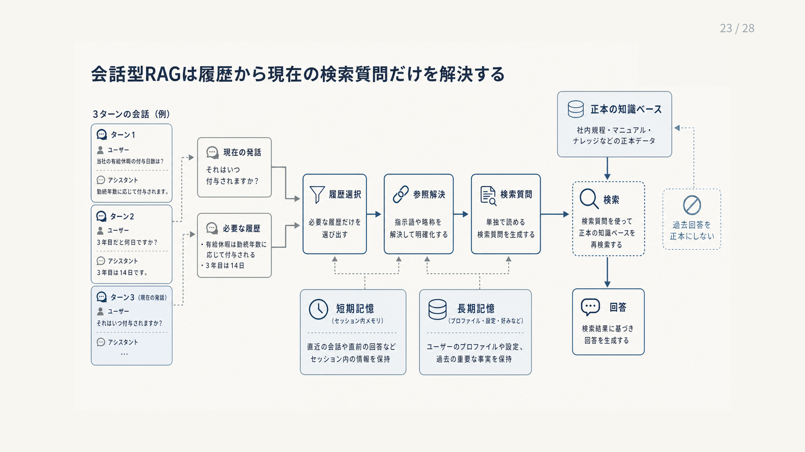

# 9.3 会話型RAG

会話型RAGは、現在の質問だけでなく、必要な過去の発話を使って検索と回答を行います。
履歴をすべて連結するのではなく、現在の意図を解決し、検索用の質問と回答用の会話状態を分けます。

図9-3は、左の会話履歴から必要な発話だけを選び、中央で指示語を解決して検索質問を作り、右の正本を再検索して回答する順に読みます。
下段の短期記憶と長期記憶は質問解決を補助しますが、過去の回答や記憶を業務情報の正本にはしません。

**図9-3　会話履歴から検索質問を作り直す流れ**

## 9.3.1 会話固有の失敗

「それ」の参照先、話題が変わった後に以前の対象へ戻ったこと、前の発話の期間条件を引き継ぐべきかを誤ると、別の質問を検索します。
回答が自然でも、利用者が尋ねた対象と違えば失敗です。

[QReCC](https://arxiv.org/abs/2010.04898)は、会話中の質問を単独で読める形へ書き換えるデータを含む会話型質問応答データセットです。
会話検索では、参照解決と検索結果を分けて評価します。

指示語、省略、話題変更、以前の話題への復帰、条件の誤継承を固定事例にします。
一発話ごとの正答だけでなく、セッション全体で目的を達成できたかを測ります。

## 9.3.2 会話状態の分離

会話の情報を一つの記憶へ混ぜません。
検索に必要な対象と用語、回答に必要な形式と制約、長期的な利用者の嗜好を分けます。

会話全文をそのまま検索質問へ追加すると、古い話題や過去の誤回答が候補を汚します。
[Query Resolution](https://arxiv.org/abs/2005.11723)のように、現在の質問を解決するために必要な履歴を選びます。

各状態に、根拠となる発話、確信度、有効期限を付けます。
業務文書の知識ベースと利用者の記憶は別の名前空間にし、会話要約を正本ではなく再検索の補助として扱います。

## 9.3.3 単独で読める質問への書き換え

質問書き換えでは、指示語の参照先を解き、製品、期間、地域、否定条件を補います。
検索に不要な挨拶と、現在の話題に関係しない過去の発話を除きます。

[CONQRR](https://arxiv.org/abs/2112.08558)は、書き換え文の自然さだけでなく、下流検索の結果を使って会話質問の書き換えを学習します。
実装では元の質問と書き換え後の質問を両方保存し、必須条件を保持したかを検査します。

参照先が複数考えられる場合に一つを作り上げません。
複数の検索質問を試すか、利用者へ確認し、書き換えなしの基準構成とも比較します。

## 9.3.4 会話文脈を使う密検索

会話文脈を使う密検索は、明示的な書き換え文を作らず、履歴を質問の符号化器へ直接入力します。
[Few-Shot Conversational Dense Retrieval](https://arxiv.org/abs/2105.04166)は、少量の会話データによる密検索器の適応を扱います。

省略を内部表現で捉えられる一方、会話用の学習データ、既存インデックスとの互換性、検索理由の説明が必要になります。
まず汎用検索器と質問書き換えを試し、それでは再現可能な失敗が残る場合に専用符号化器を検討します。

会話質問だけでなく、単発質問のRecallと遅延も回帰評価します。
モデルの版と利用した履歴範囲をトレースへ残します。

## 9.3.5 短期記憶と長期記憶

短期記憶は、セッション内の発話と一時的な条件を扱います。
長期記憶は、利用者が保存を許可した嗜好や継続設定をセッションをまたいで扱います。

業務上の事実や規程を利用者記憶へ保存して正本の代わりにすると、更新、引用、権限管理ができません。
会話全文、会話要約、嗜好、利用者が申告した事実を別々に保存し、情報源と更新日を付けます。

長期保存には明示的な同意、閲覧、訂正、削除の手段を設けます。
検索時には正本の知識ベースと利用者記憶を別の根拠として提示し、両者が矛盾した場合の優先規則を決めます。

## 9.3.6 セッション、テナント、プライバシー

会話状態を利用者、テナント、セッションへ正しく結び付けます。
共有キャッシュ、接続の再利用、非同期処理で別利用者の履歴が混ざらないようにします。

保存の同意、保存期間、削除、個人情報の除去、権限変更の反映を設計します。
退職や契約終了後の利用者記憶を参照できないことを、不許可事例で試験します。

セッションIDをクライアントから受け取るだけで信用せず、サーバーで認証済みの利用者と照合します。
テナントをまたぐ履歴取得は許容件数ゼロにし、反復質問による記憶の抽出も監視します。

## 9.3.7 検索と回答の連携

検索には、単独で読めるようにした質問を使います。
回答には、利用者の元の表現と、現在も有効な会話上の制約を戻します。
これにより、検索器向けの明確さと、利用者の意図に沿った回答を両立できます。

過去の回答や引用を再利用する場合も、情報源の版、有効日、現在のアクセス権を再確認します。
話題が変わったら古い根拠を自動継承せず、新しい検索トレースを開始します。

検索失敗と履歴解決失敗を別の理由へ分類します。
利用者への確認後に検索対象が正しく変わったか、最終的にセッションの目的を達成できたかを評価します。
