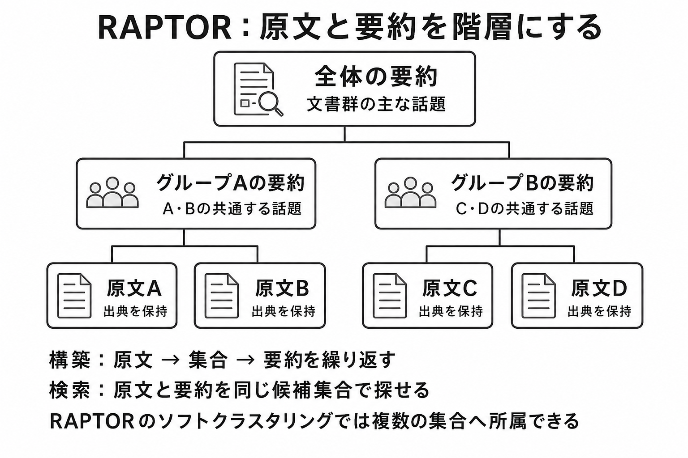

# 9.6. Hierarchical RAG・RAPTOR

階層型RAGは、原文の小さな断片と、それらをまとめた節、文書、文書群の表現を階層として検索します。
局所的な事実だけでなく、長い文書や資料群の全体像を尋ねる質問に使います。

## 9.6.1. 適用する質問とhierarchyの単位

階層検索が必要かどうかは、質問の粒度で判断します。
局所的な事実、節の要約、文書全体、コーパス全体、文書をまたぐ複数段階の質問を分けます。

FAQや単一文で答えられるfactが中心のquery sliceでは、hierarchical retrievalを追加せずflat chunk retrievalで受入条件を満たせる場合があります。
[RAPTOR](https://proceedings.iclr.cc/paper_files/paper/2024/hash/8a2acd174940dbca361a6398a4f9df91-Abstract-Conference.html)は、下位のテキストをクラスタリングして再帰的に要約し、異なる抽象度を持つ木構造から検索します。

[TreeRAG](https://aclanthology.org/2025.findings-acl.20/)は長文を木構造へ分割して双方向に探索する方式を、[ZoomRAG](https://aclanthology.org/2026.findings-acl.1643/)は複数粒度の関係グラフを粗い層から細かい層へ探索する方式を、それぞれ評価しています。
両者の結果は各研究の評価条件に限定し、RAPTORとの同一条件比較とはみなしません。
これらは同じ階層構築法の追試ではなく、対象データと構造も異なります。
hierarchical retrievalはflat retrievalをbaselineにし、同じcorpus、query、candidate数でRecall、回答品質、build費用を比較して採否を決めます。

導入前に、基準構成の失敗が局所的な根拠の検索漏れか、全体把握の不足かを確認します。
概要質問、比較質問、複数文書質問のスライスで、階層化による追加効果を測ります。

階層indexのnode typeを原文chunk、proposition、section summary、document summary、cluster summaryに限定し、各nodeから原文へ戻れるlinkを持たせます。
上位の要素ほど広い傾向を表しますが、具体的な条件、例外、少数意見を失いやすくなります。

各要素に階層の深さ、子要素、元文書、ページ、原文位置を持たせます。
要約から、それを支える下位要素へ戻れる情報源の追跡を必須にします。

検索に使う単位、生成モデルへ渡す単位、引用する単位を分けます。
上位要約で候補を見つけても、具体的な断定は下位の原文で確認します。

## 9.6.2. offline tree構築

offline treeはdocument解析、leaf chunk生成、embedding、clustering、summary生成、parent-child link作成の順に構築し、各段階の成果物を版管理します。
RAPTOR型候補では意味近傍を再帰的にcluster化し、cluster summaryと子要素を同じtree versionへ結びます。

クラスタリング手法、要約モデル、プロンプト、乱数シードを版管理します。
情報源のスナップショットから同じ構造を再構築できるマニフェストを残します。

最小の比較実験では、次を必須パラメーターとして固定します。

- leaf chunkの大きさ、重なり、embedding modelと距離尺度
- clustering方式、距離、最小・最大cluster数、乱数seed
- 各clusterの最大要素数と、再帰を止める最大深さまたは最小要素数
- 要約model、prompt、最大入力token、最大出力token
- 検索する階層、階層ごとの候補数、統合方式、最終候補数

まず一階層だけ追加し、すべてのleafが一つの親へ属し、各親要約の主張が子の原文で支持されることを確認します。
その後にだけ再帰を増やします。
要約検証は親単位で行い、未支持主張、条件の脱落、少数意見の消失を記録します。
評価データは局所質問、節の要約、文書全体、複数文書の四スライスへ分け、同じleafを使う平坦検索と比較します。

一部の要約生成に失敗した状態を、構築成功として公開しません。
すべての原文チャンクが木のどこかに含まれること、親から子へたどれること、要約の各主張に支持する原文があることを品質判定にします。

## 9.6.3. hierarchical retrievalとindex-time enrichment

すべての階層を同時に検索する方法、階層ごとに検索する方法、上から下へたどる方法、下位チャンクから親を展開する方法があります。
概要質問では上位要素、具体的な質問では下位要素を優先します。

質問の粒度判定に確信がない場合は、複数階層の結果を統合します。
候補件数、入力トークン、遅延、正解根拠の保持率を平坦な検索と比較します。

上位要約の類似度が高くても、それだけを回答根拠にしません。
回答時に関連する下位要素を展開し、具体的な条件と引用先を確認します。

要約、想定質問、文書間をつなぐ事実、固有表現のリンクを、検索前にインデックスへ追加できます。
オンライン処理を軽くし、原文だけでは表現が一致しない質問を検索しやすくする方法です。

RAPTORを含む生成情報をindexへ追加する研究は、生成する要約・質問・階層と評価taskが方式ごとに異なるため、その結果を生成情報索引全般の有効性へ一般化しません。
本書ではRAPTORの階層要約を中心に扱い、ほかの生成メタデータは比較実験の候補に限定します。
構築費用が増え、生成時の誤りが長期間インデックスへ残る可能性があります。

生成した情報を原文と別の種類として保存し、生成モデルの版、支持する原文スパン、再計算条件を持たせます。
検索補助として有用でも、原文確認なしに最終根拠へ使いません。

## 9.6.4. update・delete・rollback・summary error・provenance・評価

一文書の更新でも、その下位要素だけでなく、所属する集団とすべての上位要約が影響を受けます。
依存関係から再生成する範囲を求め、削除文書の情報が上位要約へ残っていないことを検査します。

新しい木構造を別インデックスへ構築します。
固定質問、要約差分、アクセス制御、削除確認を通してから参照先を切り替えます。

クラスタリングの変化で要素IDが変わる場合は、引用と評価ラベルを元文書の位置から移行します。
旧構造へすぐ戻せる期間を設けますが、旧版にも現在の権限と削除を適用します。

階層内の要約は、原典から作る検索用の補助情報です。
元にない主張、過度な抽象化、条件と少数意見の消失を主張単位で検査します。

要約中の各主張を、支持する下位チャンクへ結び付けます。
回答の引用は要約だけで終わらせず、元のページとスパンへ到達させます。

上位要約と下位の原文が矛盾する場合は原文を優先し、要約を再生成します。
要約モデルやプロンプトを変更したときは、概要質問だけでなく、条件、例外、少数意見を含む回帰試験を行います。

図9-4は、原文からグループの要約、全体の要約へまとめる構造です。
検索時には、異なる階層の要素を同じ候補集合として扱えます。

**図9-4　原文と要約を結ぶRAPTORの階層**
